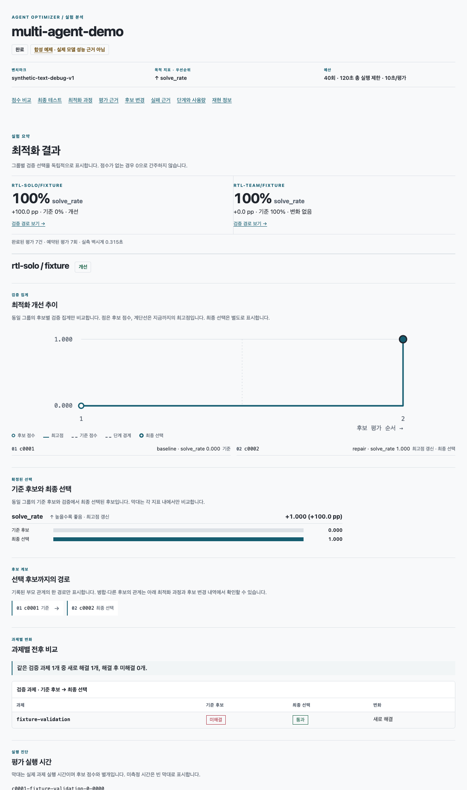
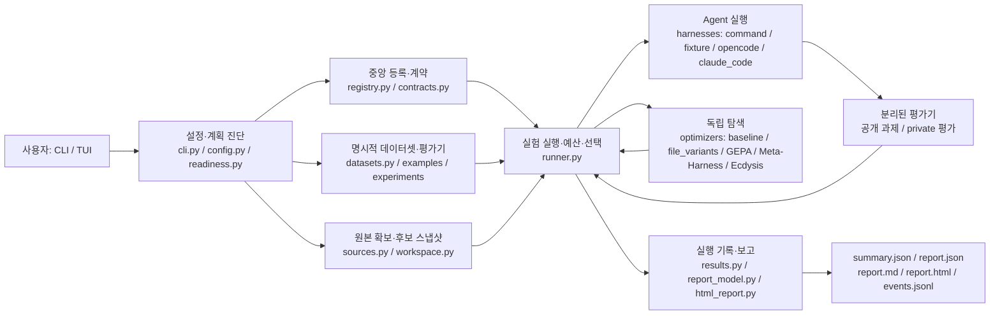
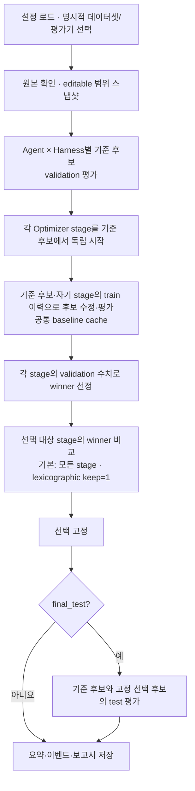

# Agent Optimizer — Agent 개발자를 위한 CLI/TUI

서로 다른 Agent의 소스·실행 방법·평가기·수정 허용 범위를 연결해 **후보 생성 → 평가 → 선택 → 보고**를 반복하는 범용 Python CLI·대화형 TUI입니다. 실제 대상 Agent는 별도 저장소의 고정 Git commit 또는 로컬 소스로 연결합니다. ACE-RTL은 선택적 데모 대상이며 제품 코어가 아닙니다. 새 Agent에는 실행 하네스와 평가기 연결이 필요합니다.

## 개발환경 빠른 시작

**Mac 또는 Linux, Git, Python 3.11+**에서 저장소 루트 기준으로 실행합니다. `make setup-core`는 uv가 없으면 로컬에 준비하고 Python 3.12·고정 개발 의존성을 `.venv`에 설치한 뒤 코어 진단과 최소 데모를 실행합니다. 첫 준비에는 다운로드가 필요할 수 있지만 **최소 데모 실행에는 모델 키·Docker가 필요 없습니다.** 네트워크/CA 설정은 [개발환경 가이드](docs/development.md)와 [네트워크 안내](docs/network.md)를 참고하세요.

```bash
make setup-core
make doctor-core
.venv/bin/agent-opt doctor --plan examples/minimal/experiment.toml --json
.venv/bin/agent-opt run examples/minimal/experiment.toml
```

`make setup-core`만으로도 데모 보고서 하나가 생성됩니다. 마지막 `run`은 새 실행을 한 번 더 만들어 결과 확인 과정을 따라가기 위한 명령입니다. `doctor --plan`의 `"scope": "plan", "ready": true`는 **정적 계획 검사** 결과이지 외부 모델·평가기의 성공 보장은 아닙니다. `run`은 완료 시 `"status": "completed", "trials_used": 7`, `run_dir`, `report_html`을 출력합니다. `runs/`는 Git에서 제외되며 실행마다 `<run-id>`가 달라집니다.

`make`가 없다면 `sh scripts/bootstrap.sh setup --core`로 준비할 수 있습니다. 기본 CLI는 `.venv/bin/agent-opt --help`, 대화형 시작은 TTY에서 `.venv/bin/agent-opt tui`입니다. `make help`는 설치 없이 개발 명령을 보여줍니다.

개발 명령의 **옵션 없는 `make setup`·`make doctor`는 ACE 전체 범위**입니다. 코어 준비·진단은 위 `-core` 명령을 쓰세요. 선택 데이터셋, ACE 전체 준비, 실제 모델 검사와 일상 검사의 준비 조건·부작용·복구 방법은 [개발 명령 기준](docs/development.md), 변경 유형별 검사는 [CONTRIBUTING.md](CONTRIBUTING.md)에 있습니다. 개발 명령 `doctor`와 사용자용 `.venv/bin/agent-opt doctor --plan ...`은 검사 범위가 다릅니다.

### 결과 확인

위 `run` 출력의 **`report_html`을 브라우저에서 열면** 별도 서버 없이 볼 수 있습니다. `make setup-core`의 자동 데모 결과는 출력 중 `run_dir`의 `report.html`에 있습니다. 결과를 터미널에서 다시 읽으려면 그 `run_dir`을 아래 `runs/<run-id>` 자리에 넣으세요.

```bash
.venv/bin/agent-opt report "runs/<run-id>"
# 저장된 실행 자료로 HTML·Markdown·보고서 JSON을 다시 만들 때만:
.venv/bin/agent-opt report "runs/<run-id>" --html
```

| 파일 | 실제 내용과 용도 |
|---|---|
| `report.html` | 실행 시 자동 생성되는 독립형 화면. 그룹별 기준/선택 검증 점수, 추이·과제·최종 테스트·실패·후보 변경·재현 정보를 확인합니다. |
| `report.md` | 같은 보고서 모델의 텍스트 표. 그룹 비교·최적화 단계·사용량·재현 정보를 파일로 읽거나 공유할 때 사용합니다. |
| `summary.json` | 실행 원본 요약: 상태, 그룹별 기준/선택/최종 테스트, 예약된 `trials_used` 등. 위 `agent-opt report RUN`의 출력입니다. |
| `report.json` | 원본 요약·이벤트에서 파생한 **보고서 스키마 v3**. 그룹·비교·평가·근거 완전성/불일치를 기록하며 선택 근거인 원본을 대체하지 않습니다. [버전과 필드 의미](docs/report-schema.md) |

`report.md`와 `report.json`은 같은 실행 폴더에서 텍스트 편집기로 열고, `summary.json`은 위 `agent-opt report` 출력으로도 확인합니다. 같은 폴더의 `manifest.json`(설정·출처), `events.jsonl`(실행 이벤트), 그룹별 `candidates/*/changes.diff`(후보 변경)도 확인할 수 있습니다. 이벤트 파일이 없거나 손상·건수 차이가 있으면 세 보고서에 경고를 표시합니다. 예약 예산과 완료 평가의 차이만으로 기록 유실을 단정하지 않습니다. 미수집 비용/토큰은 `null`이며 하네스가 보고한 일부 사용량을 전체 사용량으로 해석하지 않습니다. `--html`은 저장된 결과를 재생성하며 평가를 다시 실행하지 않습니다. 언어 기본값은 한국어이고 `AGENT_OPT_LANG=en`으로 실행·보고서 재생성 시 영어를 선택할 수 있습니다.

### 재현 가능한 최소 실행 화면

`examples/minimal/experiment.toml`을 **모델·Docker 없이** 실행한 결과입니다. 로컬 합성 텍스트 과제, `fixture` 하네스, `file_variants`의 설정 변경을 이용하며 실제 RTL/LLM 성능을 측정하지 않습니다. 2026-09-27 Mac ARM64, Python 3.12.12에서 `make setup-core`로 생성한 `report.html`을 한국어·브라우저 1200px 화면에서 캡처했습니다. 실행 시간과 run ID는 환경마다 달라집니다.

| 그룹 (`Agent/Harness`) | 기준 검증 `solve_rate` | 선택 검증 `solve_rate` | 최종 테스트 (기준 → 선택) |
|---|---:|---:|---:|
| `rtl-solo/fixture` | 0.0 | 1.0 | 0.0 → 1.0 |
| `rtl-team/fixture` | 1.0 | 1.0 | 1.0 → 1.0 |

**총 7 trial**(solo 4, team 3); 위 수치는 해당 fixture에 의도적으로 구성된 연결 확인 결과입니다. 재현 시 `summary.json`의 `synthetic: true`, `groups`의 `baseline`·`selected`·`final_test`와 `report.md`의 그룹 비교를 대조하세요.



## 지원 범위

| 구분 | 현재 구현 / 사용 조건 |
|---|---|
| 인터페이스 | `agent-opt` CLI·TTY TUI, `init` → `doctor --plan` → `run` → `report`; 데이터셋은 사용자가 직접 선택. |
| 소스·실행 | 로컬/고정 commit Git 스냅샷, 복수 Agent × 호환 Harness 조합. `command`, `opencode`, `claude_code` 등록; `fixture`는 합성 데모용. `codex`, `openagent`는 미구현 예약 ID. |
| 최적화 | `baseline`, `file_variants`(모델 없이 실행), 자체 구현 `gepa`, `meta_harness`, `ecdysis`(모델 설정·적합한 파일/과제 필요). GEPA의 후보 병합은 현재 명시적으로 실패; upstream 논문 재현을 뜻하지 않습니다. |
| 데이터·평가 | 합성 `sample_text`, 선택형 고정 CVDP·Verilog-Eval(`verilog-spec`, `verilog-completion`), 또는 사용자 `tasks.json` + 명시적 evaluator. 후자의 채점기를 자동 추측하지 않습니다. |
| 실행 환경 | 코어 fixture: Mac/Linux, Python 3.11+, Git, 모델·Docker 불필요. 선택형 ACE/CVDP·Verilog-Eval의 공식/도구 평가에는 별도 준비와 Docker 필요. 실제 통합·플랫폼별 검증 범위는 [현재 상태](docs/status.md)와 [검증 기록](docs/verification.md) 참고. |

`claude_code`는 구현·등록되어 있지만 별도 Claude Code CLI, 인증 및 프로필이 필요합니다. 실제 도구/모델·평가 성공은 명시적 실환경 실행으로 구분합니다. ACE 데모는 **OpenCode 스킬 프로필 + 외부 공식 CVDP 평가**이며 native ACE 실행과 다릅니다. 지원하지 않는 연결은 자동으로 baseline/합성 점수로 대체하지 않습니다.

### 전체 구성



`examples/`에는 데모와 도메인 연동, `experiments/<team>/`에는 팀 파일 플러그인을 둡니다. 구성요소는 공통 [`contracts.py`](src/agent_optimizer/contracts.py)를 사용하며 [`registry.py`](src/agent_optimizer/registry.py)에 ID → 구현 파일을 등록합니다. 원본/평가 자료 분리와 상세 구조는 [구조 문서](docs/architecture.md)에 있습니다.

### 한 실험의 최적화 흐름



train 자료만 후보 수정 근거로 사용하고, test는 선택을 고정한 뒤에만 실행합니다. 여러 데이터셋을 선택하면 `run-session`이 **데이터셋마다 독립 실험/보고서**를 만들며 기본 최대 2개 프로세스를 병렬 실행합니다(`--jobs N`으로 조절). 서로 다른 채점기 점수를 하나로 순위화하지 않습니다.

## 내 Agent 연결하기

준비된 코어 환경에서 `.venv/bin/agent-opt datasets list`와 `.venv/bin/agent-opt plugins`로 선택지를 확인합니다. 아래 예제는 저장소에 포함된 로컬 Agent/과제/평가기로 **비대화형 새 설정을 만드는 검증된 경로**입니다. `init`은 같은 이름의 설정을 덮어쓰지 않으므로 재시도할 때 `--name`을 바꾸세요.

```bash
.venv/bin/agent-opt init --name my-fixture \
  --agent examples/minimal/agents/solo \
  --command '{python} {agent_dir}/src/fixture_agent.py {task_dir}' \
  --editable configs/strategy.json \
  --dataset examples/minimal/tasks.json \
  --evaluator examples/minimal/evaluator.py:TextFixtureEvaluator \
  --optimizer baseline --yes
.venv/bin/agent-opt doctor --plan runs/configs/my-fixture/experiment.toml --json
.venv/bin/agent-opt run runs/configs/my-fixture/experiment.toml
```

실제 Agent는 `--agent <로컬 경로>` 또는 `--agent <Git URL> --revision <전체 commit>`을 연결하고 실행/평가 방식과 `--editable`을 지정합니다. `--command`는 `command` 하네스 전용 argv 문자열이며 셸 확장·파이프는 실행하지 않습니다. 비대화형 `init`에는 `--dataset`, `--optimizer`, `--yes`가 필요합니다. TTY에서는 `.venv/bin/agent-opt init`으로 새 설정만 만들거나 `.venv/bin/agent-opt tui`의 1번에서 최근 생성 설정/직접 경로 실행, 2번에서 새 실험, 3번에서 ACE-RTL + CVDP 예제, 4번에서 이전 보고서 열람을 선택할 수 있습니다. 1번 목록은 `runs/configs/`에 생성된 설정만 표시합니다.

모델 Optimizer에는 환경/credential store에 `AGENT_OPT_MODEL_BASE_URL`, `AGENT_OPT_MODEL_API_KEY`를 두고 필요하면 `AGENT_OPT_MODEL_ID`를 지정합니다. 앱은 `.env`를 자동 로딩하거나 키를 실험 설정에 저장하지 않습니다. OpenCode용 `AGENT_OPT_MODEL` 선택자는 이 API 설정과 별개입니다. 실제 모델/데이터 준비는 [ACE-RTL 예제](examples/ace-rtl/README.md), [사용자·팀 개발자 가이드](https://wontaeJeong.github.io/agent-optimizer/), [현재 구현 상태](docs/status.md)를 확인하세요.

팀 구현을 시작한다면 위 [개발환경 빠른 시작](#개발환경-빠른-시작) → [담당 템플릿](experiments/README.md) → [확장 계약](docs/adding-components.md) 순서로 진행합니다. 개발 명령·테스트는 [CONTRIBUTING.md](CONTRIBUTING.md), 미구현·제약은 [FUTURE.md](docs/FUTURE.md), 외부 연동 출처는 [SOURCES.md](docs/SOURCES.md)를 참고하세요.

가이드 사이트는 `website/`의 한국어 원고를 Astro + Starlight로 빌드합니다. **Node.js 22.12+** 환경에서 `website/`의 `npm ci` → `npm run dev`로 로컬 미리보기를 열고 `npm run build`로 배포 전 링크·앵커를 검사합니다. 앱 실행 환경과 별개입니다.
