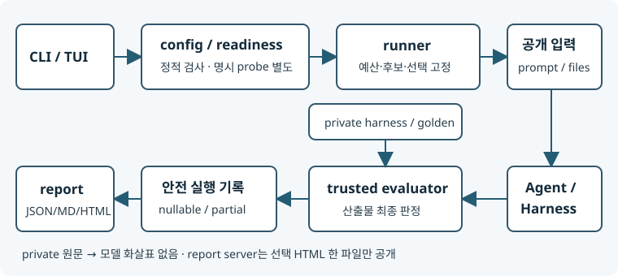
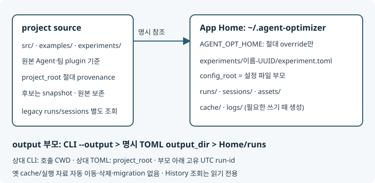

# 구조와 실행 흐름

## CLI/TUI·trusted 평가 경계

private harness/golden/로그 원문은 trusted 평가에만 전달한다. 모델 수정 근거는 train이며 validation 수치 선택·frozen selection 이후 test와 구분한다. `doctor --plan`은 읽기 전용, `--model`은 명시 API probe다.

## 프로젝트와 App Home

기본 `~/.agent-optimizer`, 비어 있지 않은 `AGENT_OPT_HOME`은 expanduser 후 절대경로만 허용한다. `experiments/runs/sessions/assets/cache/logs`는 필요할 때만 생성한다. 생성 설정은 `experiments/<이름>-<uuid12>/experiment.toml`, 원본 project_root 절대 provenance와 `config_root="."`를 보존한다. agents/harnesses/benchmark는 config_root, plugin은 project_root, local source는 Agent manifest 기준이다. output은 CLI explicit > 명시 TOML > Home/runs의 **부모**이고 상대 CLI는 CWD·상대 TOML은 project_root 기준이다. explicit session output도 부모다. 기존 config_root 없는 실험은 project_root 기준을 유지하고 자동 migration은 없다.

History는 Home와 명시 project의 legacy runs/dev-live/sessions 및 선택한 output 부모만 조회한다. 실패/중단/report 없음도 표시하고 terminal 근거 없는 running은 stale, 불충분한 기록은 unknown이다. 임의 디스크 탐색·모델/평가/서버 호출은 없다. 열람 시 원래 row/inode와 서버 FD를 재검증하며 HTML 하나만 공개한다.

## native outer/inner

native 정책·row eligibility·active surface는 `examples/ace-rtl/native_selection.py`, 코어 `native_selection.py`는 출처/인자 전달 thin hook이다. native GEPA는 `native/guidance.md`, Meta는 `native/orchestration.py:guidance`를 실제 소비한다. 정상 inner 종료 후 outer evaluator가 다시 채점하며 둘의 설정·time/count를 구분한다. 상세 조건·CID 지원은 [NATIVE](../examples/ace-rtl/NATIVE.md)다. 실환경 native loop는 not_run이다.

데이터셋 명시적 선택·준비 → source snapshot → baseline validation → **각 Optimizer를 baseline에서 독립 실행**
→ stage별 validation winner → 기본적으로 모든 stage winner 비교 → 선택 고정 → 선택적 test → HTML/JSON 보고서.
Optimizer의 `evaluate/evaluate_batch/history`는 train 전용이며 `evaluate_validation`은 후보별
private 자료를 제외한 validation 수치만 반환한다. baseline train 측정은 cache를 공유할 수 있지만
다른 stage의 후보 trial은 history에 보이지 않는다. `final_stages`를 명시하면 최종 비교 대상을 제한한다.

| 모듈 (`src/agent_optimizer/`) | 책임 |
|---|---|
| `contracts.py` | Agent/Candidate/Task, RunRequest/ExecutionResult/Evaluation, Optimizer 계약 |
| `config.py`, `registry.py`, `readiness.py` | TOML·과제·호환성 검사, 중앙 Python `file.py:Symbol` 등록, 선택 데이터셋/계획의 읽기 전용 진단 |
| `datasets.py`, `examples/benchmarks/` | 고정 Git source·명시적 dataset 준비, CVDP/Verilog-Eval 평가 자료의 공개/비공개 경계 |
| `runner.py` | 기본 전체 곱 또는 실험의 선택된 Agent–Harness 그룹, 독립 stage, train/validation/test·예산 소유 |
| `sources.py`, `workspace.py` | 원본 보존, editable 스냅샷·hash·diff·계보·산출물 경계 |
| `process.py`, `models.py` | argv 프로세스/timeout, 모델 요청 전체 deadline worker |
| `objectives.py`, `results.py`, `report_model.py`, `html_report.py` | lexicographic keep=1·mean/sum 집계, v1 기록의 보고서 정규화·Markdown/독립 HTML/CSV 출력 |
| `setup_wizard.py`, `session.py`, `terminal_report.py`, `cli.py`, `tui.py` | 사용자 dataset 선택·팀 컴포넌트 탐색·설정 생성·복수 데이터셋 독립 프로세스 실행·TUI/CLI 진행 화면 |
| `app_paths.py`, `history.py`, `report_view.py`, `report_server.py` | Home/output resolver·읽기 전용 이력·브라우저/서버 수명·loopback HTML-only 제공 |

`[[pairs]]`가 없으면 Agent 우선 순서의 전체 곱이며 모든 Agent가 모든 프로필의 adapter를 지원해야 한다.
명시하면 `agent`는 Agent ID, `harness`는 프로필 ID로 선택한 쌍만 선언 순서대로 실행한다.
알 수 없는 ID·중복·미지원 쌍과 쌍에 사용하지 않은 Agent/프로필은 설정 로드에서 거부한다.
`plan` matrix, `doctor`·실행 예산, 실제 그룹이 같은 선택을 사용한다. 독립 Agent와 내부 sub-agent는 별개이며 그룹별 후보·결과를 분리한다.
팀 확장은 `experiments/<team>/`, 도메인 연결은 `examples/`에 둔다. 별도 pipeline/plugin manager는 없다.
여러 dataset을 선택하면 서로 다른 evaluator를 가진 독립 run을 session 안에서 기본 최대 2개까지
병렬 실행한다(`run-session --jobs N`). 단일 run의 선택된 Agent–Harness 쌍·stage·과제/반복은 순차 실행한다.
session index는 각 `report.html`을 연결하지만 이질적 점수를 하나로 순위화하지 않는다.

## 격리와 평가

- 원본 소스는 수정하지 않는다. 허용된 텍스트 변경만 `context.propose`로 생성하며 후보 metadata와
  실제 파일 hash를 cache 반환 전에도 검증한다. 직접 수정·위조 후보는 거부한다.
- 공개 prompt/files만 Agent workspace로 복사한다. private evaluation은 evaluator에만 전달한다.
  Docker Agent에는 평가 데이터/Docker socket을 마운트하지 않는다. local 실행과 신뢰한 in-process
  파일 플러그인의 논리적 분리는 OS 보안 격리가 아니다. `plan`도 신뢰한 Python plugin 코드를 로딩한다.
- evaluator가 실제 결과를 판정한다. Agent 자기보고를 성공 근거로 사용하지 않는다.
  환경 오류/unsupported가 포함된 split의 집계는 null이며 정상 행만 남겨 분모를 줄이지 않는다.
- ACE 스킬 프로필은 OpenCode 호출 후 외부 CVDP 평가다. native 역할 루프와 같지 않다.
  작은 RTL evaluator의 Yosys 합성도 임의 RTL을 정화하지 않으므로 입력 제한·private 검사가 필요하다.

## 재현 자료

manifest/source-lock에 설정·resolved commit/content hash·benchmark/plugin/helper hash를 남긴다.
선택된 중앙 등록의 구현과 선언 helper 및 실험별 명시적 파일 플러그인만 fingerprint한다.
후보 `candidate.json`/`changes.diff`, trial 로그/`result.json`, 버전·timestamp·dataset/iteration/phase를 가진
`events.jsonl`, `frozen_selection.json`, `summary.json`/`report.json`/`report.md`/`report.html`을 보존한다.
seed가 모든 backend의 결정성을 보장하지는 않는다.
모델 ID 등 재현 정보와 인증정보를 구분한다. 사용량은 관측된 값만 기록하고 전체/partial을 섞지 않는다.
`optimizer_usage`에는 Agent/Harness/stage/**optimizer** 이름이 포함되며 미보고를 0으로 해석하지 않는다.
checkpoint와 결과 저장은 resume가 아니다.

### 보고서 파생 경로

- 원본 스키마 v1 `summary.json`·`manifest.json`·`events.jsonl`과 후보 metadata/패치를
  `report_model.py`가 그룹별 canonical model로 정규화한다. 별도 `report_schema_version`을 가진
  `report.json`은 파생 자료이며 원본 summary나 validation 선택 근거를 대체하지 않는다.
  Markdown과 독립형 HTML은 같은 모델의 선택·비교·실패·평가 건수를 사용한다.
  `agent-opt report RUN --html`은 기존 v1 기록에서도 파생 보고서를 새로 생성한다.
- 비교는 같은 Agent × Harness 그룹의 유효한 baseline/선택 validation **집계**와 목적 지표의
  방향·우선순위를 따른다. 과제별 `trial_completed`는 평가 한 건이며 예약된 `trials_used`와
  별개다. 그룹별 예약량이 없으면 미수집으로 남기고, 최종 test는 선택 확정 뒤 별도로 표시한다.
  명시적 실패 상태·실행 기록이 없으면 feedback만 보고 오류 유형을 추정하지 않는다.
- 범용 탐색 단위는 Optimizer가 `context.emit`으로 남기는 `report_unit`의 열린 type/label,
  부모 unit 및 후보·평가 참조로 표현한다. 후보의 복수 부모 계보는 unit 계층과 구분한다.
  명시적 단위가 없으면 기록된 후보 계보와 그룹 이벤트를 시간순으로 보여주고 평가 표를
  유지한다. 기존 checkpoint나 후보 번호에서 iteration/세대/깊이를 추론하지 않는다.
  경로는 실행 디렉토리 안의 안전한 상대 링크로 한정하고 원문은 HTML에서 이스케이프한다.

## 실행 종료와 부분 결과

summary 상태는 `completed`, `partial`, `no_eligible_candidate`, `budget_exhausted`, `interrupted`,
`source_error`, `error`다. 소스 확보부터 전역 wall-time을 사용하고 build/Harness/evaluator에는
남은 시간으로 제한한 timeout을 전달한다. 동기 Python Optimizer는 호출 전후 시간 검사이며 선점 실행이 아니다.

- 전역 예산 중단 trial은 interrupted/valid=false/passed=null이며 선택에서 제외한다.
  per-trial timeout만 소진하면 채점 가능한 실패(passed=0)다. 예약 실패는 trial 수에 더하지 않는다.
- 개별 stage.max_trials 소진 시 해당 stage만 `budget_exhausted`로 기록하고 다음 stage를 실행한다.
  일부 stage만 완료한 run은 `partial`이며 완료된 후보만 최종 validation 비교 대상이다.
- 실제 시작한 trial은 오류/Ctrl-C에도 result와 `trial_completed` 이벤트를 남긴다. 이 이름은 기록 종료이지 성공이 아니다.
- baseline 미완료면 null, 선택 전이면 selected=[]다. 완료한 평가/usage는 보존하고 미완료 split은 선택하지 않는다.
  test 중 중단되면 이미 고정한 validation 선택을 유지한다. 구현 오류를 합성 결과로 대체하지 않는다.
- CLI run: 완료 0, 예산/Ctrl-C/선택 불가 3, 설정/파일 오류 2. 예상 밖 구현 오류는 summary 저장 후 전파한다.

확장 API는 [adding-components](adding-components.md), 보류 기능과 복원 위치는 [FUTURE](FUTURE.md)를 따른다.
