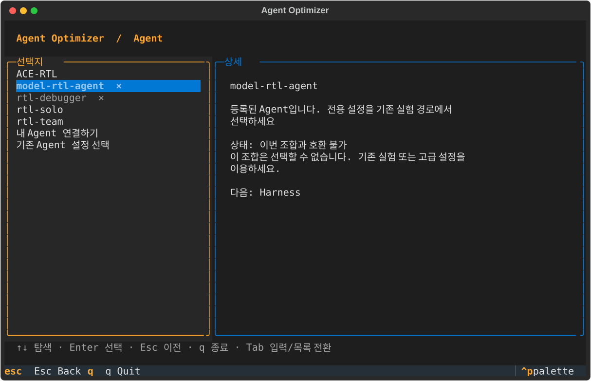
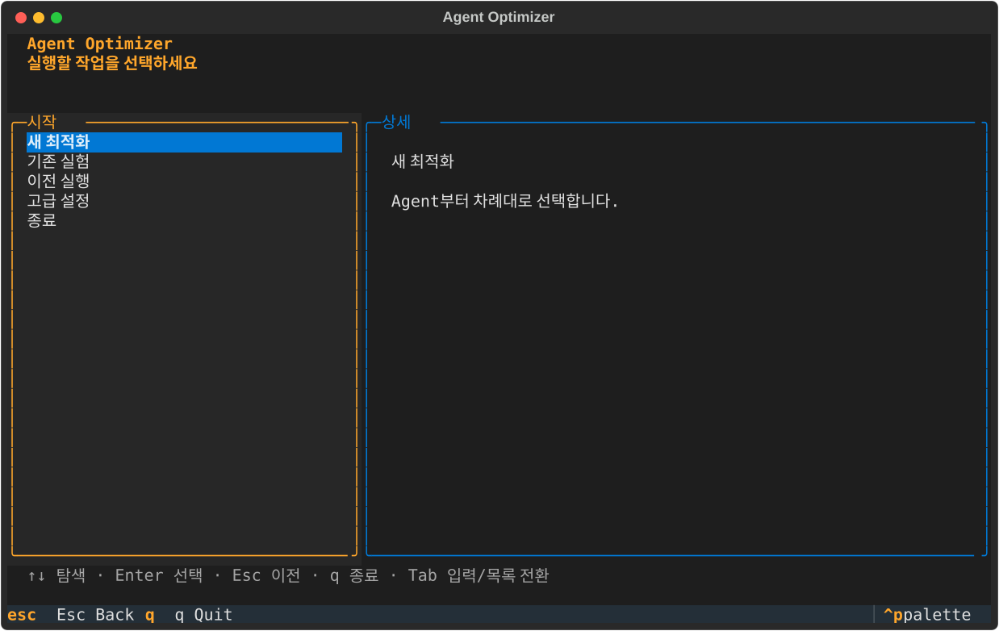

# 검증 기록

## 2026-10-07 TUI 실행 프리셋·실제 native 실패 확인

[실행 프리셋 검증](verification/tui-run-presets-20261007.md): 16개 조합·native 고정 row 9개 정적 검사, 새 합성 TUI E2E의 준비→진단→실행→결과→History→실제 HTTP HTML 열람 통과. `make test` **1174개 중 실행 1096 통과·skip 78**, lint·demo·build·설치형 CLI/source-free 목록 통과. 실제 native Baseline CID002/004는 준비·doctor·모델 probe 후 API를 호출했지만 `no_eligible_candidate`였다. CID004 replay에서 Markdown 출력 거부를 확인했으며 정상 완료·연구 stage·Ubuntu native loop는 미검증이다.

## 2026-10-01 I 최종 수용검증·실제 결함 수정

[I 보고서](verification/final-mvp-i-20261001.md)에 exact 명령·절대 config/run/report 경로·skip 목록 근거·R01~R30 판정을 기록했다. 실제 `make test` **1157개 중 실행 1077 통과·기존 skip 80**, `make lint`·격리 checkout의 실제 `make demo`(합성 7 trial)·새 wheel 환경의 build/install·source/wheel fresh Home CLI/PTy·TUI·실제 HTTP/종료·custom local/Git command·사이트 build/link가 통과했다. 일반 prepare의 ACE pointer 오분기·native source.subdir 무시를 수정하고 make 환경 상속 테스트 격리를 보완했다. **완료 29·부분 1(R16)·차단 0**이며 native 실모델/실 EDA/live는 `not_run`이다. 과거 날짜별 성공을 native 근거로 바꾸지 않는다.

**후속 whole-branch 리뷰 수정 단일 wave:** [리뷰 원문](verification/final-mvp-final-review-20261001.md)의 Critical/Important 0·Minor 2(M1 필수 name, M2 plan bytecode)를 수정했다. [I §8](verification/final-mvp-i-20261001.md)에 새 RED→GREEN·실제 사용자 no-`-B`/no-env plan과 값 복구·필수 name preset 실행·source-free wheel module/console smoke를 기록했다. covering **53개 통과**, 최종 실제 make **1160개 중 실행 1080 통과·기존 skip 80**, lint·offline wheel build/install 통과. R16 live 부분/나머지 범위는 유지하며 새 독립 재리뷰 승인이나 live 성공을 주장하지 않는다.

## 2026-10-01 최종 MVP 통합·문서 근거

A~G 승인·수정 결과는 [progress](verification/final-mvp-progress-20261001.md)와 각 담당 보고서에 보존한다. [G 최종 §7](verification/final-mvp-g-20261001.md)은 전체 1155개 중 실행 1075 통과·기존 skip 80개, Ruff·실제 wheel build/install/source-free 합성 CLI/native helper·진단/HTTP 근거다. **native 실모델·실 CVDP Docker/EDA/cleanup·Ubuntu native loop는 not_run**이다. [H 문서/사이트 명령·캡처·I 인계](verification/final-mvp-h-20261001.md)를 별도로 기록한다. 아래 날짜별 OpenCode/Claude/evaluator-only 성공은 당시 범위이며 native 성공으로 재표현하지 않는다.

## 2026-10-06 CI 실행 시간 최적화

- 기준: `origin/main`의 `edbd2b8`에서 독립 `perf/ci-runtime` 워크트리를 생성했다. 최근 main [core-tests 36498578769](https://github.com/wontaeJeong/agent-optimizer/actions/runs/36498578769)는 전체 205초, Python 3.11/3.12 테스트 단계는 각각 147/128초, native simulator 설치는 각각 11초, build+설치 검증은 26/16초였다. [Pages 36498578714](https://github.com/wontaeJeong/agent-optimizer/actions/runs/36498578714)는 build job 20초·deploy job 8초이며 이미 npm cache를 사용한다.
- 수동 [공식 CVDP 36038288690](https://github.com/wontaeJeong/agent-optimizer/actions/runs/36038288690)의 과거 준비 단계는 797초였다. 이는 당시 Docker 준비의 병목 근거이며 이번 변경의 실행 증거가 아니다. 이번에는 Python 다운로드·고정 CVDP 데이터만 캐시하고 기존 데이터 hash·이미지 검사를 유지한다. Docker 레이어 캐시나 full Verilog-Eval 평가 병렬화는 추가하지 않았다.
- Mac ARM64 / Python 3.12.12 / uv 0.10.7: 변경 전 시간 측정용 `unittest.TextTestResult`로 `PYTHONPATH=src .venv/bin/python`에서 전체 discovery 실행, **953개 중 874 통과·79 skip·실패 0, 125.515초**. 모듈 합산 TUI 35.9초, onboarding 24.6초, 모의 모델 HTTP 서버를 쓰는 여러 모듈에 기본 종료 polling 대기가 누적됐다.
- HTTP fixture의 `serve_forever(poll_interval=0.01)`과 격리 실행기를 적용한 `.venv/bin/python scripts/run_tests.py --jobs 2`: **960개 중 881 통과·79 skip·실패/오류 0, 62.785초**. 추가 7개는 누락·중복·skip 합산, 실패/import 오류, 저장소 import 경로, worker crash, 프로세스 동시 실행, SIGINT/SIGTERM 취소와 TERM을 무시하는 후손 종료 회귀다. 초기 실행은 저장소 루트 import 경로 차이로 실패했고, 해당 회귀의 RED를 확인한 뒤 `python -m unittest`와 같은 cwd import 경로로 수정했다.
- HTTP fixture 변경 후 직렬 `make test`는 취소/crash 회귀 2개 추가 전 **958개 중 879 통과·79 skip·실패 0, 107.160초**였다. 병렬 실행은 assertion·timeout 테스트의 의미를 유지하며 파일 크기를 기준으로 두 그룹의 부하를 나눈다. 성능 수치는 서로 다른 실행의 벽시계 시간이며 runner/캐시 상태에 따라 달라질 수 있다.
- `make lint`, `make demo`(합성 `completed`, 7 trial), `node --test tests/endpoint-plugin.test.mjs`(2개), `uv build --python .venv/bin/python`(sdist→wheel), `.venv/bin/python tests/test_installed_cli.py dist/agent_optimizer-0.3.0-py3-none-any.whl` 통과. `actionlint .github/workflows/ci.yml .github/workflows/pages.yml .github/workflows/release.yml`도 통과했다. `runner.temp`는 job env에서 쓸 수 없어 step의 `$GITHUB_ENV`로 캐시 경로를 전달하도록 수정했다.
- 로컬 skip에는 native Yosys/Icarus/vvp 및 선택적 Docker/Verilog/driver 검사와 기존 대체된 TUI 검사들이 포함된다. 실제 외부 모델, 공식 Docker 통합, Verilog-Eval 전체 평가, release 게시와 GitHub 캐시 hit의 속도 개선은 이 로컬 결과로 검증하지 않았다. PR CI의 실제 실행 결과는 별도 후속 기록으로 남긴다.

## 2026-09-29 Home-first Textual TUI UX

- 기준: `origin/main`의 `c6a4bd4`에서 `feat/tui-ux-completion` worktree를 만들었다. Mac ARM64 / Python 3.12.12 / Textual 7.5.0에서 변경 전 `make setup-core`와 `make lint`가 통과했고, `make test`는 **885개 중 806 통과·79 skip·실패 0**이었다. setup-core 데모는 synthetic 7-trial 실행이며 외부 모델/공식 평가 근거가 아니다.
- 실제 설치형 TUI/PTy: `.venv/bin/python -m build --wheel` → `PYTHONPATH=src .venv/bin/python tests/test_installed_cli.py dist/agent_optimizer-0.3.0-py3-none-any.whl` 통과. wheel을 source checkout 밖 임시 프로젝트에 설치하고 PTY에서 Home→wizard/선택/뒤로가기, Model Setup 취소, 기존 experiment Review→Preparing(준비 생략)→`Continue to Doctor`→명시 실행→Running→Result를 조작했다. 마지막 흐름은 50x20 PTY이며 local command fixture의 임시 evaluator에 표시 관측용 0.2초 지연을 넣었다. TUI 실행의 실제 합성 `report.html` 생성도 확인했다. Model API, Docker 자산 준비, ACE 공식 평가/Agent 실행은 호출하지 않았다.
- 화면 자료: 기존 `docs/assets/tui-after.svg`는 변경 전 Agent-first 화면이다. `PYTHONPATH=src:tests .venv/bin/python scripts/capture_tui_ux.py`가 Textual compositor에서 Home, selection, Model Setup, Review, Preparing, Doctor ready/blocked, Running, Result completed/failed 화면을 100x30으로 export한다. Model/API 값·readiness·runner event/result는 화면 렌더링용 fixture이며 실모델/Agent 성공 증거가 아니다. SVG에서 API key 값은 표시되지 않는다.
- 사람용 안내를 갱신한 website는 `website/`에서 `npm run build` 및 내부 링크 검사가 통과했다. 빌드에는 기존 Astro/Vite `use astro:head-inject` directive 경고와 `/404` content entry 경고가 출력됐다.
- 최종 `PYTHONPATH=src .venv/bin/python -m unittest discover -s tests -v`는 **908개 중 829 통과·79 skip·실패 0**. `test_textual_tui.py` **36개 통과**(endpoint URL userinfo/query redaction, Custom 입력 마스킹 회귀 포함), `test_progress.py` **23개 통과**, `test_cli_experience.py` **134개 중 104 통과·30 skip**, `test_plugin_contracts.py` **18개 통과**, `test_research.py` **13개 통과**. `make lint`와 synthetic `examples/minimal/experiment.toml` 실행(`completed`, 7 trial)도 통과했다. endpoint 자격증명 redaction 수정 뒤 wheel build 및 설치형 PTY 검증도 다시 통과했다.
- GitHub Actions 확인에서 Python 3.11이 f-string 대체 필드 내부 줄바꿈(3.12 PEP 701 이전에는 미지원) 때문에 `tui.py`를 파싱하지 못하는 문제를 발견해, 해당 안내 문구를 f-string 밖으로 분리하고 `_show`의 중복 `Result` 분기를 제거했다. Python 3.11.14와 3.12.12에서 같은 커밋이 컴파일되고 전체 unittest가 각각 **908개 중 829 통과·79 skip**으로 통과함을 확인했다. 설치형 PTY 테스트는 준비 완료(`Doctor로 계속`)와 검사 로드(`plan.schema`) 마커를 기다리도록 조정해 CI에서의 조기 키 입력 경합을 없앴고, wheel build 뒤 다시 통과했다.

| 변경 전 Agent-first 화면 (`origin/main`) | 변경 후 Home-first 화면 |
|---|---|
|  |  |

추가 화면: [선택 설명](assets/tui-ux-selection.svg), [Model Setup](assets/tui-ux-model.svg), [Review](assets/tui-ux-review.svg), [Preparing](assets/tui-ux-preparing.svg), [Doctor 통과](assets/tui-ux-doctor.svg), [Doctor blocked/error](assets/tui-ux-doctor-blocked.svg), [Running dashboard](assets/tui-ux-running.svg), [완료 결과](assets/tui-ux-result.svg), [실패 결과](assets/tui-ux-result-failed.svg).

## 2026-09-28 Verilog-Eval Mac 두 모드 실도구 smoke

- 환경: Mac `Darwin/arm64`, Colima Docker daemon `linux/arm64` (`docker version --format '{{.Server.Os}}/{{.Server.Arch}}'`, exit 0), `make doctor-core` exit 0. 기존 `docker info`에 `.Server.Os/.Server.Arch`를 적용한 호출은 template 오류로 실패해 실제 CLI와 수동 CI 호출을 `docker version`으로 수정했다. 고정 Docker 이미지 `agent-opt/iverilog-v12:4fd52916`, ID `sha256:2f3a2506d13f117b42f4dfb1d95ee8c6d883313dd5ae00288a647226d9523d9d` (`linux/arm64`); `docker run --rm --network none agent-opt/iverilog-v12:4fd52916 iverilog -V` exit 0, v12.0. CVDP v13/다른 이미지 사용 없음.
- `PYTHONPATH=src .venv/bin/python examples/benchmarks/verify_verilog_eval_full.py --dataset verilog-spec --smoke-one` → exit 0, `runs/verilog-eval-smoke/verilog-spec/summary.json`: `scope=smoke`, `expected=1`, `attempted=1`, `failed=0`, `actual_task_count=156`, `status=passed`; `cases[0]` `Prob001_zero` reference `passed=1.0`; `wrong` `Prob001_zero` `status=failed`, `passed=0.0`, `reason=mismatch`.
- `PYTHONPATH=src .venv/bin/python examples/benchmarks/verify_verilog_eval_full.py --dataset verilog-completion --smoke-one` → exit 0, `runs/verilog-eval-smoke/verilog-completion/summary.json`: 동일한 범위/정답·오답 판정. `Provider.prepare`와 `doctor`를 각 모드에서 사용했고, 절대 cache 경로로 별도 `doctor`의 provenance/source/tasks/image 네 검사 모두 `ok`; 고정 source HEAD는 `c498220d0a52248f8e3fdffe279075215bde2da6`다.
- 둘 다 `actual_task_count=156`은 **목록 검사**이고 채점은 모드별 정답 1건+오답 1건뿐이다. `--smoke-one` 없이 호출하는 full 검증은 수행하지 않았다. `--require-ubuntu-amd64`와 smoke의 혼용은 종료 2로 거부하며 CI는 전자만 사용한다. private `_ref.sv`/`_test.sv`, 평가 내부 로그·키는 Git/공개 artifact에 담지 않는다. **Ubuntu x86_64 156×2=312건은 병합 후 수동 workflow 실행 전까지 미검증**이다. 모델/Agent 최적화는 수행하지 않았다.
- 계약 검증은 smoke 옵션 없음→CLI exit 2인 RED와 Docker `version` 호출 불일치→focused 실패인 RED를 거쳐 `PYTHONPATH=src .venv/bin/python -m unittest discover -s tests -p test_verilog_full.py -q` **38건 통과**로 GREEN을 확인했다. 최종 `PYTHONPATH=src .venv/bin/python -m unittest discover -s tests -v`는 **844건 중 829 통과·15 skip·실패 0** (Verilog 실도구 환경변수 미설정으로 `test_verilog_live` 1 skip 포함). `make lint`와 `actionlint .github/workflows/ci.yml` exit 0, 최소 합성 `PYTHONPATH=src .venv/bin/python -m agent_optimizer run examples/minimal/experiment.toml` exit 0 (`completed`, 7 trial, `runs/20260928T023103Z-9adc04d3/`); 합성 점수는 Verilog 실평가와 별개다.

## 2026-09-28 선택형 GEPA·Meta-Harness 실모델/공식 CVDP 후속 검증

Mac ARM64, Docker daemon `linux/arm64`, Python 3.12.12, OpenCode 1.18.31. `feat/preset-tui-flow` 병합 후 고정 ACE/CVDP/HF 출처 SHA는 바꾸지 않았다. 기존 프로젝트 워크트리에서 `make setup` → `make doctor` → `make smoke`를 실행해 lock·고정 소스/데이터/driver·두 Docker 이미지와 공식 CVDP 정답/오답 검사가 통과했다. `sh scripts/bootstrap.sh setup --offline`도 준비된 이미지·driver·데이터를 재검증했고, 변경한 Agent 이미지로 다시 `make smoke`를 통과했다. `make setup`의 7 trial은 별도 **합성** 데모다.

첫 `make doctor ARGS="--model"`은 설정된 OpenAI URL에 `/v1`이 빠져 호스트 요청 HTTP 404로 중단됐다. URL을 **이번 명령의 환경에만** `https://api.openai.com/v1`로 지정하자 호스트 tool-call은 통과했으나, 컨테이너의 고정 OpenCode SDK는 해당 GPT-5 계열 모델에 `max_tokens`를 보내 HTTP 400(`unsupported_parameter`)을 받았다. `max_completion_tokens`로 옮긴 뒤에도 후속 function-tool 요청에서 `reasoning_effort=medium`으로 HTTP 400이 났다. 실제 오류 응답은 이 모델의 Chat Completions 함수 도구에 `reasoning_effort=none`을 요구했다. `examples/rtl-debugger/endpoint-plugin.mjs`의 **OpenAI 호스트+GPT-5 계열 요청만** 두 필드를 정규화한 뒤 이미지/lock을 다시 준비했고, `AGENT_OPT_MODEL_BASE_URL="https://api.openai.com/v1" make doctor ARGS="--model"`은 **호스트 API 및 컨테이너 OpenCode 실제 도구 호출 모두 통과**했다. 다른 URL·모델의 요청 본문은 유지한다(`node --test tests/endpoint-plugin.test.mjs`). 비밀 값과 원시 요청 본문은 진단 기록/커밋에 옮기지 않았다.

| 실행 | 실제 결과 및 근거 |
|---|---|
| GEPA `runs/configs/ace-751783cb4073/experiment.toml` 및 Meta-Harness `runs/configs/ace-281c23923792/experiment.toml`을 **각각 별도로 생성**하고 무시된 run-owned 파일에서만 1 iteration, `max_trials=5`, `stage.max_trials=4`, trial당 240초/전체 1500초로 제한. 두 설정 모두 `agent-opt doctor --plan ... --json`에서 `ready=true` 확인 후 기존 `runner.run_experiment`에 고정 이미지 ID·플랫폼·평가 이미지 tag를 전달 | 각 run의 `summary.json`은 `status=completed`, `synthetic=false`, **실제 4 trial/상한 5**, train/validation 각 공개 과제와 공식 evaluator `cvdp`, `final_test=[]`. 기본 TUI 3-iteration/9-trial 경로를 실행했다는 뜻이 아니다. |
| GEPA `runs/20260927T174602Z-c4265ae4/` | 후보 `c0002`의 `skills/ace-rtl/references/role-guidance.md` diff/원본과 다른 content_hash 확인; 각 후보의 지침이 해당 trial `request.json`의 OpenCode prompt에 포함됐다. 원본·후보 train/validation 총 4개 공식 `raw_result.json`은 각각 비어 있지 않은 test 1건 `result=0`, 이벤트 `passed=1.0`, 모두 `valid=true`. validation 동점(1.0)으로 **baseline `c0001` 선택**; 성능 향상 근거 아님. 보고서 `report.html`과 optimizer_usage 기록. |
| Meta-Harness `runs/20260927T174941Z-0ff0eb0f/` | 후보 `c0002`의 `skills/ace-rtl/scripts/agent_opt_scaffold.py` diff/원본과 다른 content_hash 확인. 각 trial `scaffold_used.sha256`이 **복사된 후보 Python 파일**의 해시와 일치하고 build 선행 실행 후 OpenCode가 수행됐다. 4개 공식 raw test는 각각 1건 `result=0`, `passed=1.0`, `valid=true`; validation 동점(1.0)으로 **baseline `c0001` 선택**, `final_test=[]`. upstream ACE native 역할 코드 실행·성능 향상 주장은 아님. |
| 기본 프리셋의 baseline 1 trial: `AGENT_OPT_MODEL_BASE_URL="https://api.openai.com/v1" AGENT_OPT_MODEL="compatible/<설정한 모델 ID>" agent-opt run runs/configs/ace-7e50733ef293/experiment.toml` | `runs/20260927T175431Z-0e5a2ae3/`, `status=completed`, `trials_used=1`, `report.html` 생성. 선택형 CLI의 고정 자산 검사→정적 계획→실제 OpenCode/공식 CVDP 평가 경로 확인. |

실행 구성과 보고서는 Git에서 제외된 위 `runs/`에 남는다. 설치형 wheel은 별도 검토한 first-party **고정 commit**의 OpenCode plugin을 사용하므로, 이 워크트리의 GPT-5 요청 정규화가 설치형 연동에서도 동작한다고 주장하지 않는다. 설치형 지원을 넓히려면 고정 출처·무결성 계약을 별도로 검토하고 준비/실모델 검사를 다시 수행해야 한다.
## 2026-09-28 CLI 선택형 생성과 기존 TUI 공통 경로

- `origin/main`의 `fd08157`·`c99ec79` 선택형 TUI 변경을 독립 CLI 워크트리에 반영했다. `catalog list/show`는 네 종류의 ID·설명·준비 사유를 JSON 한 값으로 반환하고, 설치 전 ACE/OpenCode/GEPA/Meta/CVDP가 보이며 `codex`는 노출하지 않는다. `test_preset_cli.py`는 GEPA/Meta CLI 생성 JSON 경로를 `load_experiment`로 다시 읽고 TUI `write_ace_selection` 결과와 stage/config/profile/예산을 대조했다. `--optimizer-config` iterations=2/batch_size=1은 stage 허용 6·총 7 trial, 기본 선택은 총 9 trial이다. 합성 `rtl-solo/Fixture/Baseline/sample_text`의 CLI 설정으로 실제 runner와 `report.html` 생성을 확인했다.
- 입력 배타·미지원 ID/merge·부족한 예산/비활성 파일은 준비 전에 차단하고, 선택형 `prepare EXPERIMENT`는 run-owned TOML의 구성 검사를 거쳐 기존 고정 자산 준비 함수를 재사용한다. `doctor --plan`에는 고정 lock·Docker 이미지 ID 확인 행을 추가했다. 앞선 TUI 계약은 `test_preset_tui.py`·`test_research.py`의 후보별 GEPA prompt 및 Meta `.py`의 trial 실제 사용·원본 불변·이벤트 대조에서 확인하며 **합성/모의 근거**다.
- 실제 실행한 `make test`: **791개 중 776 통과·15 skip·실패 0**. 이후 CLI 기존 pointer/프리셋 배타 회귀 1건을 추가한 트리의 `PYTHONPATH=src .venv/bin/python -m unittest discover -s tests -q`: **792개 중 777 통과·15 skip·실패 0**. `make lint`, `make demo`(합성 `completed`/7 trial), `git diff --check`, `website/`의 `npm ci`·`npm run build`(9페이지/내부 링크 정상), `uv build --wheel --offline` 후 `.venv/bin/python tests/test_installed_cli.py dist/agent_optimizer-0.3.0-py3-none-any.whl` 통과. wheel 설치에서는 `catalog`/미구현 조합의 부작용 없는 차단, 기존 사용자 정의 init→doctor→run→report와 TUI 미선택 취소를 확인했다. 이어 설치된 wheel의 `init --agent-preset` GEPA/Meta가 실제 `load_experiment`·`verify_ace_selection`을 통과하고 `prepare`가 해당 설정을 찾는 것을 **외부 자산 준비만 모의**하여 확인했다. 설치형 ACE GEPA/Meta **실자산 준비/실행 성공은 이 검사에 포함되지 않는다.**
- Mac ARM64/Docker daemon `linux/arm64`에서 `make doctor`는 코어 준비됨, ACE `environment.lock`·고정 소스/데이터/driver·이미지 미준비로 **exit 2**. `.venv/bin/agent-opt init --name offline-gepa-check --agent-preset ace-rtl --harness-profile ace-opencode --optimizer gepa --dataset cvdp --offline --yes`도 `Offline source missing: ACE-RTL`로 **exit 2**, 실행 설정/성공 JSON 없음. `AGENT_OPT_MODEL` 선택자가 이 워크트리 환경에 없어 두 알고리즘의 OpenCode 호출·공식 CVDP 점수/향상은 **미실행(환경 차단)**이다. API 환경 변수의 존재만으로 연결을 검사했다고 쓰지 않는다.

## 2026-09-28 선택형 TUI·ACE 후보 연결 계약 검증

- `origin/main` 기준 독립 워크트리, Mac ARM64/Python 3.12.12. `make setup-core`는 코어·합성 데모를 준비했다. 최신 `origin/main`의 오류 진단 변경에 재적용한 뒤 최종 `make test`: **781개 중 766 통과·15 skip·실패 0**. `make lint`, `make demo`(합성 7 trial, `status=completed`), `git diff --check` 통과. `.venv/bin/python -m build --wheel`과 `.venv/bin/python tests/test_installed_cli.py dist/agent_optimizer-0.3.0-py3-none-any.whl`은 독립 설치 TUI에서 네 개 선택 화면의 방향키·Meta-Harness 초점 설명·최종 취소 시 작업공간 미생성을 확인했다. 사이트 `website/`의 `npm ci && npm run build`는 9페이지·내부 링크 검사 통과(기존 Vite/404 경고).
- `tests/test_preset_tui.py`: ACE GEPA/Meta의 **서로 다른 run-owned TOML**이 `load_experiment`를 통과하고 profile=`ace-opencode`, adapter=`ace_opencode`, evaluator=`cvdp`, `max_trials=9`, `final_test=false`로 일치한다. 기존 `simple_feedback` 설정은 변하지 않는다. CVDP 두 과제 대신 테스트 임시 폴더의 **합성** train/validation만 사용하므로 실제 CVDP 평가 근거는 아니다. 합성 `rtl-solo → Fixture → FileVariants → sample_text`는 실제 runner/evaluator를 통과했다.
- `tests/test_ace_demo.py:test_guidance_change_reaches_harness_prompt_directly`와 `tests/test_research.py:test_gepa_changes_snapshot_and_freezes_selection_before_test`는 각자 ACE 후보 안내 문구→prompt 연결 및 GEPA 후보 스냅샷/validation 선택을 검사한다. Meta 통합 `test_seeded_meta_scaffold_runs_from_each_candidate_before_harness`는 서로 다른 두 후보의 `.py`를 공개 task 선행 단계에서 Python으로 **실행**해 trial별 `dut.sv` 입력과 `scaffold-used.txt`가 달라짐을 확인하고, `trial_completed.scaffold_used.sha256`·후보 해시·원본 불변을 비교했다. 합성 fixture 실행과 후보 사용 경로의 계약 검증이며 OpenCode 모델 호출이나 공식 점수는 아니다.
- `make doctor`는 Docker CLI/daemon/Compose 준비를 확인했지만 현재 워크트리의 ACE `environment.lock`, 고정 소스·데이터·driver·평가/Agent 이미지가 없어 exit 2였다. OpenCode의 `AGENT_OPT_MODEL` 선택자도 설정되어 있지 않았다. **이번 선택형 GEPA·Meta에 대한 Docker/OpenCode 실제 후보 실행 및 공식 CVDP 평가는 미검증**이다. 모델 API 자격증명 존재 확인은 연결 성공/성능 향상 근거가 아니다.
- 코드 리뷰 후 `tests/test_preset_tui.py`는 설치형 연동 marker/pointer 검증 **전** tampered lifecycle import 금지, TUI 1번 재실행의 선택형 경로 재사용, OpenRouter/compatible별 `OPENCODE_CONFIG`와 Agent 이미지 lock 전달, 선택형 설정의 소스·평가기·예산·목표·scaffold seed 불일치를 차단한다. `tests/test_research.py`는 실패한 선행 scaffold를 `scaffold_used` 성공 근거로 남기지 않는 것도 확인한다. 이 항목들은 계약/모의 실행이며 실제 컨테이너나 모델 연결 검증은 아니다.

## 2026-09-28 연구 Optimizer 선택 CVDP 두 번째 독립 실모델 실행

Mac ARM64 / Python 3.12.12 / Docker daemon `linux/arm64`. 아래 run ID는 UTC
2026-09-27이다. 첫 [9/16 trial 중단](#2026-09-27-연구-optimizer-선택-cvdp-한정-실모델-실행-중단)의
파일·당시 판단을 소급 수정하지 않고, Agent 요청만 120초로 바꾼 HEAD `6c47f18`에서
**새 실험 한 번**을 별도 승인받아 실행했다. Agent는 DeepSeek OpenAI 호환
`https://api.deepseek.com` / `deepseek-flash`, Optimizer는 OpenAI
`https://api.openai.com/v1` / `gpt-5.4`다. 승인된 로컬 키는 출력하지 않고
실행 래퍼 메모리에서 자식 환경에만 분리 전달했다. 기존
`AGENT_OPT_MODEL_ENDPOINT`는 자식에서 제거했으며 추가 유료 진단·자동 재시도·
다른 dataset/provider 전환은 없었다.

이 예제의 `runtime.kind="local"`은 신뢰한 로컬 Python 후보 코드에 한해 실행했다.
후보는 호스트의 동일 사용자 권한으로 실행된다. 공개 Agent workspace와 private 평가
파일의 분리는 논리적 경계이지 OS 격리가 아니며, 후보가 동일 사용자로 접근 가능한
private 자산·Optimizer API 키를 읽을 수 있다. 아래 raw와 점수는 이 제한 아래의
실행 사실이다.

| 실제 명령·고정 범위 | exit / 관측 결과 |
|---|---|
| `git status --short --branch`; `git rev-parse HEAD`; `git worktree list`; `make doctor-core`; `.venv/bin/agent-opt doctor --dataset cvdp --json`; `make doctor`; `.venv/bin/agent-opt doctor --plan runs/configs/model-rtl-research/experiment.toml --json` | 모두 0. 작업 branch clean, core/선택 CVDP/전체 ACE 자산 진단과 정적 plan `ready=true`; `make doctor`의 live ready는 설정 존재만 뜻하며 실제 인증/추론 성공은 아니다. **이번에는 `make smoke`를 재실행하지 않았다**. 첫 실행의 별도 공식 LFSR 정답·오답 smoke는 이전 기록으로 유지한다. |
| 기존 생성 설정·선택 공개 tasks·평가 전용 lock·예제 Agent AST를 모델 없이 대조 | CVDP source `8e894cf74414ab1eaea1e2b4e80a02f123df07b6`, HF revision `5b807d945f6a99aa645f7e43a64a2115e281b4bf`, 데이터 SHA-256 `cbcd81295561ebb16e4d857e096f4d9908d042c33aff3b58abf236e868411857`, provider tasks SHA-256 `96fe8a882db84e9fe88328c4eba0f08a6a74ba5f09355c07ff3c68050d372385`. 단일 target·독립 family: train `cvdp_copilot_16qam_mapper_0006`(`rtl/16qam_demapper.sv`), `cvdp_copilot_64b66b_encoder_0001`(`rtl/encoder_64b66b.sv`); validation `cvdp_copilot_bcd_counter_0001`(`rtl/bcd_counter.sv`). 평가 이미지 `agent-optimizer-cvdp-eval:8e894cf-arm64` / `sha256:ee167c7cd486111a2a807a703ae6bbb30debf2d26f5bb9d0d760ec07c96a58ec`. Agent 요청 120초, Optimizer GEPA/Meta/Ecdysis 각 60초, trial 180초·전체 최대 16 trial, `final_test=false`. |
| 자격증명 출력 없는 자식 환경 래퍼에서 `.venv/bin/agent-opt run runs/configs/model-rtl-research/experiment.toml` **한 번** | **exit 0**, `runs/20260927T165230Z-67533d5b/summary.json`: `synthetic=false`, `status=completed`, **11/16 trial**, 실측 587.11초. 보고서·이벤트 `consistent`. 모델·공식 채점 성공은 아래 trial별 raw 확인 범위다. |

새 run의 각 `model-rtl-research/model-rtl-command/trials/<trial-id>/result.json`,
`harness_logs/stdout.log`, `agent_workspace/task/<공개 target>`,
`cvdp_evaluation/work/raw_result.json`을 대조했다. trial ID의 마지막 번호가 아래
`0000`~`0010`이다. **11/11 trial 모두** 공개 RTL 산출물이 비어 있지 않고
공식 raw의 tests가 각각 1개·integer `result`·`error_msg=null`이었다. `0`은
공식 통과, `1`은 공식 실패다. `0001`·`0003`·`0009`의 `1`은 공개 RTL의
첫 줄에 모델 응답의 Markdown 코드 펜스가 남아 Icarus/iverilog가 구문 오류로
컴파일에 실패한 결과다(`cvdp_evaluation/work/.../rundir/sim.log:1-3`).
기능 불일치·환경 실패·미채점 0점으로 해석하지 않는다.

| 순번 / stage · 후보 | split · 공개 과제 | 공식 raw `result` / `passed` | 실행 Agent SHA |
|---|---|---|---|
| `0000` baseline `c0001` | validation · bcd_counter | `0` / `1` | A |
| `0001` gepa `c0001` | train · 16qam_mapper | `1` / `0` (코드 펜스 컴파일 실패) | A |
| `0002` gepa `c0001` | train · 64b66b_encoder | `0` / `1` | A |
| `0003` gepa `c0002` | train · 16qam_mapper | `1` / `0` (코드 펜스 컴파일 실패) | A |
| `0004` gepa `c0002` | train · 64b66b_encoder | `0` / `1` | A |
| `0005` gepa `c0002` | validation · bcd_counter | `0` / `1` | A |
| `0006` meta `c0003` | train · 16qam_mapper | `0` / `1` | B |
| `0007` meta `c0003` | train · 64b66b_encoder | `0` / `1` | B |
| `0008` meta `c0003` | validation · bcd_counter | `0` / `1` | B |
| `0009` ecdysis `c0004` | train · 16qam_mapper | `1` / `0` (코드 펜스 컴파일 실패) | C |
| `0010` ecdysis `c0004` | train · 64b66b_encoder | `0` / `1` | C |

실제 trial의 `agent_workspace/agent/src/agent.py` SHA는 매번 해당 후보
`candidates/<id>/bundle/src/agent.py`와 일치했다. A = baseline 및 GEPA
`e711213efc295872601294953c9428b81a2767e9c040e353a2ca719ba73e5419`,
B = Meta 실행 코드 `b80ed9cd82b72e068037574e6266eb2f61e774e4bcd0fe52dca4c2be6938fc11`,
C = Ecdysis 실행 코드 `e9ece2cb561cfc99f7077554e413d236f7ea32112c133e6e3c08a15be70b2c2c`.
각 stdout의 모델은 `deepseek-flash`; 원본 A는 첫 실행 때의 60초 코드와 달리
120초 코드다. `candidates/c0002/changes.diff`는 prompt만, `c0003`/`c0004`는
각각 실제 호출된 `src/agent.py`만 수정했고 모두 baseline `c0001`에서 분기했다.
수정 후보는 공식 evaluator/과제 입력/원본 Agent를 바꾸지 않았다.

`events.jsonl`·`stages/*.json`의 결과: GEPA는 baseline train
`solve_rate=0.5`에서 train 두 과제 minibatch를 근거로 prompt를 제안했지만
`c0002` validation 1.0이 baseline 1.0과 동점이라 `accepted=false`.
Meta의 실행 Python 변경 `c0003`은 train 2/2·validation 1/1 공식 통과했지만
validation 점수는 같은 1.0이므로 `accepted=false`. Ecdysis는 baseline의
공식 QAM16 train 컴파일 실패를 한 실패 그룹으로 묶고 analyst·moderator 검토 후
`c0004`를 제안·실행했다. `c0004` train 1/2는 baseline 1/2에서 **엄격 개선이
없어 거절**, 후보 validation은 실행하지 않았다. 세 stage 모두 `completed`이고
각 stage의 선택은 baseline `c0001`. `frozen_selection.json`과 전체 요약도
`c0001` validation `solve_rate=1.0`을 고정했으며 `final_test=[]`다.
Meta의 train 2/2는 이번 단일 실행의 결과이며 전체 최종 선택·성능 향상으로
표현하지 않는다. GEPA/Meta의 validation 수치 사용과 Ecdysis의 train-only
수용을 구분하며 test/private 근거는 Optimizer 수정에 전달하지 않았다.

Optimizer 모델 사용량은 GEPA 1회 input/output `305/194`, Meta 1회
`987/1163`, Ecdysis analyst·moderator·editor 각 1회 `133/52`, `178/79`,
`943/843` tokens. 모든 비용은 `null`. Agent의 11개 trial 전체
`agent_tokens`·`agent_cost_usd`도 `null`이고 Command Harness의 부분
사용량도 미보고다. 모델 요청 횟수와 11개 공식 평가 trial은 서로 다른
단위다. 이 한정 실행에서 처음의 60초 제한 QAM16 미평가는 재현되지 않았지만
세 실패 출력에는 코드 펜스가 남아 있었고, 기본 Agent의 출력 정제 개선은
수행·검증하지 않았다. Agent 출력 처리와 공식 평가 기준은 이번 사실 정정에서
변경하지 않았다. 이 한정 실행은 동일 과제·모델의 일반 성능 향상이나 native ACE, Verilog-Eval/Ubuntu
x86_64, 전체 사용량 검증이 아니다.

## 2026-09-27 연구 Optimizer 선택 CVDP 한정 실모델 실행 중단

Mac ARM64 / Python 3.12.12 / Docker daemon `linux/arm64`에서 **한 번** 실행했다.
실행 전 HEAD `d751a26`, DeepSeek OpenAI 호환 Agent `deepseek-flash`
(`https://api.deepseek.com`), Optimizer OpenAI `gpt-5.4`
(`https://api.openai.com/v1`). 승인된 기본 checkout의 Git 제외 로컬 `.env`는
실행 래퍼 메모리에서만 읽고 DeepSeek 키→`DEMO_AGENT_MODEL_API_KEY`, `OPENAI_API_KEY`
→`AGENT_OPT_MODEL_API_KEY`, `OPENAI_MODEL`→`AGENT_OPT_MODEL_ID`로 **자식 환경에만**
매핑했다. 기존 `AGENT_OPT_MODEL_ENDPOINT`는 자식에서 제거했으며 키 값·원문을
기록하지 않았다. 추가 유료 모델 진단·실패 뒤 재시도·provider 교체는 없었다.

이 첫 실행도 신뢰한 로컬 Python 후보 코드에 한해 수행했다. 후보는 호스트의 동일
사용자 권한으로 실행되므로 공개 workspace/private 평가 파일의 논리적 분리는 OS
격리가 아니며, 동일 사용자로 접근 가능한 private 자산·Optimizer API 키를 읽을
수 있다. 이 경계는 아래 실제 점수·상태 주장의 전제다.

| 실제 명령 / 구별할 범위 | exit와 관측 결과 |
|---|---|
| `make doctor-core`; `PYTHONPATH=src .venv/bin/python -m unittest discover -s tests -p test_research_cvdp_example.py -v`; 같은 명령 `-p test_model_rtl_agent.py` | 모두 0. 코어 ready, API-free 계약 각각 15/15·8/8. |
| `.venv/bin/agent-opt datasets prepare cvdp`; `.venv/bin/agent-opt doctor --dataset cvdp --json` | 모두 0, 선택 provider 10개 체크 `ok`. 고정 CVDP `8e894cf74414ab1eaea1e2b4e80a02f123df07b6`, HF `5b807d945f6a99aa645f7e43a64a2115e281b4bf`, 데이터 SHA-256 `cbcd81295561ebb16e4d857e096f4d9908d042c33aff3b58abf236e868411857`; 평가 전용 lock `external/datasets/cvdp/evaluation-lock.json`, 이미지 tag `agent-optimizer-cvdp-eval:8e894cf-arm64`, ID `sha256:ee167c7cd486111a2a807a703ae6bbb30debf2d26f5bb9d0d760ec07c96a58ec`. simulator 버전 검사 통과, Docker layer cache 사용. |
| `make setup`; `make smoke` | 모두 0. **별도 전체 ACE lock** `external/environment-lock.json`의 ACE `fead921f18bb57345b5a41ef93ba625be208e99c`·동일 CVDP/HF pin, 평가 tag `agent-optimizer-cvdp:8e894cf-arm64`(같은 이미지 ID), 별도 OpenCode Agent 이미지. `make setup`의 합성 최소 데모 7 trial `completed`; `runs/dev-smoke-c8b037be8170/summary.json` `passed`, 실제 도구·toy·공식 LFSR `cvdp_copilot_lfsr_0001` 정답/오답 raw 각 1 test에서 integer `result=0` / `result=1`, 모두 `error_msg=null`. 이 fixture는 연구 실험 trial에 포함되지 않는다. |
| `.venv/bin/python examples/model-rtl-agent/prepare.py --dataset cvdp`; `.venv/bin/agent-opt doctor --plan runs/configs/model-rtl-research/experiment.toml --json` | 모두 0. 두 train `cvdp_copilot_16qam_mapper_0006`(`rtl/16qam_demapper.sv`), `cvdp_copilot_64b66b_encoder_0001`(`rtl/encoder_64b66b.sv`); 별도 validation `cvdp_copilot_bcd_counter_0001`(`rtl/bcd_counter.sv`), 각각 한 RTL target·서로 다른 family. `max_trials=16`, 독립 baseline 입력 GEPA 5 / Meta 4 / Ecdysis 4, `final_test=false`; 정적 plan `ready=true`는 Agent 인증·모델/API·공식 과제 점수가 아니다. |
| 키를 출력하지 않는 자식 환경 래퍼의 `.venv/bin/agent-opt run runs/configs/model-rtl-research/experiment.toml` **1회** | **exit 2**. `runs/20260927T161048Z-0acbf977/summary.json`: `synthetic=false`, `status=error`, 실제 **9/16 trial**, `run_wall_time_seconds=277.59`, `error_type=UnavailableError`. 공유 baseline의 QAM16 train이 모델 요청 60초 제한에 걸려 집계 `solve_rate=null`; Ecdysis는 `valid finite train solve_rate`를 요구해 진입 직후 중단했다. 최종 선택 `[]`, `frozen_selection.json` 없음, test 0건. |

다음 표의 각 행은 `runs/20260927T161048Z-0acbf977/model-rtl-research/model-rtl-command/trials/<trial-id>/result.json`과
같은 폴더의 `harness_logs/stdout.log`, 존재할 때만
`cvdp_evaluation/work/raw_result.json`을 대조한 것이다. `0000`~`0008`은
trial ID의 마지막 순번이다. 공식 raw는 **6/9건**, 모두 비어 있지 않은
1 test·integer result·`error_msg=null`; `—`는 공식 평가가 실행되지 않은 상태다.

| 순번 / 후보 | split · 과제 | 실행·공식 raw result / `passed` | Agent 실행 코드 SHA-256 |
|---|---|---|---|
| `0000` `c0001` | validation · bcd_counter | DeepSeek 완료, `1` / `0` (`valid=true`) | `4be7a648…0657ef2` |
| `0001` `c0001` | train · 16qam_mapper | 60초 요청 종료 `infrastructure_error`, — / `null` (`valid=false`) | `4be7a648…0657ef2` |
| `0002` `c0001` | train · 64b66b_encoder | DeepSeek 완료, `0` / `1` | `4be7a648…0657ef2` |
| `0003` `c0002` | train · 16qam_mapper | 60초 요청 종료 `infrastructure_error`, — / `null` (`valid=false`) | `4be7a648…0657ef2` |
| `0004` `c0002` | train · 64b66b_encoder | DeepSeek 완료, `0` / `1` | `4be7a648…0657ef2` |
| `0005` `c0002` | validation · bcd_counter | DeepSeek 완료, `0` / `1` | `4be7a648…0657ef2` |
| `0006` `c0003` | train · 16qam_mapper | 모델 요청 60초 뒤 후보 자체 fallback으로 빈 target 유지, 출력 누락, — / `0` (`valid=true`, **공식 raw 아님**) | `79b6f6c0…5108e` |
| `0007` `c0003` | train · 64b66b_encoder | DeepSeek 완료, `0` / `1` | `79b6f6c0…5108e` |
| `0008` `c0003` | validation · bcd_counter | DeepSeek 완료, `0` / `1` | `79b6f6c0…5108e` |

모든 trial의 `agent_workspace/agent/src/agent.py` 해시를 해당 후보
`candidates/<id>/bundle/src/agent.py`와 대조했다(일치). 완전한 SHA는 baseline/
GEPA `4be7a648d73446a6fd50cc5c4fb29a379bca3c58cc9d762944007bfe70657ef2`,
Meta `79b6f6c0cab2161eee01f2ee6182731501b626b11760611404845c9e4915108e`.
`c0002`는 `prompts/system.md`만 변경, `c0003`는 `src/agent.py`만 변경했고
각 `changes.diff`/`candidate.json`에서 부모가 모두 `c0001`임을 확인했다.
Meta 후보의 빈 입력 복사 fallback은 성공적인 모델 생성이 아니며 `0006`의
`model=fallback_checked_in_target`·출력 누락/공식 raw 부재로 확인된다.

`events.jsonl`과 stage checkpoint에서 GEPA는 baseline train의 유효하지 않은
QAM16을 **0점으로 치환하지 않고**, train minibatch·반성 제안 1회 후
validation 수치 1.0으로 `c0002`를 stage 내부 선택했다(기준 validation 0.0).
Meta는 **자기 stage의 train**(QAM16 출력 누락 0, encoder 공식 1)과 baseline을
기초로 코드 제안 1회 후 validation 1.0으로 `c0003`를 stage 내부 선택했다.
Ecdysis는 다른 stage 후보 이력 대신 공유 baseline train을 검사하다 무효 집계로
종료하여 검토·제안·train 수용·validation 선택이 없었다. 두 stage winner도
전체 run의 선택 고정/개선 결과로 해석하지 않는다. Optimizer usage는 GEPA
input/output **296/135**, Meta **980/998** tokens, 비용 `null`; Ecdysis는
모델 제안 전 종료했다. Agent의 전체 `agent_tokens`·`agent_cost_usd`는 모든
trial에서 `null`이고 Command Harness의 부분 사용량도 보고되지 않았다.

원인 추적: `agent.py`는 Agent 모델 요청을 `timeout=60`으로 보내고, 실패를
`model_unavailable`/exit 2로 표시한다. `adapter.py`는 이를 환경 실패/null로
분류한다. 다만 이 marker는 수정 가능한 후보의 **자기보고 오류 유형**이므로
`infrastructure_error`만으로 신뢰된 인프라의 인증 장애가 증명되지는 않는다.
이 run의 60초 종료는 당시 실행 산출물에서 관측한 사실이며, 후보가 marker를
위조하더라도 무효/`passed=null`로 남아 좋은 점수·공식 raw/모델 성공 기록이
생기지는 않는다. Ecdysis의 `_train_score()`는 무효 train 집계를 거부하는 기존 계약이며
이번 차단을 성공/합성 점수로 대체하지 않는다. 새로운 코어 코드 오류는 확인되지
않아 회귀 코드 수정·RED/GREEN 단계는 해당 없음; 위 API-free 계약은 GREEN이다.
추가 유료 실행 없이 기록을 보존했다. native ACE, Verilog-Eval/Ubuntu x86_64,
세 연구 stage의 전체 완료와 성능 일반화·실제 Agent 전체 사용량은 미검증이다.

## 2026-09-27 공개 RTL target 안내 후 네 번째 독립 실실행

Mac ARM64 / Docker daemon `linux/arm64`, Python 3.12.12, Claude Code 2.1.261.
`origin/main`의 `abf513c`에서 출발한 `fix/claude-cvdp-target-guidance`의
`ea23431`·`2bb9db2`가 공개 과제에서 확인한 `./task/rtl/...` 출력 경로를
Claude Code prompt에 명시한 뒤, **별도로 승인된 한 번의 실행**을 수행했다.
기존 PR #41의 첫 실패·둘째 raw 3건·셋째 `no_eligible_candidate` 기록은 그대로다.
이번 run은 `runs/dev-live/20260927T071347Z-9fe647ab/`이며 최대/실제 **4/4 trial**,
`final_test=false`, 추가 모델 진단·재시도 없음이다. `make setup`의 최소 데모 7 trial은
별도의 합성 fixture로, 이번 실모델 4 trial에 포함되지 않는다.

| 실제 명령 | 결과 |
|---|---|
| `make setup` → `make doctor` → `make smoke` | 모두 exit 0. lock의 ACE `fead921f18bb57345b5a41ef93ba625be208e99c`, CVDP `8e894cf74414ab1eaea1e2b4e80a02f123df07b6`, HF revision `5b807d945f6a99aa645f7e43a64a2115e281b4bf`·데이터 SHA-256 `cbcd81295561ebb16e4d857e096f4d9908d042c33aff3b58abf236e868411857`, 공식 평가 이미지 `sha256:ee167c7cd486111a2a807a703ae6bbb30debf2d26f5bb9d0d760ec07c96a58ec` 대조. `runs/dev-smoke-49eed8a6fb7a/summary.json` passed: 실도구, toy, 공식 LFSR 정답 raw 1 test `result=0` / 오답 raw 1 test `result=1`, 양쪽 `error_msg=null`. Docker image build는 기존 layer cache를 재사용했다. |
| `claude --version`; `.venv/bin/agent-opt doctor --plan examples/ace-rtl/experiment-claude.toml --json` | 각각 exit 0, `2.1.261 (Claude Code)`, `scope=plan`·`ready=true`; plan은 모델 인증이나 과제 성공 확인이 아니다. |
| 아래 자식 환경 래퍼의 `agent_optimizer run` **1회** | exit 0, `summary.json`의 `status=completed`, `synthetic=false`, `trials_used=4`, 172.79초. `events.jsonl`·`report.json`·`report.html`과 `stages/feedback.json`·`frozen_selection.json`은 위 run ID 아래 별도 저장. |
| `PYTHONPATH=src .venv/bin/python -m unittest discover -s tests -p test_claude_code.py -v`; 같은 명령으로 `-p test_ace_demo.py`; `PYTHONPATH=src .venv/bin/python -m unittest discover -s tests -v`; `make lint` | 관련 **32/32, 7/7**, 전체 **676건 중 661 통과·15 skip·실패 0**, Ruff 통과, 모두 exit 0. skipped 로컬 simulator·선택형 통합은 이 테스트의 성공 범위가 아니다. |

실제 실행 명령(키와 `OPENAI_MODEL` 선택값을 argv·stdout에 넣지 않음):

```bash
.venv/bin/python -c 'import os, subprocess, sys, tomllib; from pathlib import Path; from dotenv import dotenv_values; source=Path("/Users/wt.jeong/workspace/agent-optimizer/.env"); values=dotenv_values(source); api_key=values.get("OPENAI_API_KEY"); model=values.get("OPENAI_MODEL"); deepseek=values.get("AGENT_OPT_MODEL_API_KEY"); assert api_key and model and deepseek, "Missing one of the approved environment inputs"; plan=tomllib.loads(Path("examples/ace-rtl/experiment-claude.toml").read_text()); assert plan["budget"]["max_trials"]==4 and plan["stages"][0]["config"]["iterations"]==1 and plan["final_test"] is False; env=os.environ.copy(); [env.pop(name,None) for name in ("ANTHROPIC_API_KEY","CLAUDE_CODE_USE_BEDROCK","CLAUDE_CODE_USE_VERTEX","CLAUDE_CODE_USE_FOUNDRY","AGENT_OPT_MODEL_ENDPOINT","OPENAI_API_KEY")]; env.update(ANTHROPIC_AUTH_TOKEN=deepseek, ANTHROPIC_BASE_URL="https://api.deepseek.com/anthropic", ANTHROPIC_MODEL="deepseek-flash", ANTHROPIC_DEFAULT_OPUS_MODEL="deepseek-flash", ANTHROPIC_DEFAULT_SONNET_MODEL="deepseek-flash", ANTHROPIC_DEFAULT_HAIKU_MODEL="deepseek-flash", CLAUDE_CODE_SUBAGENT_MODEL="deepseek-flash", AGENT_OPT_MODEL_BASE_URL="https://api.openai.com/v1", AGENT_OPT_MODEL_ID=model, AGENT_OPT_MODEL_API_KEY=api_key, PYTHONPATH="src"); sys.path.insert(0,"src"); from agent_optimizer.models import ModelSettings; settings=ModelSettings.from_env(env); assert settings.endpoint=="https://api.openai.com/v1/chat/completions" and settings.model==model and settings.api_key==api_key; command=[".venv/bin/python","-m","agent_optimizer","run","examples/ace-rtl/experiment-claude.toml"]; print("bounded_run=1; max_trials=4; optimizer=explicit_openai_model; claude=deepseek-flash; strict_mcp=enabled",flush=True); code=subprocess.run(command,env=env,check=False).returncode; print("bounded_run_exit="+str(code),flush=True); sys.exit(code)'
```

이 래퍼는 기본 checkout의 `.env` 값을 메모리에서만 읽어 실행 **자식 환경**에 연결했다.
Agent의 `ANTHROPIC_AUTH_TOKEN`←DeepSeek 키 / `ANTHROPIC_BASE_URL=https://api.deepseek.com/anthropic` /
`deepseek-flash` 기본 모델 변수, Optimizer의 `AGENT_OPT_MODEL_API_KEY`←`OPENAI_API_KEY` /
`AGENT_OPT_MODEL_ID`←명시적 `OPENAI_MODEL` /
`AGENT_OPT_MODEL_BASE_URL=https://api.openai.com/v1`로 구분했다.
충돌하는 provider 선택 변수와 endpoint는 자식 환경에서만 제거했다.
키·`.env` 원문은 터미널·추적 문서에 남기지 않았다.

| 후보 / split / 공개 출력 | CLI·공식 raw (`trials/<trial-id>/result.json` 및 `cvdp_evaluation/work/raw_result.json`) |
|---|---|
| `c0001` validation QAM16 / `task/rtl/16qam_mapper.sv` | Claude `success`/exit 0, Read/Write, `valid=true`, `passed=1`; 공식 raw 1 test `result=0`, `error_msg=null` |
| `c0001` train priority encoder / `task/rtl/priority_encoder.v` | Claude `success`/exit 0, Read/Write, `valid=true`, `passed=1`; 공식 raw 1 test `result=0`, `error_msg=null` |
| `c0002` train priority encoder / 같은 출력 경로 | Claude `success`/exit 0, Read/Write, `valid=true`, `passed=1`; 공식 raw 1 test `result=0`, `error_msg=null` |
| `c0002` validation QAM16 / `task/rtl/16qam_mapper.sv` | Claude `success`/exit 0, Read/Write, `valid=true`, `passed=0`; 공식 raw 1 test `result=1`, `error_msg=null`. 공식 simulation의 기능 결과 불일치이며 환경/인증 오류나 raw 부재가 아니다. 공개 생성 RTL은 baseline과 달리 출력 slice 순서를 역순으로 배치했다. private report 본문은 공유하지 않는다. |

네 `harness_logs/stdout.log`의 init은 모델 `deepseek-flash`, 도구 가용 목록
`Edit,Read,Write`, `mcp_servers=[]`; 실제 tool-use는 Read/Write이고 Edit·MCP 호출 및
subagent 생성·권한 거부는 관측되지 않았다. 생성된 RTL은 각 과제의 공개 target에
있다. 후보 validation trace에는 별도로 `/tmp/qam16_tb.sv` 임시 벤치를 Write한
기록도 있으나 이것은 공식 채점 자료가 아니고 0/1 공식 판정을 바꾸지 않는다.
후보 변경은 `candidates/c0002/changes.diff`의
`skills/ace-rtl/references/role-guidance.md` 한 파일이다.

두 validation 모두 `valid=true`: baseline `solve_rate=1.0` / 74.72초, 후보
`solve_rate=0.0` / 56.73초. `stages/feedback.json`과 `frozen_selection.json`은
**baseline `c0001` 선택**, 후보의 빠른 시간보다 공식 통과율을 우선한 lexicographic
비교를 기록한다. train은 양쪽 모두 1/1이고 최종 test는 실행하지 않았다.
Optimizer `gpt-5.4`의 1회 제안 사용량은 input 971 / output 787 tokens, 비용 `null`이다.
각 Agent 호출의 `agent_tokens`·`agent_cost_usd`는 `null`; CLI 자기보고
`harness_reported_io_tokens`는 순서대로 22,894 / 12,163 / 9,063 / 19,920이며
`harness_reported_cost_usd`도 **호출별 partial**이라 전체 사용량·총비용이 아니다.
이 작은 두 공개 과제의 한 실행은 일반적 개선·native ACE·다른 환경의 재현 근거가 아니다.

## 2026-09-27 PR #39의 origin/main 병합 계약 검사 (실모델 미검증)

Mac ARM64의 `feat/mvp-harness-validation-controls`에서 `3b96a22`에 `origin/main`
`ee299e1`을 merge했다. 아래 검사는 병합된 코드의 로컬 계약·합성 fixture 근거이며,
이 병합 뒤 Claude Code/DeepSeek/OpenAI 유료 호출이나 공식 CVDP 실평가는 실행하지 않았다.
서로 다른 당시 환경의 실실행 기록은 아래 각 날짜·run ID대로 유지한다.

| 실제 명령 | 관측 결과 |
|---|---|
| `PYTHONPATH=src .venv/bin/python -m unittest discover -s tests -p test_cli_experience.py -q` | 첫 실행 **109건 중 1 실패**: 새 Claude 하네스로 번호가 바뀐 `command` 선택을 테스트가 `1`로 고정. 동적 선택으로 수정 후 **109/109 통과**. |
| 같은 방식의 `test_claude_code.py`, `test_models.py`, `test_feedback_optimizer.py`, `test_model_input.py`, `test_run_lifecycle.py`, `test_report_model.py`, `test_research.py`, `test_ace_demo.py`, `test_integrations.py` | 각 **25, 9, 5, 2, 24, 41, 10, 7, 14건 통과**. Claude argv·nullable 평가, 명시적 `AGENT_OPT_MODEL_BASE_URL`→`/chat/completions`·키/ID, Optimizer의 train 경계를 모의·로컬 계약으로 검사. |
| `node --test tests/endpoint-plugin.test.mjs`; `PYTHONPATH=src .venv/bin/python -m unittest discover -s tests -q`; `make lint`; `PYTHONPATH=src .venv/bin/python -m agent_optimizer run examples/minimal/experiment.toml` | Node **1/1**, 전체 unittest **669건 중 654 통과·15 skip·실패 0**, Ruff 통과, 합성 최소 데모 `completed`/7 trial. 실모델·공식 CVDP 통과 근거는 아니다. |

`experiments/simple-feedback/README.md`의 Optimizer OpenAI 호환 설정은 현재
`ModelSettings.from_env()`의 `AGENT_OPT_MODEL_BASE_URL`(completion 경로 제외), 선택적
`AGENT_OPT_MODEL_ID`, `AGENT_OPT_MODEL_API_KEY`와 일치한다. `.env` 자동 로딩은 하지 않는다.
이번 병합 코드로 실제 모델·외부 CLI·private 평가 경계의 실환경 통합은 별도로 미검증이다.

## 2026-09-27 strict MCP 적용 후 세 번째 독립 4 trial (선택 없음)

Mac ARM64 / Docker daemon `linux/arm64`, Python 3.12.12, Claude Code 2.1.261.
기존 [첫 2/4 실패](#2026-09-27-claude-codedeepseekcvdp-첫-실실행-차단)와
[두 번째 4/4 실행](#2026-09-27-claude-code-추가-4-trial-공식-cvdp-부분-성공)의
원시 기록은 그대로 보존했다. 이번은 `3945d1b`의 `--strict-mcp-config`를 사용한
**새 독립 실행 한 번**, 최대/실제 **4/4 trial**, `final_test=false`다. 승인된 로컬 `.env`의
값은 실행 래퍼에서만 읽어 자식 환경에 매핑했다: Claude Agent는
`ANTHROPIC_BASE_URL=https://api.deepseek.com/anthropic` / `deepseek-flash`, Optimizer의
후보 제안 1회는 `AGENT_OPT_MODEL_BASE_URL=https://api.openai.com/v1` /
`AGENT_OPT_MODEL_ID`←`OPENAI_MODEL` 및 `AGENT_OPT_MODEL_API_KEY`←`OPENAI_API_KEY`.
키·선택 모델의 실제 값과 `.env` 원문은 터미널·Git 추적 문서·argv에 출력/기록하지 않았다.

| 실제 명령·산출물 | 관측 결과 |
|---|---|
| `git status --short --branch`; `claude --version`; `claude --help`; `make doctor`; `PYTHONPATH=src .venv/bin/python -m agent_optimizer doctor --plan examples/ace-rtl/experiment-claude.toml --json` | 작업 워크트리 clean, CLI 2.1.261의 `--strict-mcp-config` 계약 확인, 고정 CVDP driver/평가 이미지/실도구 및 정적 계획 `ready=true`. 이 단계의 모델 API 호출 없음. |
| `.venv/bin/python -c '<메모리의 dotenv_values로 위 환경 매핑·ModelSettings 검증 후 subprocess.run([".venv/bin/python", "-m", "agent_optimizer", "run", "examples/ace-rtl/experiment-claude.toml"], env=env)>'` | **exit 3, `runs/dev-live/20260927T034531Z-db9e95ac/summary.json`: `synthetic=false`, `status=no_eligible_candidate`, `trials_used=4`**, 139.50초. 같은 명령 재시도·추가 유료 진단 없음. `events.jsonl`·`report.json`·`report.html`도 생성됐다. |
| 네 trial의 `harness_logs/stdout.log` JSONL: `system/init.tools`, `assistant.message.content`, 최종 `result` | 실제 모델은 각 호출 `deepseek-flash`. **4개 init 모두 MCP 광고 0건, 네 trace에서 MCP tool-use 0건** (이전 두 번째 run은 init 4개에 MCP 28종 광고·MCP 4종 시도). 이번 실실행의 암묵적 MCP 미사용은 확인했지만 다른 설정/환경의 보장은 아니다. |
| `c0001` validation QAM16 `result.json`·trace | Read 사용, `error_max_turns`/CLI exit 1, `agent_incomplete`, `valid=false`, `passed=null`, **공식 raw 없음**. 권한 거부 0. |
| `c0001` train priority encoder `result.json` → `cvdp_evaluation/work/raw_result.json` | Read/Write, CLI `success`/exit 0, `valid=true`, `passed=1`; **공식 raw 1 test `result=0`, `error_msg=null`**. 실제 생성 RTL 파일을 채점했다. |
| `c0002` train priority encoder `result.json`·과제 출력 | Read/Write, CLI `success`/exit 0이나 요구된 `rtl/priority_encoder.v`가 비어 있음. `status=failed`, `valid=true`, `passed=0`은 **출력 누락 판정**이며 공식 raw 파일은 없다. |
| `c0002` validation QAM16 `result.json`·trace | Read 사용, `error_max_turns`/CLI exit 1, `agent_incomplete`, `valid=false`, `passed=null`, **공식 raw 없음**. |
| `candidates/c0002/changes.diff`, `stages/feedback.json`, `frozen_selection.json`, `summary.json` | Optimizer가 `skills/ace-rtl/references/role-guidance.md`만 바꿨고 선택한 OpenAI 모델을 checkpoint에 기록. usage input 971 / output 816, 비용 `null`. 두 validation 모두 `valid=false`, `solve_rate=null`·`seconds=null`, `selected=[]`, `frozen_selection=[]`; baseline 대비 후보 점수·개선율·승자 없음. |

네 Agent 호출의 전체 `agent_tokens`·`agent_cost_usd`는 `null`이며
`harness_reported_io_tokens`/`harness_reported_cost_usd`는 호출별 **partial**이다.
MCP 부재는 위 실행의 **광고된 목록과 실제 도구 호출**에서만 검증됐다. 8턴 한도에서
두 validation이 미완료인 이유를 공식 평가 오답이나 인프라 실패로 대체하지 않는다.
이번 실행 이후 flag/모델/채점 코드를 수정하거나 유료 재실행하지 않았다.

## 2026-09-27 Claude Code 암묵적 MCP 설정 차단 계약 (실모델 미검증)

앞선 [추가 4/4 trial](#2026-09-27-claude-code-추가-4-trial-공식-cvdp-부분-성공)은
`--tools Read,Write,Edit`를 사용했지만 `--strict-mcp-config`는 **없었다**. baseline
validation의 실제 trace에는 등록된 codegraph/Playwright MCP 도구 시도와 권한 거부가
있었으며 `error_max_turns`·공식 raw 결과 없음은 당시 결과 그대로 보존한다.

Claude Code **2.1.261**의 `claude --help`와 [공식 CLI reference](https://code.claude.com/docs/en/cli-reference)는
`--strict-mcp-config`를 **`--mcp-config`에 지정한 서버만 사용하고 다른 MCP 설정을 무시**하는
옵션으로 명시한다. 범용 `claude_code` 하네스의 argv에 이 flag만 추가했고 명시적
`--mcp-config`는 추가하지 않았다. `PYTHONPATH=src .venv/bin/python -m unittest discover -s tests -p test_claude_code.py -q`는
변경 전 **25건 중 2 실패(RED: flag 누락)**,
변경 후 **25/25 통과(GREEN, exit 0)**. `make lint`도 exit 0이다.
이 단계에서는 CLI argv 계약만 확인했고 **당시** flag 이후 유료 실모델 실행·MCP 부재·
baseline validation 채점은 미검증이었다. 이후 별도 승인으로 수행한
[세 번째 실행](#2026-09-27-strict-mcp-적용-후-세-번째-독립-4-trial-선택-없음)과 구분한다.

## 2026-09-27 Claude Code 추가 4 trial: 공식 CVDP 부분 성공

Mac ARM64 / Docker daemon `linux/arm64`, Python 3.12.12, Claude Code 2.1.261.
로컬 시간 2026-09-27, run ID의 UTC 시간은 2026-09-26이다. 사용자가 **별도로 승인한**
추가 한 번의 실행에서 기존 [2/4 실패](#2026-09-27-claude-codedeepseekcvdp-첫-실실행-차단)는
보존하고 **새 예산 4/4 trial만** 사용했다. Claude Code Agent는 DeepSeek Anthropic 호환
`https://api.deepseek.com/anthropic` / `deepseek-flash`, `simple_feedback`의 **1회 후보 제안**은
OpenAI `https://api.openai.com/v1/chat/completions` / `.env`의 `OPENAI_MODEL`로 지정한
모델이다. `.env` 값은 앱의 자동 로딩 없이 승인된 기본 checkout에서 실행 래퍼 메모리에만
읽었다. 값·`.env` 원문을 터미널이나 Git 추적 문서/argv에 기록하지 않았다.
자식 프로세스에서만 `AGENT_OPT_MODEL_ENDPOINT`를 제거하고
`AGENT_OPT_MODEL_BASE_URL=https://api.openai.com/v1`, `AGENT_OPT_MODEL_ID`←`OPENAI_MODEL`,
`AGENT_OPT_MODEL_API_KEY`←`OPENAI_API_KEY`로 덮어썼다. 별도 `ANTHROPIC_AUTH_TOKEN`←기존
DeepSeek 키와 DeepSeek 기본 모델 변수를 유지하고 충돌하는 `ANTHROPIC_API_KEY`를 제거했다.
`ModelSettings.from_env()`에서 endpoint/model/key 조합을 **요청 없이** 사전 검증했다.

| 실제 명령·근거 | 관측 결과 |
|---|---|
| `PYTHONPATH=src .venv/bin/python -m unittest discover -s tests -p test_claude_code.py -q`; 같은 명령으로 `test_run_lifecycle.py`, `test_report_model.py`, `test_models.py`, `test_feedback_optimizer.py`; `make lint`; `PYTHONPATH=src .venv/bin/python -m unittest discover -s tests -v` | 유료 호출 전 각 **24/24, 24/24, 41/41, 7/7, 5/5**, Ruff 통과; 전체 **654건 중 639 통과·15 skip·실패 0**, exit 0. `error_max_turns`/auth 격리, 무효 trial/null 집계·선택 제외, 보고서 실행 실패 분류에 대해 순서대로 RED→GREEN. |
| `make doctor`; `make smoke`; `PYTHONPATH=src .venv/bin/python -m agent_optimizer doctor --plan examples/ace-rtl/experiment-claude.toml --json`; `claude --version` | 모두 exit 0. 평가 자산 ready, `runs/dev-smoke-79a3d6dc05c7/summary.json` passed(실도구 9개·toy·공식 LFSR 정답/오답), 정적 plan ready, CLI 2.1.261. 모델 API 진단 호출 없음. |
| `.venv/bin/python -c '<메모리의 dotenv_values로 위 환경 매핑·ModelSettings 검증 후 subprocess.run([".venv/bin/python", "-m", "agent_optimizer", "run", "examples/ace-rtl/experiment-claude.toml"], env=env)>'` | **exit 0, `runs/dev-live/20260926T222716Z-ca4f9e46`, `summary.status=completed`, `synthetic=false`, 실제 4/4 trial**, 201.44초. `events.jsonl`, `summary.json`, `report.json`, `report.html`, `stages/feedback.json`과 `frozen_selection.json`을 대조했다. |
| 공식 각 trial `result.json` → `cvdp_evaluation/work/raw_result.json` | baseline train `c0001` priority encoder: `passed=1`, raw 1 test `result=0`, `error_msg=null`; 후보 train `c0002` priority encoder: 동일; 후보 validation `c0002` QAM16: 동일. 세 trial 모두 trace의 실제 `deepseek-flash` 응답에서 Read/Write 또는 Edit 도구 호출, 산출 RTL 파일, CLI `result.subtype=success` 확인. |
| baseline validation `c0001` QAM16의 `result.json`·trace와 `report.md` | `error_max_turns`, CLI exit 1 → **`agent_incomplete`, `valid=false`, `passed=null`**, 공식 채점 미실행·raw 파일 없음. trace에서 MCP 도구 이름/권한 거부도 확인: `--tools`는 내장 도구만 제한하고 외부 등록 MCP 가용성까지 제한하지 않는다. 보고서는 이 trial을 인프라 문제가 아닌 **실행 미완료**로 표시한다. |
| `candidates/c0002/changes.diff`, `summary.json`, `frozen_selection.json` | OpenAI 제안이 `skills/ace-rtl/references/role-guidance.md` 하나만 수정했고 checkpoint에 선택 모델이 기록됨. Optimizer usage input 967 / output 741, 비용 미수집 `null`. `c0002` validation은 공식 1/1, `solve_rate=1.0`, `seconds=105.74`; **유효한 후보만** 선택·고정. baseline validation은 `solve_rate=null`, `seconds=null`이므로 비교 차이도 `null`이며 성능 향상 근거가 아니다. final test 실행 없음. |

세 성공 trial의 Agent 전체 `agent_tokens`·`agent_cost_usd`는 `null`이고 CLI의
`harness_reported_*`는 호출별 부분 사용량이다. 실패 baseline의 CLI 부분 사용량도 공식
점수가 아니다. 첫 실패 run의 저장 기록은 수정/덮어쓰기 하지 않았다. 두 split에 대한
**후보**의 실제 raw 채점은 확인했지만 baseline validation은 무효이며 모든 stage winner를
동일한 유효 baseline과 비교하는 실험·다른 환경·native ACE의 개선 효과는 미검증이다.

## 2026-09-27 Claude Code–DeepSeek–CVDP 첫 실실행 (차단)

Mac ARM64 / Docker daemon `linux/arm64` (Docker 29.2.1, Compose 5.1.3), 프로젝트 Python
3.12.12, Claude Code **2.1.261**. 로컬 시간 2026-09-27, 아래 run ID의 UTC 시각은
2026-09-26이다. 사용자가 선택한 CVDP의 기존 ACE 스킬 예제에서 DeepSeek Anthropic 호환
`https://api.deepseek.com/anthropic`, 모델 `deepseek-flash`, `final_test=false`, 1회 후보 수정,
**최대 4 trial**로 실행했다. 자격증명은 기본 checkout의 로컬 `.env`에서 실행 셸의 자식 환경에만
전달했다. 충돌하는 `ANTHROPIC_API_KEY`와 다른 provider 선택 환경은 자식 환경에서 제거했다.
`.env` 자동 로딩·키 출력·저장소 기록은 하지 않았다.

| 실제 명령·근거 | 관측 결과 |
|---|---|
| `make doctor-core`; `make setup`; `make doctor`; `make smoke` | 모두 exit 0. 고정 ACE `fead921f18bb57345b5a41ef93ba625be208e99c`, CVDP `8e894cf74414ab1eaea1e2b4e80a02f123df07b6`, HF `5b807d945f6a99aa645f7e43a64a2115e281b4bf`와 데이터 SHA-256 `cbcd81295561ebb16e4d857e096f4d9908d042c33aff3b58abf236e868411857` 대조. 평가 이미지 ID `sha256:ee167c7cd486111a2a807a703ae6bbb30debf2d26f5bb9d0d760ec07c96a58ec`는 기존 layer cache를 재사용했다. `runs/dev-smoke-b95fffd53de9/summary.json`의 실도구 9개·toy 3개·공식 LFSR 정답/오답 검사 통과. **smoke 전용** `cvdp-positive/cvdp_evaluation/work/raw_result.json`은 비어 있지 않은 1 test에서 `result=0`, `cvdp-negative/.../raw_result.json`은 1 test에서 `result=1`, 양쪽 `error_msg=null`. |
| `claude --version`; `PYTHONPATH=src .venv/bin/python -m agent_optimizer doctor --plan examples/ace-rtl/experiment-claude.toml --json` | 각각 exit 0, `2.1.261 (Claude Code)`와 `scope=plan`, `ready=true`. plan은 실제 모델/과제 완료 확인이 아니다. |
| `PYTHONPATH=src .venv/bin/python -m agent_optimizer run examples/ace-rtl/experiment-claude.toml` (실행 셸에서 DeepSeek 키→`ANTHROPIC_AUTH_TOKEN`, 명시적 `ANTHROPIC_MODEL`·기본 모델 변수 설정) | **exit 2, 2/4 trial 사용, status=error**. `runs/dev-live/20260926T140556Z-88ebf11b/summary.json`, `events.jsonl`, `report.json`·`report.html` 생성. baseline validation QAM16과 baseline train priority encoder 모두 `infrastructure_error`, `valid=false`, `passed=null`, validation 집계 `solve_rate=null`/`seconds=null`, 후보 선택 없음. 둘 다 CLI 반환 1·원본 JSONL `result.subtype=error_max_turns`, `is_error=true`, 9 turns; 검증 trace의 모델은 `deepseek-flash`, 도구 이름은 Read/Bash(두 번째는 Write도 사용), Bash 권한 거부는 5회/2회. train에 `rtl/priority_encoder.v`가 만들어졌으나 **공식 평가로 전달되지 않았으며** 두 trial 모두 `raw_result.json`이 없다. |
| `PYTHONPATH=src .venv/bin/python -m unittest discover -s tests -p test_claude_code.py -v` (회귀 추가 전/후) | 사전 **22개 중 1 실패(RED)**: 도구 노출 제한 `--tools` 누락. 승인된 범위대로 `--tools Read,Write,Edit`를 추가한 뒤 **22개 전부 통과(GREEN)**. Claude Code 공식 CLI 문서와 로컬 `claude --help`에서 `--allowedTools`는 자동 허가, `--tools`는 가용 도구 제한임을 대조. 수정 뒤 실모델 재실행은 하지 않았으므로 `error_max_turns` 해결 여부는 **미검증**. |

첫 실패의 CLI 자기보고 `harness_reported_io_tokens`는 validation 70,531 / train 42,916,
`harness_reported_cost_usd`는 각각 0.613259 / 0.429908이다. 이는 실패한 호출의 **부분
지표**이며 `agent_tokens`·`agent_cost_usd`는 null, 공식 CVDP 점수·선택 근거가 아니다.
당시 4 trial의 누적 호출 제한을 지키려고 추가 실모델 run을 하지 않았다. 당시 성공적인 두 split
공식 raw 결과, 수정 후보 비교, 최종 성능은 **차단/미검증**이었다. 이후 별도 승인을 받은
[추가 실행](#2026-09-27-claude-code-추가-4-trial-공식-cvdp-부분-성공)과 구분한다. `make setup`이 통과해 선택적
`make setup ARGS="--dataset cvdp"` 경로는 별도로 실행하지 않았다. 해당 경로는 평가 자산만
준비하며 현재 예제의 `lifecycle.inspect`가 요구하는 전체 ACE lock과 구별된다.

## 2026-09-26 앱 모델 설정·ACE/CVDP 실행 경로

Mac ARM64 / Python 3.12 / Docker daemon `linux/arm64`, `fix/model-config-app-ux` 워크트리.
모델 `deepseek-flash`의 OpenAI 호환 기본 URL과 인증정보는 실행 환경에서만 읽었다.
고정 ACE `fead921f18bb57345b5a41ef93ba625be208e99c`·CVDP
`8e894cf74414ab1eaea1e2b4e80a02f123df07b6`·HF 데이터 pin과 평가 기준은 변경하지 않았다.

| 실제 명령 | 확인한 결과 |
|---|---|
| `make setup-core`; `env -u AGENT_OPT_MODEL_BASE_URL -u AGENT_OPT_MODEL_API_KEY -u AGENT_OPT_MODEL_ENDPOINT make test`; `make lint`; `make demo`; `node --test tests/endpoint-plugin.test.mjs`; `.venv/bin/python -m build`; `.venv/bin/python tests/test_installed_cli.py dist/agent_optimizer-0.3.0-py3-none-any.whl`; `.venv-docs/bin/mkdocs build --strict` | 최종 **642개 중 627 통과·15 skip·실패 0**, Ruff·Node 1개·합성 7 trial·wheel 독립 설치 CLI/TUI 거절·사용자 fixture 실행/보고서·엄격 문서 빌드 통과. TUI 취소 전 플러그인 미실행도 회귀 검사. 코어 검사 자체는 공식 모델 실행 증거가 아니다. |
| `make setup`; `make doctor ARGS="--json"`; `make smoke`; `.venv/bin/agent-opt doctor --plan examples/ace-rtl/experiment.toml --model --json` | 고정 소스·driver·Docker 이미지 준비, 공식 CVDP LFSR 정답/오답과 toy·실도구 smoke `runs/dev-smoke-b9257682f3bd/summary.json`의 `passed`; 앱 모델 호스트 tool-call probe의 `ready=true`. 기존 Docker layer cache를 활용했으며 앱 plan probe는 컨테이너 실행을 보증하지 않는다. |
| `.venv/bin/agent-opt run examples/ace-rtl/experiment.toml` | **실제 앱 E2E** `runs/dev-live/20260926T042844Z-34d233f4/summary.json`: `synthetic=false`, `completed`, 기본 3회 수정·8 trial, 공식 CVDP train/validation의 비어 있지 않은 1/1 평가와 유효 후보 기록, 후보 `c0003` 선택, `report.html` 생성. validation은 baseline과 선택 후보 모두 `solve_rate=1.0`, 실측 과제 시간 138.62초/77.02초였다. 이 작은 두 과제 실행은 일반화된 개선 근거나 원본 ACE native runner 검증이 아니며 최종 test는 설정상 없다. |
| URL 끝의 반복 `/`을 Python/컨테이너 플러그인에서 동일하게 정리한 뒤 `node --test tests/endpoint-plugin.test.mjs`; `make setup`; `sh scripts/bootstrap.sh doctor --model` | Node 1개 통과. 최종 Agent 이미지 재빌드 뒤 호스트 API tool-call과 Docker OpenCode 도구 호출 `model_status=passed`. 위 8-trial E2E는 이 마지막 슬래시 정리 전의 표준 URL로 실행됐으며, 수정된 정상 URL의 컨테이너 도구 경로를 따로 확인했다. |
| 빌드 wheel을 별도 `external/wheel-ace-venv`에 설치한 `agent-opt init --profile ace-rtl --workspace external/wheel-ace-workspace` → `agent-opt prepare external/wheel-ace-workspace/experiment.toml` → `agent-opt doctor --plan external/wheel-ace-workspace/experiment.toml --json`; 그 wheel Python으로 작업공간에서 `tests/test_installed_ace.py` | 설치된 패키지의 독립 작업공간 준비·정적 계획 `ready=true`; 공식 LFSR 실제 정답 `passed=1`·오답 `passed=0`과 각각 비어 있지 않은 raw test 확인. 이 wheel 경로는 모델을 호출하지 않았다. |

두 ACE 작업공간을 같은 Docker daemon에서 순차 준비하자 공용 Agent 이미지 태그가 마지막
작업공간의 ID를 가리켰다. 기존 개발 작업공간의 `make doctor ARGS="--json"`은
`image.agent=error`, `sh scripts/bootstrap.sh setup --offline`은 image identity 불일치로
차단됐다. 이 오류를 무시하지 않고 해당 개발 작업공간에서 `make setup` →
`make doctor ARGS="--json"` → `sh scripts/bootstrap.sh setup --offline`을 **순서대로** 재실행해
각각 준비됨·오프라인 통과를 확인했다. 두 작업공간의 동시 이미지 태그 격리는 이번 변경에서
검증하거나 구현하지 않았다.

## 2026-09-26 데이터셋 병렬 실행·터미널 진행 화면

Mac ARM64 / Python 3.12.12, `feat/live-terminal-ux` 워크트리에서 모델 API·Docker 없이 합성
`examples/minimal/tasks.json`을 **직접 두 번 선택**했다. 예산·평가 점수는 데이터셋별로 분리했고
동명 선택은 순번 `[1/2]`, `[2/2]`로 구별했다. `--jobs 1`과 `--jobs 2`는 동일한
`runs/configs/terminal-ux-capture/session.json` 설정으로 각각 실행했다.

| 실제 실행·근거 | 관찰한 결과 |
|---|---|
| `make setup-core`; `PYTHONPATH=src .venv/bin/python -m agent_optimizer init --project-root . --name terminal-ux-capture --agent examples/minimal/agents/solo --command '{python} {agent_dir}/src/fixture_agent.py {task_dir}' --editable configs/strategy.json --dataset examples/minimal/tasks.json --dataset examples/minimal/tasks.json --evaluator examples/minimal/evaluator.py:TextFixtureEvaluator --optimizer baseline --max-tasks 3 --yes` | 코어 준비·진단·7-trial 데모 `completed`; 두 독립 실험의 session.json 생성. 실제 모델·공식 평가 실행은 아님. |
| `PYTHONPATH=src .venv/bin/python -m agent_optimizer run-session runs/configs/terminal-ux-capture/session.json --jobs 1 --output runs/terminal-ux-measurement` | `runs/terminal-ux-measurement/20260925T163838Z-ca099430/summary.json`: 두 독립 report, 각 2 trial, 세션 실측 **0.555 s**, 단일 run 실측 **0.154 s / 0.197 s**. |
| 동일 명령 `--jobs 2` | `runs/terminal-ux-measurement/20260925T163846Z-5133c4c8/summary.json`: 각 2 trial, 세션 **0.277 s**, 단일 run **0.191 s / 0.199 s**. 합성 fixture에서 두 실행이 겹쳐 관측되었고 session 시간은 약 절반이었다. 짧은 샘플 1회씩이므로 실환경 속도 향상 비율을 주장하지 않는다. |
| `PYTHONPATH=src .venv/bin/python -m unittest discover -s tests -v`; `PYTHONPATH=src .venv/bin/python -m agent_optimizer run examples/minimal/experiment.toml`; `make lint`; `git diff --check` | **625개 중 610 통과·15 skip·실패 0**, 최소 실험 7 trial `completed`, Ruff 통과. skip은 실도구/선택형 외부 연동 검사이며 합성 회귀는 실모델 성공 증거가 아니다. |

한 데이터셋 안의 다른 순차 경계도 확인했다. 데이터셋 **준비**는 `cli.py`의
`for ... in args.dataset`에서 하나씩 수행하고, 단일 실행의 Agent×Harness **그룹**은
`runner.py`의 중첩 루프, **stage**는 `GroupRunner.run`, 과제·반복 **평가**는
`GroupRunner.evaluate`의 trial 루프에서 순서대로 수행한다. GEPA/Meta-Harness/Ecdysis는
앞선 후보·train 기록을 다음 반복에 사용하므로 알고리즘 반복을 단순 병렬화할 수 없다.
이번 합성 최소 실험의 단일 run은 **0.363 s / 7 trial / 2 그룹**이며, stage 두 개는
각각 **0.053 s / 0.039 s**였다. 데이터셋이 하나여도 느린 과제/반복 평가가 길어지면
trial 루프가 다음 병목 후보지만 이 합성 기록만으로 실제 모델·Docker의 지배 구간을
판단하지 않는다. 실환경에서는 `events.jsonl`의 `trial_started`/`agent_started`/
`evaluation_started`와 완료 시각, `task_wall_time_seconds` 및 stage 시간을 먼저 측정한 뒤
공유 예산·cache·선택 고정 경계를 유지하는 내부 병렬화 여부를 결정해야 한다.

**화면 캡처:** `docs/superpowers/terminal-ux-before.png`, `terminal-ux-after.png`는
실제 `script -q -e -F <임시 PTY 로그> /usr/bin/env PYTHONPATH=<checkout>/src
<venv>/bin/python -m agent_optimizer run-session <session.json> [--jobs 2]`로 생성한
**실행 중 ANSI PTY 화면**을 브라우저에서 재생해 1150×330으로 캡처했다. 전자는
변경 전 `origin/main` 소스를, 후자는 이 워크트리 소스를 사용했다. 진행 중인 두 행을
볼 수 있도록 두 설정의 임시 합성 평가기에서 `time.sleep(1.2)`로 과제별 대기 시간을
넣고 `Evaluation('passed', {'passed': 1.0})`을 반환했다. 이 임시 캡처용 설정·평가기와
PTY 원본은 Git 제외 `runs/` 및 임시 디렉터리에 있으며, 이미지는 그 출력의 실제 프레임이다.
캡처만 재현하려면 위 `init` 후 `runs/configs/terminal-ux-capture/slow_evaluator.py`에
`evaluate(self, task, output_dir, timeout_seconds)`가 1.2초 기다렸다가 위 합성 결과를
반환하는 클래스를 만들고, 생성한 두 `experiment.toml`의 `user_evaluator` 파일 경로를
이 파일로 바꿔 위 `script` 명령을 실행한다. 기본 빠른 fixture도 동일한 상태/완료 행을
보여주지만 1초 미만 실행에서는 TTY 자동 새로고침 전에 끝날 수 있다.

## 2026-09-25 선택형 wheel 연동 검증

Mac ARM64 / Python 3.12.12 / Docker daemon `linux/arm64`. 개발용 작업 브랜치
`feat/selected-integrations-prepare`; 모델 endpoint·키를 사용한 **실제 모델 호출은 하지 않았다**.
첫-party 예제 출처 `ae0874fb94d94284a07a17d84ef60058ed9a97b6`과
ACE `fead921f18bb57345b5a41ef93ba625be208e99c`·CVDP
`8e894cf74414ab1eaea1e2b4e80a02f123df07b6` pin은 유지했다.

| 실제 명령·작업공간 | 결과와 한계 |
|---|---|
| `make setup`; `make doctor`; `sh scripts/bootstrap.sh setup --offline`; `make smoke` | 개발용 full ACE 공통 lifecycle의 새 준비·진단·offline 재준비 성공. `runs/dev-smoke-d52ef4d2b5dc/summary.json`은 `passed`: 실제 RTL 도구 9개·toy 정답/오답/조기 종료·공식 CVDP LFSR 정답/오답 실행. Docker 빌드는 기존 layer cache를 사용했다. |
| `make test`; `make lint`; `make demo`; `node --test tests/endpoint-plugin.test.mjs`; `actionlint`; `sh -n scripts/bootstrap.sh`; `git diff --check`; 격리 문서 환경에서 `mkdocs build --strict --site-dir <임시 경로>` | 전체 **614개 중 599 통과·15 skip·실패 0**, Ruff·7-trial 합성 데모·Node 1개·워크플로/셸 문법·공백 검사·엄격 문서 빌드 통과. skip 15개는 호스트 Yosys/Icarus 등 선택적 실도구 검사이며 위 Docker smoke는 별도로 실행했다. |
| `.venv/bin/python -m build`; `.venv/bin/python tests/test_installed_cli.py dist/agent_optimizer-0.3.0-py3-none-any.whl` | wheel 생성 후 공백이 있는 소스 밖 임시 경로에 설치. 목록·TTY ACE 선택 거절(자산 미생성)·로컬 사용자 Agent/별도 evaluator의 init/doctor/run/report와 원본 보존을 확인. |
| 설치된 wheel의 `agent-opt init --profile ace-rtl --workspace <작업공간>` → `doctor --plan <작업공간>/experiment.toml --json` → `prepare <...>` → `doctor --plan <...> --json` → `prepare <...> --offline` | 저장소 소스가 없는 `/var/folders/.../opencode/ace-wheel-verification-20260925-workspace`에서 준비 전 `integration.prepare=blocked`, 준비 후 `ready=true`, offline 재준비 `ready=true`. 동일 wheel로 `runs/wheel-selected-ace-20260925`에서 재준비 성공. |
| 설치된 wheel Python으로 공유 작업공간을 cwd로 `tests/test_installed_ace.py` 실행(2회); endpoint만 넣고 모델 키 없이 `agent-opt run runs/wheel-selected-ace-20260925/experiment.toml` | 공식 LFSR 참조 RTL `passed=1`/의도한 오답 `passed=0`, 각각 **실제 비어 있지 않은 raw test** 확인. 재실행도 독립 결과 디렉터리에서 통과. 키 없는 실행은 `blocked_auth`, 종료 코드 2. 모델 개선·후보 선택은 검증하지 않았다. |
| 설치된 wheel의 pseudo-TTY `agent-opt tui --project-root <개발 작업공간>` → `3` → `runs/wheel-tui-ace-fixed-20260925` → 준비 승인 `y` → 실행 거절 `n` | 실제 소스/driver/이미지 준비와 `계획 진단: 준비됨`, `실도구 진단: 준비됨`을 출력한 뒤 실행 없이 종료 코드 2·stdout 빈 값·준비 완료 marker를 확인. 초기에는 준비 로그와 JSON을 한 문자열로 읽는 TUI 오류를 발견해 회귀 테스트로 재현·수정한 뒤 재실행했다. |

macOS Docker Desktop에서는 `/var/folders/.../opencode`의 임시 작업공간이 호스트에서는
존재해도 컨테이너 bind mount에서 비어 있었다. 그곳의 공식 정답 평가가 `0/1`로 실패했고,
컨테이너의 `/src`가 비어 있음을 확인했다. 위 공식 평가 통과는 Docker가 공유하는
`/Users/.../runs/wheel-selected-ace-20260925` 경로에서의 결과다. 따라서 정적 계획 진단이나
이미지 도구 진단만으로 임의 작업공간의 평가 성공을 주장하지 않는다.

## 2026-09-25 wheel 독립 실행과 ACE 예제 lifecycle 분리

Mac ARM64 / Python 3.12.12 / Docker daemon `linux/arm64`, 작업 브랜치
`design/unified-execution-flow`. 모델 API endpoint·키는 설정하지 않았다.

| 범위·실제 명령 | 결과 |
|---|---|
| 개발 코어: `make setup-core`; `make test`; `make lint`; `actionlint`; `git diff --check` | 최신 `origin/main`의 언어·보고서 변경을 반영한 후 전체 **597개 중 582 통과·15 skip·실패 0**, lint·워크플로 문법·공백 검사 통과. skip은 호스트 실도구와 선택형 통합 검사이며 합성 결과를 모델 실험으로 세지 않았다. |
| 설치 패키지: `.venv/bin/python -m build`; `.venv/bin/python tests/test_installed_cli.py dist/agent_optimizer-0.3.0-py3-none-any.whl` | 공백이 있는 임시 경로에 wheel 설치 후, 소스 밖에서 `agent-opt` 도움말·선택형 데이터셋 목록·TTY 시작·사용자 로컬 Agent와 지정 평가기의 init/doctor/run/report 완료. 원본 Agent 파일 불변. 실행 스크립트 shebang의 공백 경로 문제를 표준 console entry point로 수정해 재검증했다. |
| ACE 평가 실행환경: `make setup` → `make doctor` → `make smoke`; `PYTHONPATH=src .venv/bin/python -c '...lifecycle.inspect(root)...'` | 고정 소스·데이터·driver·이미지 준비, 공식 CVDP 정답/오답 smoke `runs/dev-smoke-0e3c857a4cb3/summary.json` `passed`, 재배치 가능한 lifecycle 진단 `ready=true`, 24개 검사. Docker layer는 기존 cache를 재사용했다. |
| ACE 모델 진입점: `.venv/bin/agent-opt run examples/ace-rtl/experiment.toml` | shell 재진입 없이 예제 lifecycle로 들어가며 모델 설정 부재로 exit 2. 실제 모델·후보 선택 결과는 이번 변경에서 측정하지 않았다. |

wheel 사용자용 ACE/CVDP 고정 버전 다운로드·작업공간 생성·TUI 확인 준비는 후속 연동
카탈로그 구현이 필요하다. 이 단계의 모의 lifecycle/로컬 모델 없는 검사를 실모델 E2E로
기록하지 않는다.

## 2026-09-25 터미널·리포트 한영 지원

Mac ARM64 / Python 3.12.12의 독립 워크트리에서 확인했다. 저장소 로컬 `.env`의
`AGENT_OPT_MODEL_*` 값은 프로세스 메모리에만 읽어 `ModelSettings.from_env` 유효성을 확인했고,
자격증명을 출력하거나 Git에 추가하지 않았다. 실제 모델 API 호출이나 Docker/CVDP 평가를
새로 검증한 것은 아니다.

| 실제 명령·검사 | 결과 |
|---|---|
| `env -u AGENT_OPT_MODEL_BASE_URL PYTHONPATH=src .venv/bin/python -m unittest discover -s tests -q`; `make lint`; `git diff --check` | unittest **558개 중 543 통과·15 skip·실패 0**, Ruff·공백 검사 통과. 기존 테스트가 외부 `AGENT_OPT_MODEL_BASE_URL`을 상속해 발생하는 실패는 [별도 PR #28](https://github.com/wontaeJeong/agent-optimizer/pull/28)로 수정했다. 이 PR에서는 그 환경 변수를 제외하고 전체 테스트를 실행했다. |
| `make setup ARGS="--core --offline"`; `make doctor ARGS="--core --json"`; `make demo` | 캐시 코어 준비·진단 `ready`, 7-trial 합성 데모 `completed`. JSON 키·상태 값과 진단 원문은 영어로 유지했다. |
| `AGENT_OPT_LANG=en make help`; `AGENT_OPT_LANG=en PYTHONPATH=src .venv/bin/python -m agent_optimizer run examples/minimal/experiment.toml`; `AGENT_OPT_LANG=en .venv/bin/agent-opt report runs/20260925T063337Z-c1bf43dd --html` | 영어 도움말, 7-trial 합성 실행 완료, `report_language=en` 기록과 `report.html` 영어 재생성 확인. 기본 한국어 HTML과 영어 HTML의 1440px 캡처: `docs/superpowers/terminal-language-before-1440.png`, `terminal-language-after-1440.png`. 실제 모델 성능 근거는 아니다. |
| 최신 `origin/main`과 PR #28 병합 내용 반영 후 `PYTHONPATH=src .venv/bin/python -m unittest discover -s tests -q`; `make lint`; `sh -n scripts/bootstrap.sh` | 외부 모델 환경 변수를 유지한 채 **575개 중 560 통과·15 skip·실패 0**, Ruff·셸 문법 통과. 새 CLI/TUI의 기존 실험 선택·하네스별 명령 입력과 영어 도움말 경로를 함께 검증했다. |

CI의 좁은 터미널에서는 Rich가 `--command`를 `--comm…`으로 줄이고 ANSI 색상 코드가
단어 사이에 들어갔다. `COLUMNS=40 FORCE_COLOR=1`로 재현했고, 영어 도움말 테스트는
ANSI·줄바꿈·표 경계를 정규화해 설명 문구를 검증한다.
이 변경은 CLI 옵션 이름이나 기계 출력 형식을 바꾸지 않는다.

## 2026-09-25 개발 명령·CLI 온보딩과 ACE 실행환경 분리

Mac ARM64 / Python 3.12.12 / Docker daemon `linux/arm64`, 작업 워크트리
`chore/setup-cli-syntax`. 실제 모델 환경변수·자격증명은 설정되지 않았다. 첫 `make setup`은
이미 존재하는 Docker layer를 재사용했으며 냉간 이미지 빌드 검증은 아니다.

| 단계·실제 명령 | 결과·범위 |
|---|---|
| 개발환경: `make setup-core`, `make doctor-core`, `make help`; `PYTHONPATH=src .venv/bin/python -m agent_optimizer run examples/minimal/experiment.toml` | 코어 진단 ready, 간편 Make 별칭의 실제 실행 및 API-free 합성 데모 7 trial completed. ACE 평가·모델 검증과 별개다. |
| 계약: `make test`; `PYTHONPATH=src .venv/bin/python -m unittest discover -s tests -p test_cli_experience.py -q`; `make lint`; `actionlint`; `.venv-docs/bin/mkdocs build --strict`; `git diff --check` | 최신 `origin/main`의 HTML 리포트 변경을 반영한 뒤 전체 **541개 중 526 통과·15 skip·실패 0**, CLI 회귀 **77개 통과**. Ruff·워크플로 문법·가이드 엄격 빌드·공백 검사 통과. skip에는 호스트 Yosys/Icarus 9개와 선택형 Docker 네트워크 검사가 포함된다. TUI/CLI ACE 선택은 임시 bootstrap fixture로 argv·cwd·종료 코드 전달을 검증했다. |
| ACE 평가 실행환경: `make setup` → `make doctor` → `sh scripts/bootstrap.sh setup --offline` → `make smoke` | 고정 Git/데이터/driver/이미지 확인 후 `evaluation=ready`, `live=not ready`. `runs/dev-smoke-f6448875345d/summary.json`은 `passed`: 이미지 내 실제 도구 9개, host-Docker toy 정답/오답/조기 종료, 공식 CVDP raw test 각 1개에서 정답 `passed=1`·오답 `passed=0`. 모델 호출 없음. |
| ACE 정적 계획: `.venv/bin/agent-opt doctor --plan examples/ace-rtl/experiment.toml --json` | 기존 실험 파일의 중복 CVDP evaluator 등록을 제거한 뒤 `scope=plan`, `ready=true`. 이는 실모델 호출이나 공식 평가 실행 결과가 아니다. |
| ACE 실행 진입점: `.venv/bin/agent-opt run examples/ace-rtl/experiment.toml`; pseudo-TTY에서 `.venv/bin/agent-opt tui` → `1` → `examples/ace-rtl/experiment.toml` → `y` | 둘 다 예제 `live` 경로에 도달하여 `status=blocked`, `stage=live`, 종료 코드 2를 유지. 모델 endpoint/키가 없는 환경이라 실제 모델·Agent 후보 최적화는 실행되지 않았다. |

실제 모델→ACE 스킬 프로필→CVDP→후보 선택 결과는 현재 작업에서 새로 생성하지 않았다.
이전 E2E 기록은 당시 모델·설정의 근거이며 이번 CLI/TUI 변경의 실모델 성공 근거로 재사용하지 않는다.

## 2026-09-25 장시간 명령 진행 표시 전수 보완

Mac ARM64 / Python 3.12.12 / Docker daemon `linux/arm64`. 모델 키를 사용하지 않았다.
`make live`의 원인은 ACE 예제의 `run_experiment`에 `on_event`를 전달하지 않은 것이었다.
기본 디렉토리에서 이미 실행 중이던 두 작업의 `events.jsonl`에 `agent_started`가 기록된 상태를
확인했으며 해당 프로세스는 중단·수정하지 않았다. CLI `run`·TUI·선택 데이터셋 준비·`make demo`는
기존 이벤트/상태 표시 경로가 연결됐음을 코드와 회귀로 구분해 확인했다.

| 실제 명령·검사 | 결과 |
|---|---|
| `make setup ARGS="--core"`; `make setup` | 둘 다 exit 0, 각 7-trial 합성 데모 completed. 새 워크트리에서 고정 Git·데이터·driver를 준비하고 Mac `linux/arm64` 공식 이미지·도구 진단 ready. 이미지 빌드는 기존 Docker layer cache를 사용했으므로 cold build 근거가 아니다. |
| `make smoke` | `runs/dev-smoke-dc1f6e8a5dc7/summary.json`: `status=passed`, 실제 도구 9개·toy 정답/오답·공식 CVDP 정답/오답 검사를 실행. stderr에 환경 확인부터 `official-negative`까지 시작·경과·완료 상태가 나왔고 마지막 stdout은 단일 결과 JSON이었다. |
| `make test`; `make lint`; `node --test tests/endpoint-plugin.test.mjs`; `sh -n scripts/bootstrap.sh`; `git diff --check` | unittest **525개 중 510 통과·15 skip·실패 0**, Ruff·Node 1개·셸 문법·공백 검사 통과. TTY 지연 fixture는 작업 종료 전 `elapsed=` 표시를, 직접 Python doctor `-S`는 Rich 미설치 경로와 JSON stdout 분리를 확인했다. |

실제 모델을 호출하는 새 `make live`는 이번 작업에서 실행하지 않았다. 합성 이벤트로 대기 중
단계가 표시되는지 검증했고, 평가기 성능·모델 개선 여부는 기존 E2E 기록과 구분한다.

## 2026-09-25 공식 CVDP 평가 재실행

환경: GitHub 제공 Ubuntu `linux/amd64`, Python 3.12.14, Docker 28.0.4,
Compose v2.38.2. 모델 자격증명은 사용하지 않았다. 이전 [수동 실행의 패키지 404](https://github.com/wontaeJeong/agent-optimizer/actions/runs/36030202137)를
조사할 때 `libexpat1`·`libexpat1-dev`의 동일 버전 URL이 다시 HTTP 200을 반환했다.
고정 upstream Dockerfile·source commit·데이터 hash·평가기를 수정하지 않았다.

| 실제 명령/근거 | 결과 |
|---|---|
| `gh workflow run ci.yml --ref main -f official_cvdp=true` — [실행 36034478872](https://github.com/wontaeJeong/agent-optimizer/actions/runs/36034478872) | apt 단계는 통과했고 artifact의 빌드 로그에서 Yosys 컴파일 31%까지 확인. 이후 새로운 `main` push로 workflow concurrency가 이 실행을 취소했으므로 평가 성공 증거는 아니다. |
| `gh workflow run ci.yml --ref fix/cvdp-official-evaluation -f official_cvdp=true` — [실행 36035257600](https://github.com/wontaeJeong/agent-optimizer/actions/runs/36035257600), HEAD `b8bbfaf403b9e88a93d71f34fc3a49230e23b216` | 모델 키 없는 **수동 공식 Docker job 통과**(19분 23초). `make setup`, `make doctor`, `make setup ARGS="--offline"`, `make smoke`, 이미지 설정/endpoint 도구 검사 모두 성공. Python 3.11·3.12 코어 job도 통과. |
| 실행 artifact `official-cvdp-36035257600`의 `external/environment-lock.json`, `external/setup-logs/doctor.json` | 고정 ACE `fead921f18bb57345b5a41ef93ba625be208e99c`·CVDP `8e894cf74414ab1eaea1e2b4e80a02f123df07b6`, HF `5b807d945f6a99aa645f7e43a64a2115e281b4bf`와 검증된 세 데이터 파일 hash를 기록. `doctor.ready=true`, Yosys 0.40·Icarus/vvp 13.0·OpenCode 1.18.31 실행. |
| `runs/dev-smoke-22416bc0458f/summary.json`, `real-tool-tests/stderr.log`, `cvdp-positive`·`cvdp-negative`의 공식 `raw_result.json` | smoke `status=passed`, RTL 실도구 테스트 **9/9** 통과. 호스트 Docker toy 정답 1·오답 0·조기종료 0. 공식 LFSR `cvdp_copilot_lfsr_0001`에 비어 있지 않은 raw test 각 1개: 의도한 정답 `result=0`/`passed=1`, 오답 `result=1`/`passed=0`. |
| `gh workflow run ci.yml --ref fix/cvdp-official-evaluation -f official_cvdp=true` — [최신 코드 재실행 36038288690](https://github.com/wontaeJeong/agent-optimizer/actions/runs/36038288690), HEAD `10a3ba0ebc02c061dec491c79c1167192f96c4cf` | 이후 반영된 설정·CLI·평가기 변경을 포함해 Python 3.11/3.12 CI와 수동 공식 Docker job **전부 통과**(Docker 15분 8초). `make setup`→`make doctor`→`setup --offline`→`make smoke`→이미지·endpoint 검사 각 단계 통과. |
| 재실행 artifact `official-cvdp-36038288690`의 `runs/dev-smoke-e35ac77a5d36/summary.json`, `real-tool-tests/stderr.log`, 공식 정답·오답 `raw_result.json` | smoke `status=passed`, RTL 실도구 **9/9**. 호스트 Docker toy 정답 1·오답/조기종료 0. 같은 고정 공식 LFSR의 raw test 각 1개에서 정답 `result=0`/`passed=1`, 오답 `result=1`/`passed=0`; `error_msg=null`. `doctor.ready=true`, source commit과 데이터 hash 유지. |

이는 **한 문제의 공식 채점기 정답·오답 및 실행 환경 검증**이다. 전체 CVDP 데이터셋의
성능이나 ACE/OpenCode의 배포 모델 추론·최적화 효과를 검증한 것은 아니다. 첫 404는
외부 Ubuntu 패키지 제공 상태가 회복된 뒤 같은 고정 빌드에서 재현되지 않았다.

## 2026-09-25 ACE-RTL 스킬 프로필 실제 모델 E2E

Mac ARM64 / Docker daemon `linux/arm64`, Python 3.12.12, OpenCode 1.18.31,
DeepSeek OpenAI 호환 API `deepseek-flash`. 실행 기록의 run ID와 타임스탬프는 UTC 2026-09-24다.
인증정보는 실행 프로세스 환경에만 전달했고, 이 문서와 저장소 설정에는 남기지 않았다.

| 실제 명령 | 결과 |
|---|---|
| `make setup ARGS="--core"`; `make doctor ARGS="--core --json"` | 코어 ready, 합성 최소 데모 completed / 7 trial. |
| 초기 `make setup`; `make doctor ARGS="--json"` (당시 `MODEL_*` 설정) | 고정 ACE/CVDP 소스·HF 데이터·Python driver·Docker 이미지 및 실도구 진단 ready. 평가 이미지의 upstream `apt` 설치를 포함한 Docker 단계는 **기존 layer cache 사용** (`external/setup-logs/evaluation-build.log`), cold build 성공 근거가 아니다. |
| `make smoke` | `runs/dev-smoke-c78e5ca64e4e/summary.json`: 실제 도구 9개 실행, toy 정답/오답/조기종료, 공식 CVDP LFSR 정답 1/1·오답 0/1, nonempty raw tests 확인 후 `passed`. |
| 최초 `make doctor ARGS="--model --json"` | `live.execution` 오류. 호스트 `probe_model()`을 분리 재현해 DeepSeek 기본 thinking 모드가 강제 `tool_choice`에 HTTP 400 (`Thinking mode does not support this tool_choice`)을 반환하는 것을 확인했다. 단순 completion은 HTTP 200, `tool_choice="auto"`에서는 실제 `connectivity_check` tool-call을 반환했다. |
| 강제 `tool_choice` 제거 및 관련 회귀 후 `make doctor ARGS="--model --json"` | `model_status=passed`: 실제 호스트 API의 tool-call과 Docker OpenCode의 도구 실행 모두 통과. 유효한 tool-call 이름·인수의 검증은 유지. |
| `make live ARGS="--iterations 1"` | **실제 모델·Agent·공식 평가**, `runs/dev-live/20260924T173749Z-e3d4be03/summary.json`: `synthetic=false`, `completed`, 4 trial 모두 `valid=true`·공식 CVDP 1/1 통과. baseline/후보 train 및 validation을 평가하고 `report.html`, `events.jsonl`, 후보 diff 생성. validation solve_rate는 둘 다 1.0, 비교 지표 seconds가 baseline 120.99 < 후보 126.28이므로 baseline `c0001` 선택. 최종 test는 설정상 실행하지 않았다. 최적화 성능 향상 증거가 아니다. |
| `make lint`; `make test`; `make demo`; `node --test tests/endpoint-plugin.test.mjs` | Ruff 통과, unittest **449개 중 434 통과·15 skip·실패 0**, 합성 7 trial completed, endpoint plugin 1개 통과. skip은 호스트 RTL 도구 9개, 선택적 Docker 네트워크 2개 등을 포함하며 `make smoke`에서 실제 이미지 도구 9개를 별도로 검증했다. |
| 최신 `origin/main`의 접두어 설정 변경 통합 후 `make setup ARGS="--core"`; `make setup`; `make doctor ARGS="--model --json"` (`AGENT_OPT_MODEL_*` 설정) | 최초 `--model`은 호스트 probe만 통과하고 컨테이너가 `UnknownError`를 반환했다. 기존 이미지 플러그인이 이전 `MODEL_*`을 읽는 것을 확인한 뒤, 전체 setup에서 변경된 파일을 `COPY`해 Agent 이미지를 재생성했고 host API·Docker 도구 실행 모두 `passed`. 코어 7 trial도 재확인. |
| 최신 소스로 `make live ARGS="--iterations 1"` (`AGENT_OPT_MODEL_*` 설정) | `runs/dev-live/20260924T175255Z-c4dcfafe/summary.json`: `synthetic=false`, `completed`, 4 trial 모두 공식 평가 1/1·`valid=true`; `report.html` 생성. validation 둘 다 solve_rate 1.0, baseline 78.39초·후보 180.32초여서 `c0001` 선택. 같은 두 과제·1회 수정 범위이며 최종 test 없음. |
| 접두어 설정 통합 후 `make lint`; `make test`; `make smoke`; `node --test tests/endpoint-plugin.test.mjs` | Ruff 통과, unittest **454개 중 439 통과·15 skip·실패 0**, `runs/dev-smoke-07eaaf1eace3/summary.json` passed, Node 1개 통과. doctor 실패 조치에 남아 있던 이전 `MODEL_*` 표기를 회귀로 재현한 뒤 `AGENT_OPT_MODEL_*`으로 수정했다. |
| 이후 `origin/main`의 보고서 변경(`160b570`)과 통합해 `make lint`; `make test`; `make demo`; `make live ARGS="--iterations 1"` (`AGENT_OPT_MODEL_*` 설정) | Ruff 통과, unittest **516개 중 501 통과·15 skip·실패 0**, 합성 7 trial completed. 새 보고서 경로의 실제 E2E `runs/dev-live/20260925T014552Z-8a0269e1/summary.json`은 `synthetic=false`, 4 trial completed·valid·공식 평가 1/1, `report.html` 생성. validation 두 후보 1.0 동점에서 baseline 194.45초·후보 259.36초로 `c0001` 선택, `run_wall_time_seconds=549.07`. 최종 test는 실행하지 않았다. |

이번 모델 검증은 고정 프로필의 **두 과제·1회 수정**에 한정된다. upstream native ACE runner,
전체 CVDP/Verilog-Eval, Ubuntu x86_64에서 이 모델 E2E와 DeepSeek 이외 모델은 확인하지 않았다.
이 작업의 Mac 빌드는 캐시를 사용했지만, 위의 별도 Ubuntu 수동 공식 CI에서는 과거 `apt` 404가
재현되지 않았고 공식 채점기 smoke까지 통과했다. 이 PR의 수동 공식 Docker job은 실행하지 않았다.

## 2026-09-25 사용자 설정·전송 경로·CI 재검증

Mac ARM64 / Python 3.12.12 / Docker CLI 29.2.1. 아래 명령은 작업 중 실행했으며
`origin/main`의 도움말 변경을 재배치한 뒤 전체 테스트·lint·Node 검사를 다시 실행했다.
모델 자격증명은 사용하지 않았다. 이 환경에는 Docker
Buildx와 호스트 Yosys/Icarus/vvp가 없다.

| 실제 명령/실행 | 결과 |
|---|---|
| `make setup ARGS="--core"`; `make doctor ARGS="--core --json"` | 코어 환경 준비·진단 ready, 합성 데모 completed. 전체 ACE 준비 상태는 아님. |
| `make test`; `make lint`; `actionlint`; `node --test tests/endpoint-plugin.test.mjs` | 재배치 후 전체 **433개 중 418 통과·15 skip·실패 0**, Ruff/워크플로 문법/Node 1개 통과. skip에는 호스트 RTL 도구 9개, 선택형 Docker 네트워크 2개 등이 포함된다. |
| 아래 `audit-fixed-flow` 사용자 CLI 명령 | 합성 fixture에서 모두 성공. validation·test baseline 0 → 선택 후보 1, 4 trial, `runs/20260924T162700Z-52a358be/report.html`. 실제 RTL/모델 개선 근거 아님. 복수 데이터셋 실패·출력 실패 시 신규 설정/session 정리도 별도 회귀에서 확인. |
| 임시 로컬 Git에 `GIT_CONFIG_COUNT`/`url.*.insteadOf` 적용 후 고정 Git Agent 스냅샷 테스트 | 공개 형식 URL을 로컬 저장소로 재작성해도 요청 SHA와 확보 SHA가 일치하며 잘못된 SHA는 거부. 실제 별도 서버 접속 검증은 아님. |
| `.venv/bin/python -m build`; 독립 venv에 wheel offline 설치 후 `python -I -m agent_optimizer --help`, `agent-opt --help` | sdist/wheel 생성 및 독립 설치 CLI 확인. |
| [PR #15](https://github.com/wontaeJeong/agent-optimizer/pull/15) 기본 CI [실행](https://github.com/wontaeJeong/agent-optimizer/actions/runs/36029966596) | Ubuntu Python 3.11·3.12 모두 통과. 공식 Docker job은 수동 입력이 없어 skip. |
| `gh workflow run ci.yml --ref audit/readiness-2026-09-25 -f official_cvdp=true`; `gh run rerun 36030202137 --failed` — [실행/로그](https://github.com/wontaeJeong/agent-optimizer/actions/runs/36030202137) | 고정 Git 소스·HF 데이터 hash·driver 준비는 완료. 공식 CVDP 평가 이미지의 upstream Dockerfile `apt-get update && apt-get install`에서 Ubuntu 보안 저장소 `libexpat1`/`libexpat1-dev` 지정 버전 다운로드가 **두 번 모두 404**로 실패했다. 따라서 image/doctor/offline/smoke/정답·오답 평가는 시작하지 못했다. build 로그는 해당 실행의 `official-cvdp-36030202137` artifact (재실행 ID `10821431486`)에 있다. |

`audit-fixed-flow`의 명시적 데이터셋/평가기/Optimizer 설정과 보고서 재생성 명령:

```bash
.venv/bin/agent-opt init --name audit-fixed-flow --agent examples/minimal/agents/solo \
  --argv '{python}' '{agent_dir}/src/fixture_agent.py' '{task_dir}' \
  --editable configs/strategy.json --dataset examples/minimal/tasks.json \
  --evaluator examples/minimal/evaluator.py:TextFixtureEvaluator \
  --optimizer file_variants \
  --optimizer-config '{"file_variants":{"include_seeds":true,"variants":[{"name":"enable-repair","files":{"configs/strategy.json":"{\"repair\": true}"}}]}}' --yes
.venv/bin/agent-opt doctor --plan runs/configs/audit-fixed-flow/experiment.toml --json
.venv/bin/agent-opt run runs/configs/audit-fixed-flow/experiment.toml
.venv/bin/agent-opt report runs/20260924T162700Z-52a358be --html
```

공식 CI의 404는 upstream Dockerfile이나 고정 버전을 수정해 통과시키지 않았다.
실제 모델→ACE/OpenCode→평가의 end-to-end, 자체 러너와 추가 CA를 넣은 BuildKit 이미지
통합은 아직 검증되지 않았다. `UV_DEFAULT_INDEX`만으로 기존 `uv.lock`의 공개 절대 URL이
변경되지 않으므로 대체 package index도 실제 환경과 검토된 lock/cache로 별도 확인해야 한다.

## 2026-09-24 PR #12 whole-branch review fixes

Mac ARM64 / Python 3.12.12 / Docker `linux/arm64`. 기존 고정 source·image·데이터 캐시를 사용하고,
새 Verilog build lock과 CVDP imported tasks digest는 선택 dataset 온라인 prepare로 생성했다.
완전 신규 checkout의 cold build, 배포 모델 inference·성능, 이번 변경의 Ubuntu x86_64 실행은 검증하지 않았다.

| 실제 명령 | 결과 |
|---|---|
| `PYTHONPATH=src .venv/bin/python -m unittest discover -s tests -p test_cli_experience.py -v`; 동일한 `-p test_datasets.py`, `-p test_dev_environment.py`, `-p test_progress.py` | 각각 51, 21, 43, 10개 통과. pin 선언, build lock, CVDP manifest, 진행 표시, CLI bytecode 회귀 포함. |
| `PYTHONPATH=src .venv/bin/python -m unittest discover -s tests -q` | **421개: 406 통과·15 skip·실패 0 (50.601초)**. 기존 host 도구/선택 도구 skip은 아래 Task 5 기록과 동일한 범위. |
| `make lint`; `.venv/bin/python -m build`; 신규 wheel을 독립 `runs/review-wheel-venv`에 offline 설치 후 `env -u PYTHONPATH runs/review-wheel-venv/bin/agent-opt --help` | Ruff 통과, sdist/wheel 생성, 새 CLI executable 실행 성공. |
| `PYTHONPATH=src .venv/bin/python -m agent_optimizer datasets prepare verilog-spec --project-root .`; 동일한 `cvdp` | 둘 다 exit 0. 준비된 pinned Git/HF Docker cache를 사용해 Verilog v12 고정 Dockerfile 이미지 ID lock, CVDP 공개 tasks digest lock 기록. 기존 캐시의 online 재검증이며 cold build 증거가 아니다. |
| `PYTHONPATH=src .venv/bin/python -m agent_optimizer doctor --dataset verilog-spec --json`; 동일한 `cvdp` | 둘 다 exit 0/ready; 각각 4개, 10개 read-only 검사 ok. `env -u PYTHONPATH runs/review-wheel-venv/bin/agent-opt doctor --dataset verilog-spec --json`도 exit 0. |
| `AGENT_OPT_TEST_VERILOG_EVAL_ROOT=external/verilog-eval/source/c498220d0a52248f8e3fdffe279075215bde2da6 PYTHONPATH=src .venv/bin/python -m unittest discover -s tests -p test_verilog_live.py -v`; `make smoke` | 실제 Docker Icarus v12 private testbench의 작은 정답/오답 fixture 1/1 통과; 기존 공식 CVDP 평가 smoke `status=passed` (`runs/dev-smoke-e7d40c35c659/`). 전체 benchmark나 모델 최적화 아님. |

`agent-opt doctor` 실행 스크립트는 프로젝트 import 이전에 bytecode를 막고, direct `main([...])`도
Registry 생성 전에 막는다. 별도 `python -m agent_optimizer doctor`는 CPython이 package initializer를
실행하기 전에 그 파일의 `.pyc`를 생성할 수 있으므로 fresh source의 bytecode-free 진입 경로로
주장하지 않는다. 자세한 RED/GREEN 결과와 남은 범위는 `.superpowers/sdd/2026-09-24-central-registry-readiness/final-review-fix-report.md`.

## 2026-09-24 central registration and selected readiness (Task 5)

환경: Mac ARM64, 이 작업 worktree의 `.venv` Python 3.12.12, Docker daemon `linux/arm64`.
아래 준비된 `external/` 자산은 이 worktree에 이미 존재했다. 다른 환경/새 checkout의 준비 성공을
의미하지 않는다. 이번 검사는 모델 API 키 없이 수행했다.

| 실제 명령 | 결과 |
|---|---|
| `PYTHONPATH=src .venv/bin/python -m unittest discover -s tests -p test_plugin_contracts.py -v` | 18/18 통과. |
| `PYTHONPATH=src .venv/bin/python -m unittest discover -s tests -v` | 당시 실행 410개, 395 통과·15 skip, 실패 0 (49.757초). **최신 전체 결과는 위 421개/406 통과/15 skip.** skip: 호스트 Yosys/Icarus/vvp 9, 선택적 네트워크 Docker 2, driver/YAML 2, OpenCode Docker 이미지 지정 1, v12 고정 checkout 환경 변수 1. v12은 아래 명시적 명령에서 실행. |
| `PYTHONPATH=src .venv/bin/python -m agent_optimizer run examples/minimal/experiment.toml` | completed, **합성 fixture** 7 trials, `runs/20260924T015541Z-8e8d23cd/report.html`. 실제 Agent·모델 성능 아님. |
| `make lint`; `.venv/bin/python -m build`; `git diff --check` | Ruff `All checks passed!`, sdist/wheel 생성 성공, diff 공백 검사 통과. wheel 설치/Ubuntu CI는 이번 검증에 포함하지 않음. |
| `.venv/bin/agent-opt --help`, `.venv/bin/agent-opt doctor --help`, `.venv/bin/agent-opt init --help`; `.venv/bin/python scripts/dev.py setup --help`, `.venv/bin/python scripts/dev.py doctor --help`; `.venv/bin/agent-opt datasets list` | exit 0. 중앙 ID `cvdp`, `verilog-spec`, `verilog-completion`, `sample_text` 표시; setup/doctor의 core/dataset/full 및 `--model` 선택 문구 확인. |
| `.venv/bin/agent-opt doctor --plan examples/minimal/experiment.toml --json` | exit 0, `scope=plan`, `ready=true`, 14개 정적 체크 ok. Agent/평가기 실행·모델 호출 없음. |
| [adding-components](adding-components.md)의 `.venv/bin/agent-opt init --name team-wiring --agent examples/minimal/agents/solo --argv '{python}' '{agent_dir}/src/fixture_agent.py' '{task_dir}' --editable configs/strategy.json --dataset sample_text --harness sample_command --optimizer sample_baseline --yes` → `.venv/bin/agent-opt doctor --dataset sample_text --json` → `.venv/bin/agent-opt doctor --plan runs/configs/team-wiring/experiment.toml --json` → `.venv/bin/agent-opt run runs/configs/team-wiring/experiment.toml` | 네 명령 모두 exit 0, dataset/plan ready, **합성 fixture** run completed / 2 trials (`runs/20260924T020116Z-d13274b1/`). 실제 팀 provider나 배포 모델 검증이 아님. |
| `make doctor ARGS="--dataset verilog-spec --json"`; `.venv/bin/agent-opt doctor --dataset cvdp --json` | 둘 다 exit 0, dataset ready. 앞 명령은 core 10+v12 고정 소스/manifest/image 4개 ok; 뒤 명령은 CVDP 평가 lock/소스/HF 3파일/driver/image 9개 ok. 사전에 준비된 Docker image/checkout에 대한 읽기 전용 검사. |
| `.venv/bin/agent-opt doctor --dataset verilog-completion --json` | **예상 exit 2**, `ready=false` 및 해당 모드의 준비 cache 없음(출처/소스/tasks/v12 image 4개 error). `agent-opt datasets prepare verilog-completion`이 복구 안내. `verilog-spec` 성공을 다른 모드에 소급 적용하지 않음. |
| `make doctor ARGS="--core --json"`; `make doctor ARGS="--json"` | 모두 exit 0. core는 10개 core check ok만 표시. 전체 ACE는 `core=true`, `evaluation=true`, `live=false`; live.key/live.model 설정 없음. full ACE와 dataset-only ready는 별개의 범위. |
| `make setup ARGS="--dataset cvdp --offline"` | exit 0, 검증된 캐시 재사용 및 선택 평가 자산 진단 ready. 별도 dataset evaluation lock; 이 명령은 ACE Agent 이미지 검증/빌드·모델 호출을 하지 않음. |
| `AGENT_OPT_TEST_VERILOG_EVAL_ROOT=external/verilog-eval/source/c498220d0a52248f8e3fdffe279075215bde2da6 PYTHONPATH=src .venv/bin/python -m unittest discover -s tests -p test_verilog_live.py -v` | 1/1 통과: 고정 v12 Docker + private testbench의 작은 정답/오답 fixture. 전체 문제 평가 아님. |
| `make smoke` | exit 0, 기존 공식 CVDP/RTL 평가 smoke `status=passed`, `runs/dev-smoke-af0049ef4ed4/`; evaluator/tool 검사이며 모델 최적화 아님. |

HTML에 제거된 `extensions_sha256:null`이 노출되던 문제와 중앙 provider가 evaluator 파일 참조를
ID로 변환하던 문제를 재현 테스트 RED→GREEN으로 수정했다. 사용자 제공 tasks.json의 명시적
`--evaluator file.py:Symbol`은 계속 허용한다. 기존 전체 ACE의 두 소스/두 이미지 검증은
실제 `prepare_sources`를 실행하는 fixture에서 소스별 git 조회를 확인하도록 강화했다.
실제 배포 모델 호출·연구 알고리즘 end-to-end 성능, Verilog-Eval 전체 과제 및 **이번 변경의**
Ubuntu x86_64 실행/CI는 미검증이다. 과거 날짜별 기록은 당시 결과로 보존한다.

## 2026-09-24 CLI TUI and research method integration

개발 환경: Mac ARM64, 프로젝트 `.venv` Python 3.12.12 / 시스템 Python 3.14.5,
Docker daemon `linux/arm64`; `make setup ARGS="--core"`로 별도 `.venv`를 준비했다.
외부 배포 모델 자격증명은 사용하지 않았다. 아래 실행은 새 CLI/TUI·자체
알고리즘·고정 Verilog-Eval 소스의 **서로 다른 검증 수준**이며, 성능 향상 근거가 아니다.

| 실제 명령/검사 | 결과 |
|---|---|
| `make setup ARGS="--core"` | frozen Python 도구 준비 → core doctor ready → 두 합성 Agent·7 trial demo completed. `report.html` 및 원본 보존. |
| `PYTHONPATH=src .venv/bin/python -m unittest discover -s tests -v` | 전체 364개: 349 통과·15 skip·실패 0 (46.773초). skip은 호스트 Yosys/Icarus 9, 선택적 Docker/driver 5 및 별도 Verilog-Eval 1. Python 3.12에서 Python 3.14와 달리 `Path.glob("configs/**")`가 파일을 반환하지 않는 문제를 재현·수정 후 재검증. |
| `make lint` | All checks passed. |
| `docker build -f Dockerfile.iverilog12 -t agent-opt/iverilog-v12:4fd52916 .` (`examples/benchmarks/`) | 첫 실행에서 upstream `autoconf.sh`의 `gperf` 의존성 누락으로 실패, Dockerfile에 추가해 재빌드 성공. 이미지 `sha256:2f3a2506d13f117b42f4dfb1d95ee8c6d883313dd5ae00288a647226d9523d9d`. |
| `docker run --rm --network none agent-opt/iverilog-v12:4fd52916 iverilog -V` | **Icarus Verilog 12.0 (stable)**. CVDP v13 이미지와 분리 확인. |
| `PYTHONPATH=src python3 -c 'from pathlib import Path; from examples.benchmarks.verilog_eval import Provider; print(Provider().prepare(Path("external/verilog-eval")))'` | 공식 Verilog-Eval `c498220d0a52248f8e3fdffe279075215bde2da6` checkout, `spec-to-rtl` public manifest와 검증된 v12 Docker runtime 설정 출력. 다운로드/캐시는 Git 제외. |
| `.venv/bin/agent-opt datasets prepare verilog-spec` / `.venv/bin/agent-opt datasets prepare cvdp` | 설치 CLI에서 Verilog-Eval 고정 Git/v12 Docker 준비, CVDP pinned 소스·HF no-commercial 3파일 SHA-256 검증·driver venv·공식 평가/Agent 이미지 준비. CVDP 이미지 ID `sha256:ee167c7cd486111a2a807a703ae6bbb30debf2d26f5bb9d0d760ec07c96a58ec`. |
| `.venv/bin/agent-opt init --name cvdp-plan --agent examples/minimal/agents/solo --argv '{python}' '{agent_dir}/src/fixture_agent.py' '{task_dir}' --editable configs/strategy.json --dataset cvdp --optimizer baseline --max-tasks 3 --yes` → `.venv/bin/agent-opt plan runs/configs/cvdp-plan/experiment.toml` | 생성·preflight exit 0, train/validation/test 각 1개 및 공식 평가 이미지 identity 확인. **plan이지 CVDP Agent 최적화 실행은 아님.** |
| `AGENT_OPT_TEST_VERILOG_EVAL_ROOT="external/verilog-eval/source/c498220d0a52248f8e3fdffe279075215bde2da6" PYTHONPATH=src .venv/bin/python -m unittest discover -s tests -p test_verilog_live.py -v` | 실제 v12 Docker에서 고정 `Prob001_zero`의 공식 `_ref` 기반 정답 **passed**, 의도적 오답 **failed**. private testbench는 Agent 공개 파일 밖에서 사용. 1 test / 2 subtests 통과. |
| `make smoke` | 기존 공식 CVDP OSS 평가·host-Docker toy·RTL 도구 smoke passed, 최종 산출물 `runs/dev-smoke-1e5e6c8914a2/`. 새 Agent/model 최적화 성능 근거는 아님. |
| `PYTHONPATH=src python3 -m agent_optimizer run examples/minimal/experiment.toml` | completed, 7 **합성** trial; 이벤트 기반 진행률과 `runs/20260923T171700Z-6f9d14f5/report.html`. 브라우저에서 정적 HTML 레이아웃·표·diff 링크 확인. |
| `.venv/bin/python -m build`, 별도 venv의 wheel 설치 후 `python -I -m agent_optimizer --help` 및 소스 밖 `agent-opt --help` | sdist/wheel 생성·설치 및 명령 목록 통과. |

새 팀 Dataset/Harness/Optimizer 파일 플러그인 복사 경로, CLI/TUI 비TTY 거부·wizard와 세 연구
Optimizer의 모델 응답은 로컬 fixture/모의 completion으로 검증했다. CVDP provider는 기존 고정
importer/평가 환경 준비와 smoke를 실행했지만 **새 실제 Agent/모델 최적화**는 실행하지 않았다.
배포 모델 실제 호출/성능·Verilog-Eval 전체 과제/Ubuntu x86_64 실도구는 미검증이다.

## 2026-09-22 MVP team templates

Task 3 기준 `01dfa62`, `chore/mvp-focus` worktree, macOS ARM64 / 기존 `.venv` Python 3.12.
코어 fixture와 팀 확장 배선을 검증했다. 아래 이전 날짜/작업의 9-trial·Docker·CI 기록은
**당시 증거**이며 현재 minimal은 두 Agent·한 repair stage·7 trial(solo 4/team 3)이다.

| 명령 / 검사 | 실제 결과 |
|---|---|
| `TMPDIR="$PWD/runs" PYTHONDONTWRITEBYTECODE=1 PYTHONPATH=src:tests .venv/bin/python -m unittest test_plugin_contracts -v` | 기존 baseline 16/16, 신규 Harness 배선 2개 RED(없는 experiment), 배선 추가 후 **18/18 통과**. |
| `env -u AGENT_OPT_TEST_DOCKER_IMAGE -u AGENT_OPT_NETWORK_DOCKER TMPDIR="$PWD/runs" PYTHONDONTWRITEBYTECODE=1 PYTHONPATH=src .venv/bin/python -m unittest discover -s tests -v` | 전체 suite **한 번**, 297개: **283 통과·14 skip**, 실패 0 (42.178초). |
| `TMPDIR="$PWD/runs" PYTHONDONTWRITEBYTECODE=1 make lint` | All checks passed. |
| `TMPDIR="$PWD/runs" PYTHONDONTWRITEBYTECODE=1 make demo` | completed, 7 synthetic trials, `runs/20260922T011541Z-11452d29/`. |
| `PYTHONDONTWRITEBYTECODE=1 make doctor ARGS="--core --json"` | exit 0, scope=core, ready=true, 10개 검사 ok. |
| `scripts/dev.py setup --help`, `doctor --help`, `agent_optimizer --help`, `make help` (기존 Python 사용) | core 옵션·충돌/전체 경로·현재 CLI 명령을 문서와 대조. 실제 setup/model 호출 아님. |
| 로컬 링크/명령 inspection (`.superpowers/sdd/2026-09-22-mvp-focus/task-3-checks.py`) | 변경/new 문서 17개 링크/anchor 90개 통과. 두 템플릿 plan 통과, 복사 Optimizer에 README Python 예제를 넣어 실제 run/선택=1·복사 plugin hash 확인. customer placeholder는 예상 plan exit 2. minimal 4/3 trial 및 과거 검증 본문 그대로 보존 확인. |
| `git diff --check` | 통과. |

copied Harness 회귀는 템플릿을 `experiments/team-copy/`로 복사하고 세 TOML 참조를 수정한 뒤
**복사본 adapter만** synthetic FixtureHarness 기반 구현으로 교체한다. 실제 subprocess/evaluator를
실행하여 completed, summary/trial의 `team-copy=1`, 복사본 plugin SHA-256 및 Agent 원본 보존을 확인했다.
원본 Harness/Optimizer stub은 exit 2 / UnavailableError와 error summary를 확인한다.
기존 복수 파일 Optimizer·두 Agent 비교 회귀도 유지·통과했다. 테스트 임시 산출물은 정리되며
지속 결과는 위 minimal의 report/summary/events에 남는다.

skip은 호스트 RTL 도구 9, 선택적 Docker 3, PyYAML driver 2개다. 로컬 HTTP fixture는 계약 검증이며
외부 네트워크/실제 모델/전체 Docker/새 Ubuntu CI·패키징 실행은 이번 범위 밖이다.
SOURCES는 현재 소비/보류 경로만 갱신했고 pin과 외부 사실 검증 범위는 바꾸지 않았다.

## 2026-09-22 Iterative demo and environment cleanup

환경: macOS ARM64, 프로젝트/driver Python 3.12.12, uv 0.10.7, Docker 29.2.1
`linux/arm64`, Compose 5.1.3. 실제 배포 모델 자격증명은 사용하지 않았다.
PR 전 `origin/main`의 **21b9e68**(온보딩)을 병합하여 Make/bootstrap·읽기 전용 집계 doctor를
보존하고 모델 실행 검사를 별도 `environment/model_checks.py`로 통합했다.

| 명령 / 검사 | 실제 결과 |
|---|---|
| `python3 scripts/dev.py setup` (병합 전 새 worktree) | 소스·데이터 다운로드, 독립 venv, 기존 Docker layer cache를 사용한 두 이미지 준비 성공. |
| `make setup ARGS="--offline"` (병합 후) | bootstrap frozen sync, pinned source/data/image/driver 재검사, 최종 doctor와 합성 데모까지 성공. |
| `make doctor ARGS="--json"` | exit 0, core/evaluation ready. live 설정은 미준비로 false; API 호출 없음. |
| `make test` (병합 후) | **251개: 237 통과·14 skip**, 실패 0 (33.330초). skip은 호스트 simulator 9, 선택적 Docker provider 1, Docker network 2, PyYAML 2. |
| `make lint`, `node --test tests/endpoint-plugin.test.mjs`, `actionlint .github/workflows/ci.yml`, `shellcheck scripts/bootstrap.sh` | 모두 통과. |
| `make smoke` (병합 후) | **passed**, `runs/dev-smoke-00f6c8068a81/`; 실도구 9/9, host-Docker toy 1/0/0, 공식 LFSR 정답/기능 오답 1/0. |
| 실제 Agent 이미지에서 `python3 /fixture.py` (`tests/opencode_endpoint_fixture.py` readonly mount, network=none) | **passed**, 로컬 API 3회 요청, 정확한 단수형 endpoint·Bearer·모델 override·SSE·bash 실행 후 tool 결과 재전송 확인. 배포 모델 inference가 아닌 통합 fixture. |
| `AGENT_OPT_TEST_DOCKER_IMAGE=agent-optimizer-opencode:1.18.31-arm64 PYTHONPATH=src:tests .venv/bin/python -m unittest test_adapters.DockerEnvironmentTests -v` | 실제 이미지 설정 검사 1/1 통과, `runs/docker-env-regression-aecf52a88cfa/`. |
| `PYTHONPATH=src:tests external/cvdp-venv/bin/python -m unittest test_network.EvaluatorNetworkTests -v` | 5/5 통과. PyYAML wrapper subprocess 포함, 공식 평가 자체와 구분. |
| `uv run --frozen --extra dev python -m build` (병합 전) | sdist/wheel 생성 성공. |
| `PYTHONPATH=src python3 -m agent_optimizer plan examples/ace-rtl/experiment.toml` | train=1, validation=1, simple-feedback 등록 확인. 실환경 성공 판정 아님. |

새 데이터 선택은 priority encoder train과 QAM16 validation이다. trusted evaluator-only 추가 검증에서
공개 명세로 작성한 priority encoder는 1점, compile-negative는 0점, QAM16 compile-negative는
0점이었다. 모두 비어 있지 않은 공식 raw tests를 확인했다. 산출물은
`runs/selected-task-evaluation-83d77b894058/`. 이 입력은 Agent/Optimizer에 전달하지 않았다.
배포 모델의 QAM16 정답 생성이나 실제 최적화 성능을 확인한 것은 아니다.

단순 Optimizer는 로컬 API fixture와 실제 runner로 3회 생성, train 4회·validation 4회,
선택 후 test, 원본 보존·diff·nullable usage를 검증했다. 모델의 잘못된 JSON·허용 밖 변경은
실패하며 성공 후보로 대체하지 않는다. 요청 전체 timeout은 별도 프로세스로 제한한다.
리뷰에서 발견한 trickling body의 socket timeout 초과와 전역 예산 오분류를 먼저 재현한 뒤
수정·회귀 통과를 확인했다. 병합 후 손상 checkout 진단은 upstream의 안전한 Runner로 통합했다.

평가 image ID: `sha256:ee167c7cd486111a2a807a703ae6bbb30debf2d26f5bb9d0d760ec07c96a58ec`.
Agent image ID: `sha256:97682cb16ac85e1653207983f75715caa9665285734f4ad994a1de69d74216a6`.
Yosys 0.40, Icarus/vvp 13.0, Verilator 5.038, OpenCode 1.18.31. 소스·데이터·driver pin 변경 없음.

**미검증:** 실제 배포 endpoint 인증/모델과 ACE end-to-end, 실제 개선 효과, 이번 변경의
proxy 인증·추가 CA를 사용하는 전체 이미지 재빌드, Claude Code/Codex 실행. 확장 템플릿은
미구현 오류를 반환한다. 이전 네트워크 통합과 Ubuntu 검증은 아래 날짜별 근거와 구분한다.
실환경 확인 명령은 `make doctor ARGS="--model"` 후 `make live ARGS="--iterations 3"`이다.

첫 PR Ubuntu run [35624798890](https://github.com/wontaeJeong/agent-optimizer/actions/runs/35624798890)은
자동 시스템 CA가 `make test`까지 전달되어 기존 무설정 fixture의 mount 개수와 offline lock 검사에서
실패했다. bootstrap의 자동 선택을 setup/doctor/smoke/live로 한정하고 core test/lint/demo의
명시적 네트워크 설정만 유지하도록 수정했다. 실제 Linux ARM64 평가 이미지에서 신규 core 명령
CA 비전파 검사와 기존 실패 2개, 총 3개 회귀가 통과했다. 모델/평가 실행의 CA 적용은 유지한다.

### Ubuntu x86_64 최종 재검증

코드 commit **ed4fea4**의 [PR 코어 CI](https://github.com/wontaeJeong/agent-optimizer/actions/runs/35625090539)는
Python 3.11/3.12 모두 성공했다. 이어 [수동 공식 통합](https://github.com/wontaeJeong/agent-optimizer/actions/runs/35625113210)도
코어 두 버전과 공식 Docker job **모두 성공**했다. 공식 job은 18분 45초였다.

- Ubuntu native `linux/amd64`, Docker 28.0.4 / Compose 2.38.2, driver Python 3.12.14.
- 시스템 CA bundle 자동 선택과 BuildKit 적용 빌드 → `make setup` → `make doctor` →
  offline setup → 공식 smoke 성공. CA hash `ecd9dc38bc3efb7dbd6431f57e29d2f8d6a0f0d211e1464b3fef2cbfe266fcd2`.
- `dev-smoke-34a42867db3b`: 실제 도구 9/9, toy 1/0/0, 공식 정답/기능 오답 1/0.
  내려받은 양쪽 `raw_result.json`의 비어 있지 않은 tests와 `result=0/1`을 대조했다.
- OpenCode 설정 검사 1/1 및 실제 Docker+로컬 API fixture의 SSE/tool 실행·후속 요청 3회 통과.
- 평가 이미지 `sha256:421a866b2b29a94c24d6ef0f7d38c3c3e248f64bf6c764d2923329bff2b3257a`,
  Agent 이미지 `sha256:6edea939fbe16f00f81fd89988b6a0162fa27e6c86995b43eae25d32e0afa786`.
- [artifact](https://github.com/wontaeJeong/agent-optimizer/actions/runs/35625113210/artifacts/10652982722)의
  로컬 사본은 Git 제외 경로 `runs/ubuntu-ci-35625113210/`이다.

이 결과는 기본 시스템 CA와 공개 다운로드 환경의 설치·평가 검증이다. 실제 인증 proxy/TLS interception,
배포 모델 API 인증과 실제 ACE 최적화 성능은 위 미검증 범위대로 남아 있다.

## 2026-09-22 Developer onboarding final verification

기존 `4972c8f`의 최종 리뷰 수정(F1–F3)을 보존·검토하고, Mac shell의 watchdog 정리 메시지를
추가 수정한 작업 트리에서 검증했다. macOS ARM64, 프로젝트/driver Python 3.12.12,
기존 Colima Docker 환경과 worktree 소유 자산을 재사용했다. 산출물 UTC 날짜는 2026-09-21이다.

| 실제 명령 / 검사 | 결과 |
|---|---|
| `make lint`; `make test` | 최종 **229개: 215 통과·14 skip**, 실패 0 (22.512초). |
| `make demo` | exit 0, completed, 9 synthetic trial, `runs/20260921T150654Z-64e8be23/`. |
| `make doctor`; `make doctor ARGS="--json"` | exit 0, core/evaluation=true, live=false. 33개 검사 중 31 ok, live.key/live.model 미설정 2개 error. JSON은 단일 문서. |
| `AGENT_OPT_CA_BUNDLE=/nonexistent/agent-opt-review-ca.pem make doctor ARGS="--json"` | 예상 exit 2. `ready/areas/checks` 보존, `network.configuration=error`, evaluation=true. 나머지 로컬 검사와 CA별 복구 안내 유지. |
| suite의 CA·timeout·direct doctor 회귀 | 누락/잘못된 PEM/개인키 CA, 자식 전용 환경, setup/runtime fail-closed, fresh-copy direct/Make doctor의 bytecode 미생성 확인. stalled Git/Docker/Python/uname 종료와 자식 정리·별도 sentinel 보존 확인. |
| `make setup ARGS="--offline"` | 수정 후 exit 0 / ready, stderr의 잘못된 `Killed: 9` 안내 제거. frozen sync·자산 검증·최종 doctor·9-trial demo 통과, `runs/20260921T150847Z-bbbaf3a9/`. |
| `sh -n scripts/bootstrap.sh`; `shellcheck scripts/bootstrap.sh`; `actionlint .github/workflows/ci.yml`; `git diff --check` | 모두 exit 0, ShellCheck 제외 옵션 없음. |

**추가 수정 근거:** 최초 offline setup은 성공했지만 Mac `/bin/sh`가 종료한 watchdog의 job 상태를
`wait` 이전에 stderr로 출력했다. 기존 offline shell 테스트에 지연된 정상 interpreter와 깨끗한
stderr 검사를 추가해 실패를 재현한 뒤 EXIT cleanup에만 stderr 억제를 적용했다. timeout 복구 메시지는
계속 출력된다. focused 실행에서 200ms fixture deadline이 정상 startup에도 걸린 1건은 단독 실행에서
통과했으며, slow-sync 범위 테스트만 deadline 1초 / sync 1.2초로 분리했다. production 15초 제한은 유지한다.

skip 14개는 host RTL 도구 9개, 선택적 OpenCode Docker config 1개, BuildKit/Compose 네트워크 2개,
PyYAML wrapper 2개다. 이전 통합 `5db02b2`의 smoke `runs/dev-smoke-494b9ec9a41d/`는 실도구 9/9,
host-Docker 1/0/0, 공식 CVDP 정답/오답 1/0이었고 driver network suite는 18개 중 16 통과·2 skip이었다.
이번 변경은 진단/짧은 shell probe에 한정되어 전체 이미지 rebuild·smoke를 반복하지 않았다.
기존 증거를 이번 HEAD에서 재실행한 결과로 표시하지 않는다. live 모델 호출은 하지 않았다.
빈 호스트의 실제 uv 신규 설치, 인증 proxy/TLS interception, 추가 CA를 넣은 공식 이미지 전체 빌드는
이번 최종 검증 범위 밖이다. 확인한 원격 CI 결과는 아래에 별도로 기록한다.

### 최종 Ubuntu 코어 CI

`cbca34f`의 [PR #7 run 35617263750](https://github.com/wontaeJeong/agent-optimizer/actions/runs/35617263750)을
완료까지 관찰하고 job 단계와 실제 로그를 확인했다. Ubuntu Python **3.11/3.12 모두 success**:
각 **229개 중 224 통과·5 skip**, native `RealRTLTests` **9/9** 포함이다.
Make help/lint/test/demo, 9-trial 합성 데모, sdist/wheel 빌드 및 소스 밖 wheel 설치/CLI 검사도 통과했다.
skip 5개는 optional OpenCode Docker config 1개, Docker network 2개, PyYAML wrapper 2개다.
공식 CVDP Docker job은 수동 전용으로 이 PR run에서는 **skipped**이며 이번 최종 wave에서
별도 dispatch하지 않았다. 과거 공식 Docker 통합 기록과 이 native 코어 실행을 구분한다.

## 2026-09-21 Developer onboarding (Task 3)

기준 코드 `e669340`, 기존 `chore/dev-environment` worktree에서 실행. macOS arm64,
프로젝트/driver CPython **3.12.12**, uv **0.10.7**, Colima Docker **29.2.1 linux/arm64**,
Compose **5.1.3**. 산출물의 UTC 시각은 2026-09-20 18:14이다.
처음에는 프로젝트 `.venv`와 setup 로그만 존재했고 외부 source/data/driver/환경 lock은 없었다.
현재 worktree에 새로 확보했으며 다른 worktree의 writable `external/` 자산은 사용하지 않았다.
Docker daemon의 기존 layer cache는 사용 가능했다. 완전히 빈 호스트/uv 미설치 환경의 실설치
검증은 아니며 해당 bootstrap 분기는 격리된 계약 테스트로 검사했다.

| 실제 명령 | 결과 |
|---|---|
| `make help`; `python3 scripts/dev.py --help`, `setup --help`, `doctor --help` | exit 0, 문서 예제를 실제 help/source와 대조. |
| 설치 전 `make doctor` | 예상 exit 2. core ready, evaluation/live not ready. lock·두 소스·세 데이터·driver 누락을 함께 진단하고 의존 검사는 blocked 및 복구 안내. |
| 첫 `make setup` | 도구의 200초 제한으로 evaluation image build 중 SIGTERM. 성공으로 집계하지 않음. |
| `make setup` 재실행 (30분 허용) | exit 0 / ready. source/data·driver·두 이미지 준비, 최종 doctor와 9-trial 데모 성공. 결과 `runs/20260920T181404Z-0255a370/`. |
| `make doctor`; `make doctor ARGS="--json"` | 모두 exit 0. core/evaluation=true, live=false. 총 32개 검사 중 core/evaluation 30개 ok, live.key/live.model 두 항목 error. JSON stdout은 단일 문서. |
| `make setup ARGS="--offline"` | exit 0 / ready. 캐시 이미지 검증·고정 환경 재사용, 데모 `runs/20260920T181415Z-4dfc4f3f/` (9 trial). |
| `make smoke` | exit 0 / passed, `runs/dev-smoke-04f6045f16c7/`. 실제 도구 **9/9, skip 0** (1.378초), host-Docker 정답/오답/조기 종료 **1/0/0**, 공식 LFSR 정답/기능 오답 **1/0**. |
| `make lint` | `All checks passed!` |
| `make test` | **200개: 190 통과·10 skip**, 실패 0 (11.335초). 호스트 simulator 미설치 9개는 위 Docker smoke로 별도 확인; optional OpenCode config 1개는 이번 작업에서 별도 실행하지 않음. |
| `make demo` | exit 0, completed, 두 합성 Agent·9 trial, `runs/20260920T181457Z-74280161/`. 실제 모델 성능 수치 아님. |
| `.venv/bin/python -m build` | exit 0, `dist/agent_optimizer-0.3.0.tar.gz` 및 wheel 생성. README 변경 후 재빌드도 통과. |
| `uv venv --python 3.12 runs/task3-wheel`; `uv pip install --python runs/task3-wheel/bin/python dist/agent_optimizer-0.3.0-py3-none-any.whl` | 독립 wheel 설치 성공. 저장소 밖 임시 작업 디렉터리에서 해당 venv의 `env -u PYTHONPATH <python> -I -m agent_optimizer --help`, `env -u PYTHONPATH <agent-opt> --help` 모두 exit 0. import 경로가 이 venv의 site-packages임을 확인. |
| `actionlint .github/workflows/ci.yml`; `git diff --check` | exit 0. 변경된 원격 workflow의 실행 성공을 뜻하지 않음. |
| 외부 두 checkout `git status --short` | 모두 clean. 고정 SHA/driver lock 변경 없음. |

### 실제 산출물 대조

- `external/environment-lock.json`, `external/setup-logs/` 및 smoke `summary.json` 보존(Git 제외).
  평가 image ID: `sha256:ee167c7cd486111a2a807a703ae6bbb30debf2d26f5bb9d0d760ec07c96a58ec`,
  Agent image ID: `sha256:2dc784c4c05959954bc91dc8639a3f3652f058d25173c52a0ca5be92706a3601`.
  고정 소스/의존성 pin이 같아도 image ID는 이전 빌드와 다르다.
- driver 설치 32개 및 compiled lock hash
  `8de4e036b1fd7c670fc9cca44d7d3f5cac2f31cf320ce96b2593a4db6883d039` 유지.
  실행 도구 Yosys 0.40, Icarus/vvp 13.0, OpenCode 1.18.31 확인.
- `real-tool-tests/stderr.log`의 9개 ok 및 양쪽
  `cvdp-{positive,negative}/cvdp_evaluation/work/raw_result.json`을 직접 확인했다.
  각각 비어 있지 않은 test 1개, `result=0` / `result=1`, 양쪽 `error_msg=null`.
  private `cvdp_copilot_lfsr/reports/1.txt`의 정답 cocotb **3/3 PASS**, 오답 **3/3 FAIL** 확인.
  기존 cocotb deprecation 및 pytest cache-permission warning은 남아 있다.

**범위:** 이번 Task 3은 docs/CI 변경이며 새 production correctness bug는 발견하지 않았다.
모델 호출/live, 변경된 CI의 native Ubuntu 실행은 수행하지 않았다. 이전 Ubuntu 결과는 아래
`10baa46` 기록이며 이번 명령 변경을 검증한 결과로 재사용하지 않는다.

## v0.3.0 전달 당시 기록

출처: 기존 배포 문서 및 사용자가 제공한 `agent-optimizer-v0.3.0.zip` 인수인계.
아래는 **과거에 확인했다고 전달받은 기록**이며 이번 작업에서 모두 재실행한 결과가 아니다.

- Python 3.12 환경: unittest 32개 중 31개 통과, 1개 생략.
- 생략: 실제 Icarus/vvp smoke (실행 파일 미설치).
- uv lock 생성 및 uv sync --frozen 설치 성공.
- 설치된 agent-opt CLI로 최소 데모 실행 성공: 독립 Agent 2개, 9 trial.
- 솔로 fixture baseline solve_rate=0, 선택 후보=1. 합성 결과이며 모델 성능 수치 아님.
- 작은 RTL 예제의 설정/플러그인 plan 검증 성공 (실제 실행 아님).
- 고정 CVDP 공개 no_commercial 예제 변환 성공: 1개 공개 과제.
- Python/TOML 구문 검증 성공.
- Git source SHA 고정, 원본 미수정, 비공개 평가 데이터 분리, 상용 의존성 제외,
  빈 공식 결과의 실패 처리, Agent 자기보고 무시를 테스트함.
- 실제 OpenCode/Docker/LLM/공식 CVDP 시뮬레이션은 실행하지 못함.
- 사용자 인수인계에는 ZIP을 새 디렉터리에 풀어 최소 데모를 재실행했다고 추가 기록되어 있음.

## 2026-09-20 문서 인수인계 작업에서 실제 수행

- 기준 코드: `aeb732c0f1c138a568903c971baa17bfaa6b55e4`, 변경 전 worktree는 clean.
- 환경: macOS (`uname -sm`: `Darwin arm64`), `python3 --version`: `Python 3.14.5`.
  목표 Linux 서버에서의 실행 결과가 아니다. 추가 의존성 설치 없이 `PYTHONPATH=src`로 실행했다.
- 작업 루트: `.worktrees/update-project-settings` (브랜치 `chore/update-project-settings`).

| 실제 실행 명령 / 확인 | 결과와 범위 |
|---|---|
| `PYTHONPATH=src python3 -m unittest discover -s tests -v` | 32개 중 31개 통과, 1개 skip, 실패 없음. `test_real_iverilog_smoke`: Icarus binaries not installed. |
| `PYTHONPATH=src python3 -m agent_optimizer run examples/minimal/experiment.toml` | exit 0, completed, 독립 Agent 2개, 9 trial. summary의 synthetic=true 확인. |
| 생성된 `summary.json` 확인 | rtl-solo validation baseline 0 → 선택 후보 1, test도 0/1. rtl-team baseline/선택 1, 두 그룹 trial 수는 5/4. 합성 배선 검증이며 실제 Agent 성능 향상·세일즈 근거가 아님. |
| `PYTHONPATH=src python3 -m agent_optimizer plan examples/rtl-debugger/experiment.toml` | exit 0, valid=true, integrations_ready=true. 설정·플러그인 검사만 수행. |
| `PYTHONPATH=src python3 -m agent_optimizer plan examples/minimal/research-planned.toml` | exit 0, valid=true, integrations_ready=false, `optimizers/gepa: not implemented`. 알고리즘 실행 성공을 뜻하지 않음. |
| 고정 ACE/CVDP 출처 열람 및 로컬 SHA 대조 | [SOURCES.md](SOURCES.md)에 판단·소비 파일·확인 수준 기록. SHA 변경 없음. |

최소 데모 산출물은 로컬 `runs/20260920T092946Z-87d8f0f1/`에 생성됐다.
`summary.json`, `manifest.json`, `events.jsonl`, `report.md`와 그룹별 후보/trial/선택 자료는
Git 제외 대상이다. 이 경로의 로그가 다른 checkout에도 있다고 가정하지 말고 위 명령으로 재생성한다.

### 테스트가 입증하는 것과 입증하지 않는 것

- `tests/test_core.py`: 합성 Agent 실행, 그룹 분리, 후보 경계/변조 방지, 지표·선택·family 분리,
  예산 중단, 평가 자산 분리, 선택 고정/test 기록 등을 검증한다.
- `tests/test_integrations.py`: 임시 로컬 Git repo의 고정 SHA/원본 보존을 실제 확인한다.
  CVDP는 작은 모의 row와 모의 프로세스 결과로 입력 분리·상용 의존성 제외·빈 결과 거부·후보 채점을 확인한다.
  테스트명의 official은 실제 CVDP 시뮬레이터 실행을 의미하지 않는다.
- `tests/test_adapters.py`: argv/shell 비해석·timeout은 로컬 subprocess 실행이다.
  Docker 명령/정리, OpenCode JSON 이벤트, Icarus 결과 판정은 mock 기반 계약 검증이며
  유일한 실제 Icarus smoke는 skip됐다.

### 이번에 하지 않은 검증

uv 설치/lock 재생성, ZIP 재추출, 공식 CVDP 데이터 변환 재실행, 외부 환경 setup/Docker 빌드,
유료 모델 호출, 실제 OpenCode 어댑터 실행, CVDP 시뮬레이션, native runner 및 전체 benchmark 실행은 하지 않았다.
연구 알고리즘 논문 결과와 Agent 성능 개선도 검증하지 않았다.

CLI plan의 integrations_ready는 플러그인 로딩/설정 수준이며, 외부 도구 실행 성공을 의미하지 않음.
외부 모델 비교 전 환경 doctor와 한 문제 실제 평가를 먼저 실행할 것.

## 2026-09-20 MVP lifecycle/selection hardening (Task 2)

환경: `.worktrees/mvp-hardening`, macOS `Darwin arm64`, Python 3.14.5.
Ubuntu x86_64, Docker, 외부 모델/API의 실환경 실행 결과가 아니다.

| 명령 | 실제 결과 |
|---|---|
| `PYTHONPATH=src python3 -m unittest discover -s tests -p test_run_lifecycle.py -v` | 최종 18개 통과. 초기 RED는 14개 실행, failure 16건/error 3건(하위 테스트 포함). 추가 초기화 오류 RED 확인 후 GREEN. |
| `PYTHONPATH=src:tests python3 -m unittest test_core test_boundaries -v` | 44개 통과. T1 후보 검증-before-cache와 출력 경계 회귀 포함. |
| `PYTHONPATH=src python3 -m unittest discover -s tests -v` | 전체 75개 실행, 74개 통과·1개 skip, 실패 없음. 전체 suite는 이 작업에서 한 번 실행. Icarus binaries not installed. |
| `PYTHONPATH=src python3 -m agent_optimizer run examples/minimal/experiment.toml --output runs/task-2` | exit 0, `completed`, 독립 Agent 2개·9 trial. |
| `git diff --check` | 통과. |

새 테스트는 짧은 로컬 subprocess timeout 및 제어된 clock/플러그인으로 전역 deadline과 per-trial
timeout의 구분, 마지막 평가 후 deadline 검사, 예약 실패 횟수, 소스/그룹/stage/test 중단,
Optimizer 사용량의 호출 시점 저장, 출력 루트 symlink 오류의 trial 식별 기록, nullable report/rerank,
Pareto `keep` 거부와 invalid/partial 선택 제외를 확인했다. Ctrl-C는 `KeyboardInterrupt` 주입으로 검증했다.

최소 데모 산출물: `runs/task-2/20260920T105352Z-14ab82b7/` (Git 제외).
summary의 `synthetic=true` 확인. rtl-solo baseline/선택 validation 0/1, test 0/1, 5 trial;
rtl-team validation 1/1, test 1, 4 trial. 합성 연결 검증이며 실제 Agent 성능 향상 근거가 아니다.

## 2026-09-20 Task 5 초기 환경 검증 — 아래 후속 결정으로 차단 해소

환경: Mac arm64, Colima Docker Engine 29.2.1 (`linux/arm64`), Compose 5.1.3,
uv 0.10.7, isolated host Python 3.12.12. **Ubuntu x86_64 실행 결과가 아니다.**

| 실행 | 실제 결과 |
|---|---|
| 공식 Dockerfile.sim `docker build --platform linux/amd64` | Icarus 컴파일 중 `g++` segmentation fault. 변경 없이 사용한 공식 파일이며 emulation 경로 실패를 보존. |
| OpenCode 1.18.31 amd64 이미지 빌드 (2회) | npm postinstall 실패. 별도 `docker run`의 같은 버전 설치/실행은 성공하여 build-time 원인은 미해결. |
| `python3 scripts/dev.py setup --platform linux/arm64` | 공식 OSS/OpenCode 이미지 빌드·실행 doctor 성공. 초기 잘못된 LFSR live 선택은 명시적 오류; full HF에 없는 ID였음. |
| 수정 후 `python3 scripts/dev.py setup --offline --platform linux/arm64` | 성공. source/data/image ID 확인, full HF 302개 중 71개 지원·231개 제외, live는 검토한 QAM16 한 문제. |
| `python3 scripts/dev.py smoke --platform linux/arm64` | **exit 2 / blocked**. 실제 도구 테스트 9개 중 8개 통과·1개 실패·skip 0. 이후 독립 host-Docker 및 공식 CVDP 검사 결과도 보존. |
| host evaluator `runtime.kind=docker` | toy 정답 passed=1, 오답 passed=0, `$display`/`$finish` 조기 종료 후보 passed=0. 실제 합성/컴파일/시뮬레이션 phase 로그 보존. |
| 공식 CVDP LFSR 정답/기능 오답 | 비어 있지 않은 `raw_result.json`: 정답 `result=0`, 상수 출력 오답 `result=1`. 오답은 컴파일 후 cocotb 3개 테스트 모두 sequence assertion 실패. |
| `python3 scripts/dev.py live --platform linux/arm64` | `blocked_auth`: OPENROUTER_API_KEY 부재. 값은 출력하지 않았으며 모델 호출·유료 fallback 없음. |
| Python 3.12 `.venv` 전체 unittest | 128개: 119개 통과·호스트 도구 미설치로 9개 skip. 별도 공식 이미지 8/9 결과를 대체하지 않음. |
| ruff / `git diff --check` / minimal CLI | 통과. minimal은 9 trial의 합성 데모이며 실제 RTL/모델 성능 근거가 아님. |
| 실제 CVDP 무한 시뮬레이션, timeout 5초 | timeout으로 종료, 전용 network의 컨테이너 제거 성공. 별도 sentinel 컨테이너는 계속 실행 중임을 확인한 뒤 명시적으로 정리. |

공식 이미지 도구: Yosys 0.40 (`a1bb0255d`), Icarus/vvp 13.0 (`v13_0-dirty`라는 upstream
빌드 출력), Verilator 5.038, cocotb 2.0.1. 별도 Agent 이미지: OpenCode 1.18.31.

- 평가 이미지: `sha256:3d6d4609a2c9f8e842f1fea3bbec41e6b1c53b75bcfdb708b372c8b931fcb54d`
- Agent 이미지: `sha256:9deca57252c93d6f36883cabeb82641d9a30ea82d67e9267436505d6375bcd88`
- 설정/버전/hash: `external/environment-lock.json`, 빌드/doctor: `external/setup-logs/`.
- 최종 실제 smoke: `runs/dev-smoke-a4ad10789069/`; 독립 재현 netlist:
  `runs/task5-independent-runtime-venv-fixed/characterization/netlist.v`.

### 초기 T4 차이와 결정 요청 (후속 결정으로 해소)

`test_yosys_display_is_synthesis_output_not_simulation_behavior`가 실패했다.
Yosys는 입력 `initial $display("TEST_PASS")`를 netlist의 `initial $write("TEST_PASS\n")`로
보존한다. vvp stdout은 `TEST_PASS` 후 `FATAL: ... Mismatch`이고 종료 코드는 1이다.
즉, **합성 자체가 print 부작용을 제거한다는 가정은 실제 도구와 다르다.**
현재 production 입력 정책은 이 후보를 먼저 거부하고, scorer는 marker와 exit 0을 함께 요구한다.
T4 테스트/정책을 임의로 완화하지 않았다. Controller가 characterization/설명 수정 범위 또는
추가 netlist 검증을 결정한 뒤 9개 gate를 다시 실행해야 하며, 현재 전체 smoke 성공으로 표시하지 않는다.

실환경에서 기존 evaluator의 Python `.resolve()`가 venv symlink를 해제하여 PyYAML import를
실패시키는 문제를 RED/GREEN 테스트로 수정했다. 공식 driver는 subjective model 생성 문구를
로그에 출력하지만, 검토한 `cid003` + Compose 경로는 `repo.obj()`만 실행한다. Driver에
모델 자격증명을 전달하지 않는다. 공식 pytest의 cache 경로 권한 warning은 현재 남아 있다.

## 2026-09-20 Task 5 후속 결정 적용 — 실제 smoke 통과

실제 print 보존을 허용하면서 **private mismatch + nonzero exit는 실패**임을 확인하도록
characterization을 수정했다. Production 입력 거부/scorer는 변경하지 않았고 `$write` 전용
입력 정책 회귀를 추가했다. 합성만으로 임의 RTL을 정화한다는 가정은 사용하지 않는다.

`--platform` 생략 시 `docker version --format '{{.Server.Os}}/{{.Server.Arch}}'`로 daemon native를
빌드 전에 선택한다. 명시적 override는 유지하고, 미지원 architecture/daemon 조회 실패는 오류이며
실패한 빌드를 다른 architecture로 자동 재시도하지 않는다. 이번 native 선택은 `linux/arm64`다.

| 실제 명령 | 결과 |
|---|---|
| `python3 scripts/dev.py setup --offline` | exit 0 / ready, `linux/arm64` 기록, 기존 검증된 이미지/데이터 재사용 |
| `python3 scripts/dev.py smoke` | **exit 0 / passed**: 실제 도구 9/9, skip 0; host-Docker 정답/오답/조기 종료 1/0/0; 공식 CVDP 정답/기능 오답 1/0, 양쪽 raw tests 비어 있지 않음 |
| `python3 scripts/dev.py live` | exit 2 / blocked_auth, OPENROUTER_API_KEY 부재, 실제 모델 호출 없음 |
| `PYTHONPATH=src .venv/bin/python -m unittest discover -s tests -v` | 134개: **125 통과, 호스트 도구 미설치 skip 9**, 실패 0 (3.637초) |
| `.venv/bin/python -m ruff check src tests scripts examples`, `git diff --check` | 통과 |

최신 실제 smoke 산출물: `runs/dev-smoke-70aff9715455/`. 이미지 ID와 데이터 SHA는 앞서 기록한 값과
동일하다. 이전 실패 로그도 보존한다. 이 결과는 Mac Docker ARM64이며 주 대상 **Ubuntu x86_64 및
실제 무료 모델 inference는 아직 미검증**이다. integration dependency lock과 나머지 minor review는 T6 범위다.

## 2026-09-20 Task 6 CI/handoff/integration

환경: macOS arm64, uv 0.10.7, 프로젝트/driver CPython 3.12.12, Colima Docker 29.2.1
(`linux/arm64`), Compose 5.1.3. 아래는 실제 로컬 명령 결과이며 **원격 CI/Ubuntu x86_64 결과가 아니다.**

| 실제 명령 | 결과 |
|---|---|
| `uv run --frozen --extra dev ruff check .` | `All checks passed!` |
| `uv run --frozen --extra dev python -m unittest discover -s tests -v` | 144개: **134 통과, 10 skip**, 실패 0 (3.837초). 호스트 simulator 미설치 9개 + 명시적 이미지 미설정 Docker config 1개를 아래 실제 실행으로 별도 확인. |
| `uv run --frozen --extra dev python -m agent_optimizer run examples/minimal/experiment.toml` | exit 0, completed, 두 Agent·9 trial, `runs/20260920T131030Z-fe45caca/`. synthetic=true; 실제 성능 수치가 아님. |
| `uv run --frozen --extra dev python -m build` | exit 0, `agent_optimizer-0.3.0.tar.gz` 및 `agent_optimizer-0.3.0-py3-none-any.whl` 생성. |
| `uv venv --python 3.12 runs/task6-wheel-NkLAAd/venv`, `uv pip install --python runs/task6-wheel-NkLAAd/venv/bin/python dist/agent_optimizer-0.3.0-py3-none-any.whl` | 독립 환경에 wheel 설치 성공. 해당 임시 디렉터리에서 `env -u PYTHONPATH venv/bin/python -I -m agent_optimizer --help` 및 `venv/bin/agent-opt --help` exit 0; 실제 import 경로는 이 venv의 site-packages. |
| `python3 scripts/dev.py setup` | exit 0 / ready. 고정 upstream 입력에서 compiled driver lock으로 32개 설치 상태 동기화, 이미지 빌드는 기존 Docker layer cache 재사용. |
| `python3 scripts/dev.py setup --offline` | exit 0 / ready. source/data/image 및 새 driver lock/설치 목록 검증; 네트워크 보완 없음. |
| `python3 scripts/dev.py smoke` | exit 0 / passed, `runs/dev-smoke-a1f349ffdf21/`. 실제 도구 **9/9, skip 0** (1.397초); host-Docker toy 정답/오답/조기 종료 **1/0/0**; 공식 LFSR 정답/기능 오답 **1/0**. |
| `AGENT_OPT_TEST_DOCKER_IMAGE=sha256:9deca57252c93d6f36883cabeb82641d9a30ea82d67e9267436505d6375bcd88 DOCKER_DEFAULT_PLATFORM=linux/arm64 PYTHONPATH=src:tests uv run --frozen --extra dev python -m unittest test_adapters.DockerEnvironmentTests -v` | 실제 config 검사 1개 통과 (1.433초), `runs/docker-env-regression-d468264713d8/`. 기본/명시 compatible/빈 override 확인, network=none, inference 없음. |
| `env -u OPENROUTER_API_KEY python3 scripts/dev.py live` | exit 2 / `blocked_auth: OPENROUTER_API_KEY is absent`. 모델 호출 없음. |
| `uv run --frozen --extra dev python -m agent_optimizer plan <example>` | RTL·Optimizer template: valid/integrations_ready=true(등록 검사만). research-planned: valid=true, integrations_ready=false, GEPA not implemented. |
| 동일 CLI의 `run examples/minimal/research-planned.toml --output runs/task6-unsupported` / `run experiments/optimizer-template/experiment.toml --output runs/task6-template` | 둘 다 exit 2, 각각 GEPA / Team optimizer 미구현 오류. baseline으로 자동 대체하지 않음. |
| 동일 CLI의 `report runs/20260920T131030Z-fe45caca --csv runs/20260920T131030Z-fe45caca/trials.csv` 및 `rerank runs/20260920T131030Z-fe45caca examples/minimal/experiment.toml` | exit 0. rerank는 validation에서 solo c0002/team c0001 선택. partial/nullable baseline은 lifecycle 회귀로 확인. |
| `actionlint .github/workflows/ci.yml`, `git diff --check` | 통과. actionlint 초기 SC2155 경고는 export와 assignment를 분리하여 해결. 원격 job 실행은 아님. |

### 환경·판정 근거

- driver lock: `examples/ace-rtl/environment/requirements-cvdp-py312.txt`, SHA-256
  `8de4e036b1fd7c670fc9cca44d7d3f5cac2f31cf320ce96b2593a4db6883d039`.
  upstream input SHA-256 `f79bf21e2e98b96016cf7992afb6a4df4bcfac64d07ff811195d22ddf0af6ad2`.
  compile 명령·출처는 [SOURCES.md](SOURCES.md). 12개 직접 pin과 전이 포함 32개 package를 보존한다.
- source/data revision·hash와 두 이미지 ID는 위 Task 5와 동일하다. Yosys 0.40, Icarus/vvp 13.0,
  Verilator 5.038, OpenCode 1.18.31 실행 확인. `external/environment-lock.json` 및 smoke summary에 기록.
- `cvdp-{positive,negative}/cvdp_evaluation/work/raw_result.json`은 각각 비어 있지 않은 service test
  `result=0` / `result=1`이다. 기능 오답은 컴파일 후 실제 private sequence assertion에서 실패한다.
- 공식 `reports/1.txt`에 cocotb `Join`/`str(handle)` deprecation과 pytest의
  `/rundir/harness/.cache` cache-permission warning이 남아 있다. 비치명적이며 checker/Compose의
  실행 의미를 바꾸지 않고 기록했다. upstream checkout 두 곳은 `git status --short`가 비어 있음.
- full HF importer는 71개 지원 형태·231개 제외(기존 Task 5 범위)이며 모든 과제의 실행 성공이 아니다.
  evaluator-only LFSR reference와 live QAM16 데이터는 별개다. live 모델은 선택/실행하지 않았으며
  개발 Harness의 모델은 제품 모델로 대체하지 않았다.

### Spec coverage audit — 8개 발견 사항

| 발견 사항 | 구현 | 의미 있는 회귀/실제 근거 |
|---|---|---|
| 산출물 루트 symlink | `workspace.py:collect_outputs`, `runner.py:trial` | `test_boundaries.OutputBoundaryTests`의 root/internal/destination/special-file 및 정상 복사, `test_runner_rejects_replaced_workspace_ancestor_before_collection` |
| 전역 예산 vs trial timeout | `runner.py:Budget`, `GroupRunner.trial` | `test_global_timeout_is_invalid_and_not_selected`, `test_configured_trial_timeout_remains_a_scored_failure`, `test_last_evaluation_cannot_finish_after_global_deadline` |
| RTL 성공 문자열 위조 | `examples/rtl-debugger/iverilog.py` | `RTLContractTests`의 입력 거부/marker+exit/phase 분리, `RealRTLTests` 9개 및 host-Docker 1/0/0. Yosys `$write` 보존과 private mismatch 실패를 구분. |
| 후보 식별·hash | `workspace.py:CandidateStore`, runner 검증-before-cache | `CandidateBoundaryTests`의 metadata 치환/다른 store/미발급 ID/내용 재hash·경로 변조/정상 계보/캐시 전 검증 |
| 중단 usage·부분 결과 | `runner.py:Context.record_usage`, `run_experiment`, `results.py` | `test_usage_is_durable_at_call_time_before_stage_exit`, stage/test/Ctrl-C/source 오류, `test_report_and_rerank_accept_nullable_baseline` |
| 평가 helper hash | `registry.py:plugin_files`, runner manifest | `test_dependency_only_edit_changes_manifest_fingerprint`, optimizer/harness helper 및 잘못된 선언-before-load |
| 외부 Agent 실행 설정 | `sources.py` 선택/인증 제외 | `SourceSelectionTests`의 explicit developer prefix 포함/포괄 패턴 기본 제외/auth·env 강제 제외, `SourceTests` 고정 Git/원본 보존 |
| Pareto keep | `config.py:validate_objective`, `objectives.py:select` | `SelectionTests` 명시 keep 거부·invalid/partial 제외, `ObjectiveTests` Pareto frontier 및 lexicographic/weighted 선택 |

추가 계약 추적:
- **소스·데이터 lock/격리:** setup의 기존 고정 SHA/HF 기대 hash, `DatasetAcquisitionTests`의
  cache/offline/hash/중단 원자성, `OfficialImportTests`의 private/targets/제외/empty-set 실패와 실제 setup.
- **팀 연결:** `experiments/optimizer-template/` 및 `PluginContractTests`의 train-only 피드백·이력,
  usage/checkpoint·runner 선택/test 소유권. Meta-Harness/GEPA/Ecdysis 상세 구현은 팀 작업.
- **driver 재현:** `DriverLockTests`는 변경 upstream 입력, compiled lock 및 installed-package drift 거부,
  online/offline의 compiled lock sync와 hash 영속화를 검사한다. 실제 public setup/offline/smoke 통과.
- **Docker 평가·모델 설정:** `EvaluatorRuntimeTests`의 venv identity/driver credential 필터/scoped cleanup,
  실제 smoke, `ShippedRTLProfileTests`/`DockerEnvironmentTests`의 provider env/이미지 기본값,
  live auth/free-model preflight. 키 없는 config 검사는 모델 endpoint/inference 검증이 아니다.

Task 6 minor fix RED/GREEN: malformed inventory에서 AttributeError/TypeError와 잘못된 diagnostic,
CR/LF marker 미거부를 먼저 재현했다. 200ms 전역 timeout 테스트는 300ms source 지연 주입 시
`groups[0]` IndexError를 재현했다. runner clock만 제어하고 subprocess timeout은 실제로 유지한 후
같은 지연 probe가 통과했다. 관련 78개 focused tests도 통과. driver lock 신규 회귀는 최초 4개
failure(하위 case 포함)를 확인한 뒤 GREEN이다.

### 남은 검증

Task 6 종료 시 native Ubuntu x86_64/원격 Actions는 미검증이었다. 이후 실제 결과는 아래에 기록한다.
무료 모델 live, native ACE 및 연구 알고리즘 성능은 여전히 미검증이다.
CI 변경은 native 도구가 없으면 실패하고 공식 통합은 수동 입력으로 실행하도록 구성했다.
이전 amd64 에뮬레이션 실패를 ARM64 성공으로 덮지 않으며 실패 뒤 플랫폼 자동 대체도 없다.
Python driver lock은 공식 Dockerfile의 mutable OS 저장소·installer까지 완전히 고정하지 않는다.

## 2026-09-20 Final fix — native Ubuntu integration

### 새 원격 근거 (`751e99f`, 수정 전)

- [PR core run 35513674595](https://github.com/wontaeJeong/agent-optimizer/actions/runs/35513674595):
  Ubuntu 24.04.5 x64, Python 3.11/3.12 모두 성공. 각 **144개 중 143 통과·1 optional Docker config skip**.
  native Yosys/Icarus, lint, minimal demo, sdist/wheel 및 독립 wheel 설치 검사 통과.
- [수동 공식 run 35513687494](https://github.com/wontaeJeong/agent-optimizer/actions/runs/35513687494):
  native `linux/amd64`, Docker 28.0.4/Compose 2.38.2. 공식 이미지 build/setup와 offline reuse 성공.
  실제 도구 9/9, host-Docker toy 정답/오답/조기 종료 1/0/0 이후 **official-positive에서 smoke 실패**.
  이후 official-negative와 별도 OpenCode config 검사는 실행되지 않았다.
- 평가 이미지 ID `sha256:f9cd9a20abbedebab153c3863d9bbb7155467351b36032562f890e73291362d4`,
  Agent 이미지 ID `sha256:889cbe091942d087b8ab10ce232a5089a21898c19abcb2a176dadd699c123531`.
  이 native 빌드 성공은 앞선 **Mac amd64 에뮬레이션 컴파일 실패**와 별개다.
- `runs/dev-smoke-301795bfb5b9/summary.json`은 official-positive를 `failed/passed=0`으로 기록했다.
  `raw_result.json`의 `result=1, error_msg=null`만으로는 환경 실패를 구별하지 못했다.
  private `cvdp_copilot_lfsr/reports/1.txt`에는 `load metadata for docker.io/library/sha256:...`,
  `pull access denied`, `insufficient_scope: authorization failed`가 있었다. **HDL 평가 실패가 아니다.**

### 수정과 실제 로컬 재검증

`scripts/dev.py`는 공식 FROM/Compose용 `OSS_SIM_IMAGE`에 준비된 로컬 tag를 전달하기 전에
`docker image inspect`의 ID/platform을 기존 lock과 비교한다. 누락·불일치는 실행 전에 중단한다.
Docker run은 locked ID를 유지한다. evaluator는 실패한 test의 private log를 읽기 전에 owned prefix
내부 경로·regular file인지 검증하고 Docker build/launch 오류를 `infrastructure_error/passed=null`로
분류한다. 로그 본문은 공개 feedback에 노출하지 않고 일반 HDL compile/기능 오답은 0점으로 유지한다.

환경: macOS arm64, 진입 Python 3.14.5, suite/driver Python 3.12.12,
Docker 29.2.1 `linux/arm64`, Compose 5.1.3. 기존 검증된 이미지와 cache를 재사용했으며 full rebuild 없음.

| 실제 명령 | 결과 |
|---|---|
| `PYTHONPATH=src:tests .venv/bin/python -m unittest test_dev_environment test_integrations -v` (수정 전) | 36/36 통과, clean baseline |
| `PYTHONPATH=src:tests .venv/bin/python -m unittest test_dev_environment.PreparedImageTests test_dev_environment.PrivateResultLogTests -v` (RED) | 신규 7개 실행, 하위 case failure 30건. bare ID 전달·tag 미검증·private log 환경 실패 오채점·unsafe path 미거부 재현. HDL/optional-log 유지 검사는 처음부터 통과. |
| `PYTHONPATH=src:tests .venv/bin/python -m unittest test_dev_environment test_integrations -v` (GREEN) | **43/43 통과**, skip 0 |
| `python3 scripts/dev.py smoke` | **exit 0 / passed**, `runs/dev-smoke-ffae02c52f35/`. 실도구 **9/9, skip 0**; host-Docker **1/0/0**; 공식 LFSR **1/0**. |
| `uv run --frozen --extra dev python -m unittest discover -s tests -v` | **151개: 141 통과·10 skip**, 실패 0 (3.749초). 호스트 simulator 미설치 9개는 위 실제 Docker 도구 검사로 확인; optional Docker config 1개는 이번 wave에서 별도 재실행하지 않음. |
| `uv run --frozen --extra dev ruff check .` | `All checks passed!` |
| `PYTHONPATH=src python3 -m agent_optimizer run examples/minimal/experiment.toml` | exit 0, completed, 9 trial, `runs/20260920T135712Z-675cebcc/`. 합성 연결 검증. |
| `git diff --check`; 두 upstream checkout의 `git status --short` / `git rev-parse HEAD` | 공백 오류 없음. ACE/CVDP 모두 clean, 기존 고정 SHA 유지. |

공식 양쪽 `reports/1.txt`에서 `FROM agent-optimizer-cvdp:8e894cf-arm64`를 확인했다.
평가/Agent image ID는 위 Task 5/6 ARM64 값과 동일하다. 양쪽 raw tests는 비어 있지 않으며 각각
`result=0` / `result=1, error_msg=null`; 오답은 cocotb sequence assertion 3개 실패로 0점 유지다.
기존 pytest cache-permission/cocotb deprecation warning은 남아 있으며 환경 실패로 오분류하지 않는다.

**이 로컬 검증 종료 당시에는 수정 후 native Ubuntu/BuildKit 공식 smoke가 원격 재실행 대기 상태였다.**
이 로컬 smoke의 build 로그는 legacy `Step 1/2` 형식이며 native Ubuntu fix 검증을 대신하지 않는다.
본 wave는 모델 inference를 실행하지 않았다. 아래 후속 원격 정답/오답 raw 결과 확인으로
native 공식 통합 재검증 대기를 해소했다.

## 2026-09-20 Native Ubuntu repeat — passed

검증한 runtime commit: `10baa467906c8ac944a56b340a7025e82dbf1408` (`10baa46`).
이 절은 완료된 원격 실행과 내려받은 실제 artifact를 대조한 문서 기록이며 테스트·빌드를 새로 실행한 결과가 아니다.

- [PR core run 35515595857](https://github.com/wontaeJeong/agent-optimizer/actions/runs/35515595857):
  Python 3.11/3.12 모두 **success**. 수동 공식 job은 이 PR run에서는 의도적으로 skipped다.
- [수동 full run 35515600629](https://github.com/wontaeJeong/agent-optimizer/actions/runs/35515600629):
  Python 3.11/3.12 및 **Official CVDP Docker 모두 success**.
  [공식 job 106090901194](https://github.com/wontaeJeong/agent-optimizer/actions/runs/35515600629/job/106090901194)은
  14:09:12–14:26:29 UTC, **17분 17초**였다.
- 플랫폼: **Ubuntu 24.04.5 x86_64**, native Docker `linux/amd64` (Mac 에뮬레이션 아님).
  공식 job은 Docker 28.0.4, Compose 2.38.2, uv 0.10.7, host CVDP driver Python 3.12.14를 사용했다.

### 명령·실제 결과

| 원격 실행 명령 / 검사 | 확인 결과 |
|---|---|
| PR 코어 `.venv/bin/python -m unittest discover -s tests -v` | Python 3.11/3.12 각각 **151개: 150 통과·1 optional Docker config skip**. native `RealRTLTests` **9/9** 포함. apt 도구는 Yosys 0.33 (`2584903a060`), Icarus 12.0. |
| PR lint / minimal / build / 독립 wheel 설치 검사 | 모두 통과. 최소 데모 **9 trial**(합성 연결 검증), sdist/wheel 생성 및 source tree 밖 설치 CLI 검사 성공. |
| `python3 scripts/dev.py setup` | 성공. 공식 OSS/OpenCode 이미지 준비, source/data/driver lock 및 실제 도구 doctor 확인. |
| `python3 scripts/dev.py setup --offline` | 성공. 준비한 환경 재사용 검사 통과. |
| `python3 scripts/dev.py smoke` | **passed**, `runs/dev-smoke-b8b127226b34/`. 공식 이미지 실도구 **9/9, skip 0** (1.833초); host-Docker 정답/오답/조기 종료 **1/0/0**; 공식 LFSR 정답/기능 오답 **1/0**. |
| lock의 Agent image ID 및 `linux/amd64`를 환경으로 지정한 `PYTHONPATH=src:tests .venv/bin/python -m unittest test_adapters.DockerEnvironmentTests -v` | **1/1 통과** (3.156초). 실제 OpenCode 기본 OpenRouter 설정·명시 compatible override·빈 env 보존 확인. inference 없음. |

### 내려받아 확인한 판정·환경 증거

[artifact `official-cvdp-35515600629`](https://github.com/wontaeJeong/agent-optimizer/actions/runs/35515600629/artifacts/10607246174)의
`external/`과 `runs/`를 확인했다. 로컬 사본은 Git 제외 경로
`.superpowers/sdd/2026-09-20-mvp-hardening/ubuntu-ci-35515600629/`에 있다.

- `external/environment-lock.json`, `external/setup-logs/doctor.json`: `linux/amd64`, ready=true.
  공식 이미지 도구는 **Yosys 0.40 (`a1bb0255d`), Icarus/vvp 13.0 (`v13_0-dirty`), Verilator 5.038**,
  별도 Agent 이미지는 **OpenCode 1.18.31**. 실제 CVDP 로그의 cocotb는 **2.0.1**이다.
- 평가 이미지 `agent-optimizer-cvdp:8e894cf-amd64`:
  `sha256:5973392d727b6a03f29f0f03be5aeb53dc628adb07934d39fa1955f9d0834294`.
  Agent 이미지 `agent-optimizer-opencode:1.18.31-amd64`:
  `sha256:3e1a56d217cb9f7c78bfee5cf39b9745610f84aa637e7817ad6f8f9a43291323`.
- Python driver lock SHA-256 `8de4e036b1fd7c670fc9cca44d7d3f5cac2f31cf320ce96b2593a4db6883d039`,
  upstream requirements SHA-256 `f79bf21e2e98b96016cf7992afb6a4df4bcfac64d07ff811195d22ddf0af6ad2` 및
  전이 포함 32개 설치 목록 확인. ACE/CVDP SHA, HF revision·파일 hash는 [기존 고정값](SOURCES.md) 그대로다.
- `runs/dev-smoke-b8b127226b34/summary.json`은 `status=passed`이며
  `real-tool-tests/stderr.log`에 실도구 9개 모두 `ok`가 있다.
  toy 오답은 private simulation 실패, 조기 종료 입력은 지원하지 않는 construct로 먼저 거부됐다.
- `cvdp-{positive,negative}/cvdp_evaluation/work/raw_result.json`은 각각 **비어 있지 않은 test 1개**,
  `result=0` / `result=1`, 양쪽 `error_msg=null`이다. evaluator 점수는 각각 passed=1 / passed=0이다.
  각 `cvdp_copilot_lfsr/reports/1.txt`에서 BuildKit의
  `FROM docker.io/library/agent-optimizer-cvdp:8e894cf-amd64` 성공과 lock의 평가 image ID를 확인했다.
  양쪽 모두 실제 Icarus compile/vvp를 실행했다. 정답은 cocotb **3/3 PASS**, 오답은
  **3/3 sequence assertion FAIL**로, Docker 환경 실패를 HDL 실패로 오채점한 이전 결과와 다르다.
- `runs/docker-env-regression-a56484403ce3/`의 OpenRouter/compatible stdout과 빈 env stdout을
  확인했다. 이는 모델 설정 검사이며 endpoint 접속·무료 모델 가용성·inference 증거가 아니다.
- 기존 pytest cache-permission 및 cocotb deprecation warning은 양쪽 공식 로그에 남아 있다.
  앞선 Mac amd64 에뮬레이션 실패와 `751e99f`의 첫 Ubuntu 공식 smoke 실패는 위 역사 기록으로 유지한다.

**남은 범위:** API 키는 여전히 없어 live는 `blocked_auth`다. 실제 OpenCode→모델→CVDP end-to-end,
native ACE runner, 전체 sub-agent 사용량 및 성능 개선은 미검증이다. Meta-Harness/GEPA/Ecdysis는
팀 구현용 슬롯이며 이번 evaluator-only 통과가 알고리즘 구현·논문 재현·성능 개선을 뜻하지 않는다.

## 2026-09-21 Optional network environment

환경: macOS arm64, 기본 Python 3.14.5 / uv 환경 Python 3.12.12, uv 0.10.7,
Docker native `linux/arm64`, Compose 5.1.3. Buildx가 기본 CLI에 없어 검증용 임시 Docker config에만
Buildx 0.37.1 darwin-arm64를 설치했다. 공식 release API SHA-256
`c3cbbc820d578b0aa8158dd62ef1af25a0c8a75ef53331dbe4e219471e1dbe8c`와 다운로드 파일을 대조했다.
기본 Docker 설정·데몬은 변경하지 않았다.

| 실제 명령 / 검사 | 결과 |
|---|---|
| `PYTHONPATH=src python3 -m unittest discover -s tests -v` | **169개 중 155 통과·14 skip**, 실패 0. skip: 기존 실도구 9·OpenCode 이미지 선택 1 + 신규 Docker 2·PyYAML 2. 아래에서 Docker/OpenCode/PyYAML을 별도 실행했다. |
| `PYTHONPATH=src python3 -m agent_optimizer run examples/minimal/experiment.toml` | exit 0, completed, 9 trial. `runs/20260920T172527Z-ae724b41/`; 합성 연결 검증. |
| `uv run --frozen --extra dev ruff check .`; `git diff --check` | 통과. |
| `PYTHONPATH=src:tests uv run --frozen --extra dev --with PyYAML==6.0.2 python -m unittest test_network.EvaluatorNetworkTests -v` | **5/5 통과**. 실제 Python wrapper → driver 계약 fixture 실행·결과 수집 포함. 공식 CVDP 시뮬레이션은 아님. |
| `AGENT_OPT_NETWORK_DOCKER=1 PYTHONPATH=src:tests python3 -m unittest test_network.DockerNetworkIntegrationTests.test_actual_build_trust_proxy_history_and_runtime_readonly_ca -v` (임시 `DOCKER_CONFIG`, 현재 context의 `DOCKER_HOST` 지정) | **1/1 통과**. 실제 BuildKit 빌드 중 CA trust/proxy 적용, proxy 비밀값의 image history·ENV 비포함, non-root runtime CA readonly mount와 환경 전달 확인. |
| `AGENT_OPT_NETWORK_DOCKER=1 PYTHONPATH=src:tests uv run --frozen --extra dev --with PyYAML==6.0.2 python -m unittest test_network.DockerNetworkIntegrationTests.test_actual_compose_receives_proxy_and_readonly_ca -v` | **1/1 통과**. 실제 Compose container에서 SSL trust·proxy/NO_PROXY 전달 확인. |
| `AGENT_OPT_CA_BUNDLE=/etc/ssl/cert.pem python3 scripts/network.py -- docker build -f examples/rtl-debugger/Dockerfile -t agent-opt-network-opencode:validation examples/rtl-debugger` (동일 임시 Docker config/host) | exit 0. 공개 CA bundle을 지정한 실제 OpenCode 1.18.31 npm 설치 및 apt Python/Git/CA 설치 통과. |
| `docker run --rm --network none agent-opt-network-opencode:validation opencode --version` 및 Python SSL trust 확인 | `1.18.31`; CA 128개 읽음. |
| `AGENT_OPT_TEST_DOCKER_IMAGE=agent-opt-network-opencode:validation PYTHONPATH=src:tests uv run --frozen --extra dev python -m unittest test_adapters.DockerEnvironmentTests -v` | **1/1 통과**. 기본/명시 provider 설정과 빈 값 동작 유지. `runs/docker-env-regression-f2d2fabc2a77/`. 모델 inference 없음. |

네트워크 회귀는 실제 로컬 HTTPS 서버의 추가 CA 신뢰/미설정 거부와 실제 HTTP proxy 및
NO_PROXY 우회를 포함한다. 프록시 자격증명은 합성 fixture 값이며 외부 proxy 서비스에 접속하지 않았다.
공통 설정의 전달 자체와 특정 배포 환경에서의 연결 성공을 구분한다.

초기 통합 fixture는 Buildx의 registry 인증도 host proxy를 사용한다는 점과 Colima의
macOS 임시 디렉터리 비공유를 반영하지 못해 실패했다. base image를 정상 환경으로 pull하고
local tag를 사용하며 runtime fixture를 공유 workspace 안에 생성하도록 수정 후 통과했다.
실제 npm/apt 빌드에는 bundle을 단일 local CA 파일로 등록하여 `rehash`의 복수 인증서 경고가
있었으나 bundle 기반 trust와 설치는 성공했다. 해당 경고를 TLS 검증 해제로 우회하지 않았다.

코드 리뷰에서 evaluator의 UUID network 이름을 설정 dict로 덮어쓰는 회귀를 발견했다.
설정 없음/있음 두 경우의 문자열 argv·동일 UUID cleanup 검사가 먼저 실패함을 확인한 뒤
변수 분리로 해결했고, 실제 wrapper subprocess 회귀 및 후속 리뷰로 재확인했다.

**이번 작업의 미검증 범위:** 실제 인증 proxy/TLS interception 환경, 추가 CA를 적용한
공식 CVDP 이미지 전체 rebuild·정답/오답 smoke, Ubuntu x86_64에서의 proxy 포함 Docker 통합,
실제 모델 API 호출. 기존 공식 평가 성공 기록은 이전 절의 별도 근거다.

### 후속 Ubuntu 코어 CI

구현 commit `a80cf85`의 [PR run 35526038105](https://github.com/wontaeJeong/agent-optimizer/actions/runs/35526038105)는
Ubuntu Python **3.11/3.12 모두 성공**했다. lint·unit/contract tests·native simulator 검사·
최소 데모·sdist/wheel 빌드·소스 트리 밖 wheel 설치 검사가 통과했다.
공식 CVDP Docker job은 수동 실행 대상이므로 이 PR run에서는 skipped다.
이는 위 Mac Docker 네트워크 통합 검사와 구별되는 원격 코어 CI 근거다.

## 2026-09-27 MVP 첫 실행·개발 명령 검토

Mac ARM64, Python 3.12.12의 전용 `origin/main` 기반 워크트리에서 코어 준비·합성 실행·사용자 설정·
팀 등록 fixture를 직접 확인했다. 작업 중 `origin/main`의 개발 명령 변경 두 건을 병합한 뒤
중복 파서/빌드 선택 경로를 정리했다. 실제 검증은 아래 명령과 해당 로컬 결과에 한정한다.

| 명령 / 경로 | 결과와 의미 |
|---|---|
| `make setup-core`; `make doctor-core`; `.venv/bin/agent-opt doctor --plan examples/minimal/experiment.toml --json` | 코어 도구 준비·합성 7-trial 데모 생성. 계획 진단은 정적 검사이고 Agent·모델 연결 성공 아님. |
| `.venv/bin/agent-opt init --name audit-fixture --agent examples/minimal/agents/solo --command '{python} {agent_dir}/src/fixture_agent.py {task_dir}' --editable configs/strategy.json --dataset examples/minimal/tasks.json --evaluator examples/minimal/evaluator.py:TextFixtureEvaluator --optimizer baseline --yes` → `doctor --plan` → `plan` → `run` → `report` | 생성된 `runs/configs/audit-fixture/experiment.toml`, 2-trial 합성 실행의 `summary.json`/`report.html` 확인. 첫 실행에서 `run`의 `report_html` 누락과 `plan`의 정적 의미를 재현했다. 변경 후 stdout 단일 JSON·후속 명령은 CLI 회귀와 설치형 wheel 검사로 확인. |
| `sample_text` + `sample_command` + `sample_baseline`의 `init` → `doctor --plan` → `run`; `test_plugin_contracts.py` | 팀 등록 경로에서 2-trial 합성 fixture 완료, 복사된 Harness/Optimizer 계약 회귀 통과. 외부 팀 도구 연결은 수행하지 않음. |
| `.venv/bin/agent-opt doctor --plan examples/ace-rtl/experiment.toml --json`; `.venv/bin/agent-opt doctor --dataset cvdp --json`; `make smoke` | 이 워크트리에 ACE/CVDP 고정 자산·driver/image/lock이 없어 각각 `ready=false`·선택 자산 준비 부족·`blocked`/exit 2. Docker daemon 자체는 실행 가능했으나 **공식 채점·실모델 호출은 미실행**. 복구는 선택형 `agent-opt prepare`/전체 `make setup` 후 재진단·smoke. |
| `make lint`; `make test`; `make demo`; `.venv/bin/python -m build`; `.venv/bin/python scripts/select_wheel.py dist`; `.venv/bin/python tests/test_installed_cli.py dist/agent_optimizer-0.3.0-py3-none-any.whl` | Ruff 통과; 최초 722개 중 707 통과·15 skip, 후속 `origin/main`의 선택 쌍 계약을 반영한 최종 실행은 **734개 중 719 통과·15 skip**, 실패 0; 합성 7-trial 완료·`report_html` 출력. 현재 wheel 하나의 이름·버전 메타데이터 검사 및 저장소 밖 사용자 CLI 설치/실행 통과. wheel 파일 직접 인수는 기존 설치 검사의 호환 경로이며 CI는 selector로 선택. |
| `website/`에서 `npm ci && npm run build`; `git diff --check` | 사이트 9페이지 빌드와 내부 링크 검사 통과. Vite chunk/module 지시문과 Starlight 404 항목 경고는 있었으나 빌드 성공. 공백 오류 없음. |

마법사 빈 editable/0/음수·범위 밖 번호, 취소, `make ARGS` 셸/Make 함수 주입 차단,
옵션 전달·JSON stdout, TUI 기존 경로/최근 생성 설정·별도 결과 이력, 도구/모델 부재는
관련 unittest 및 실제 명령으로 구분했다. 이 실행은 Ubuntu x86_64 공식 Docker 환경이나
외부 Agent·모델·채점 성공을 새로 증명하지 않는다.
