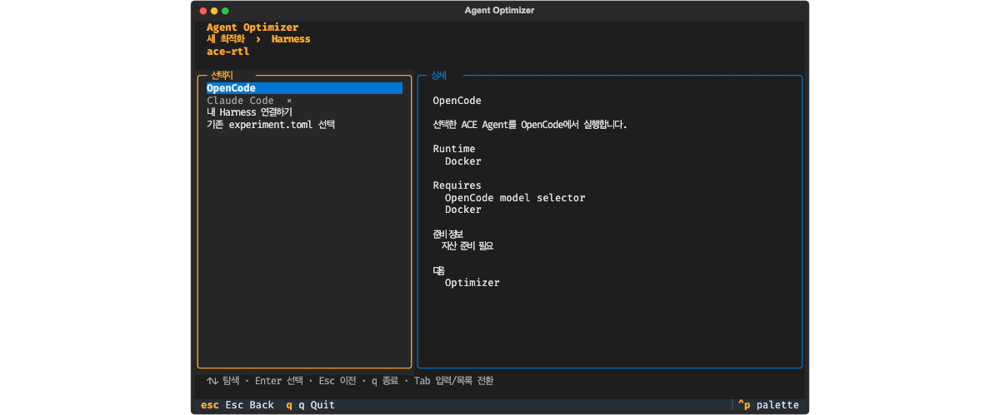
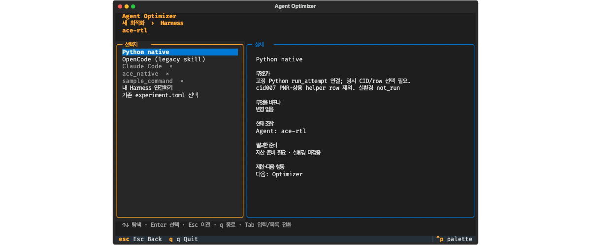

# 최종 MVP PR 화면 비교

2026-10-06에 이전 임시 캡처 파일이 남아 있지 않아 동일 조건으로 다시 생성했다.

- 변경 전: `edbd2b8`의 `src/`, `examples/`, `experiments/`를 임시 경계에 `git archive`로 추출.
- 변경 후: `320532c`의 통합 worktree.
- 화면: Agent `ace-rtl`을 명시 선택한 Harness 선택 화면, Textual Pilot 100×32.
- 환경: 고유 임시 HOME·AGENT_OPT_HOME, `AGENT_OPT_LANG=ko`, 개인 모델 환경과 API key 미상속.
- 재현: 각 checkout의 `OptimizerApp(checkout)`을 `run_test(size=(100, 32))`로 열고 `app.selections['Agent']='ace-rtl'`, `app._show('Harness')`, `await pilot.pause()` 후 `save_screenshot()`으로 SVG를 저장한다. Chromium에서 해당 SVG를 렌더링하고 PNG로 캡처한다.
- 선택 화면만 렌더링했으며 준비·다운로드·모델·실제 Agent 실행은 수행하지 않았다. 실제 native 성공 증거가 아니다.

| 변경 전 | 변경 후 |
|---|---|
|  |  |
