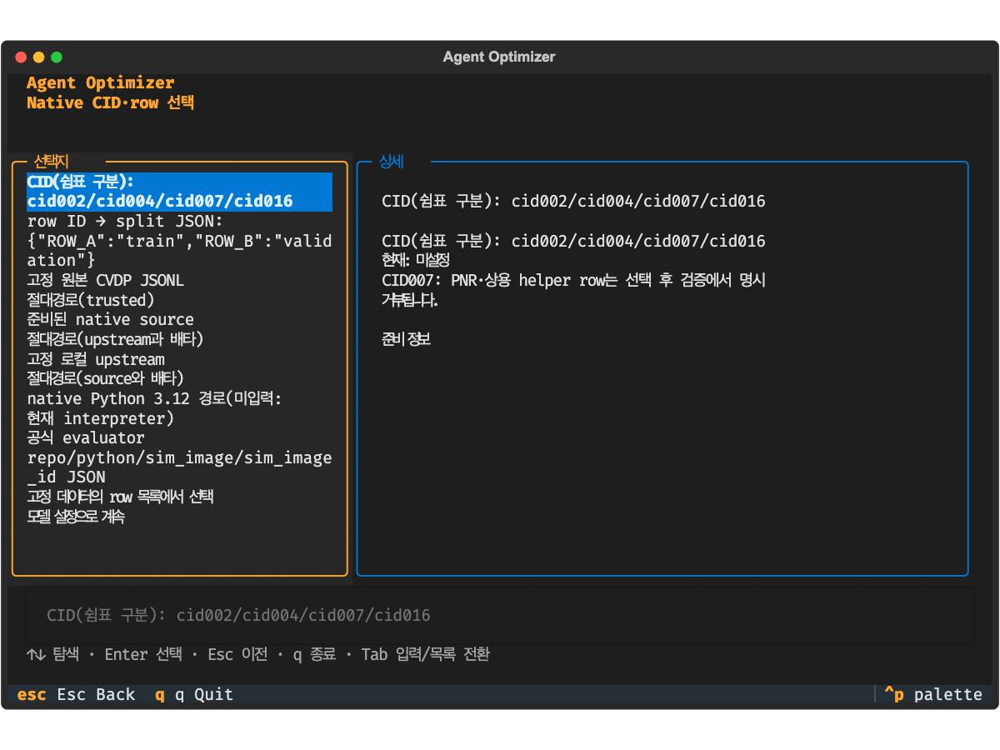
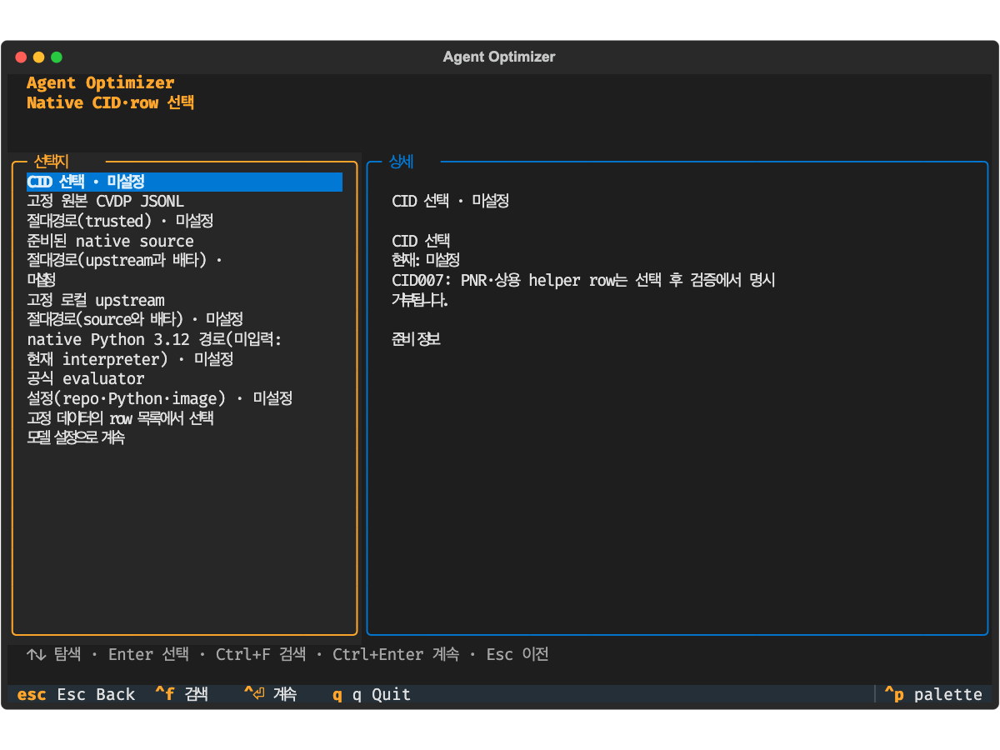
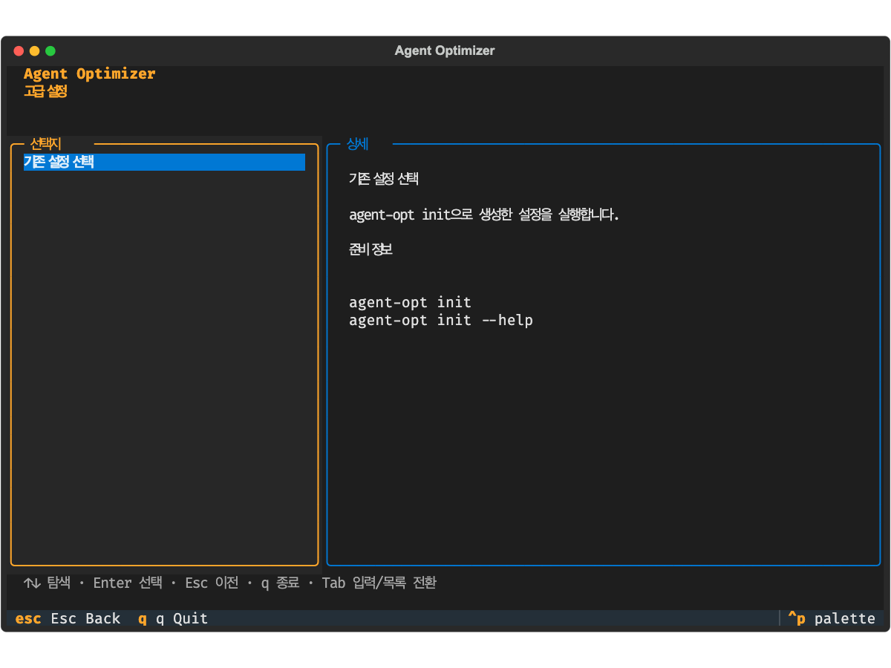
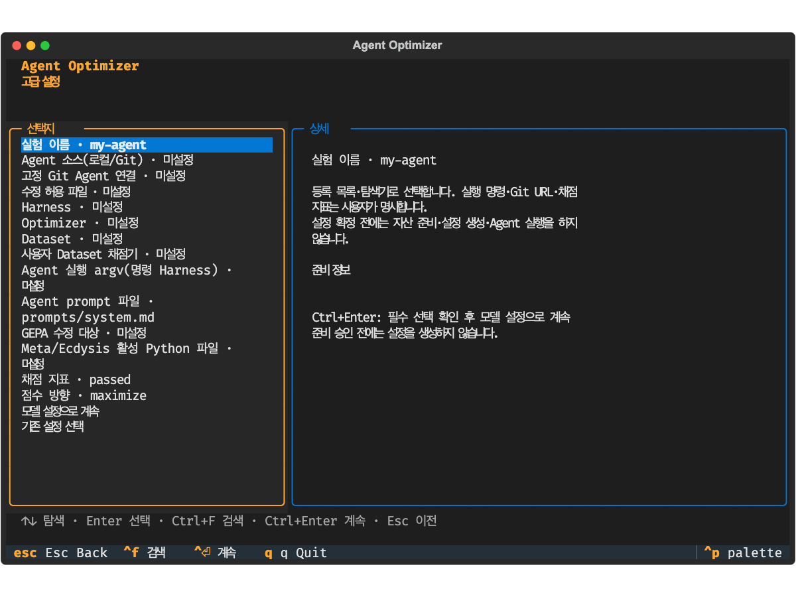
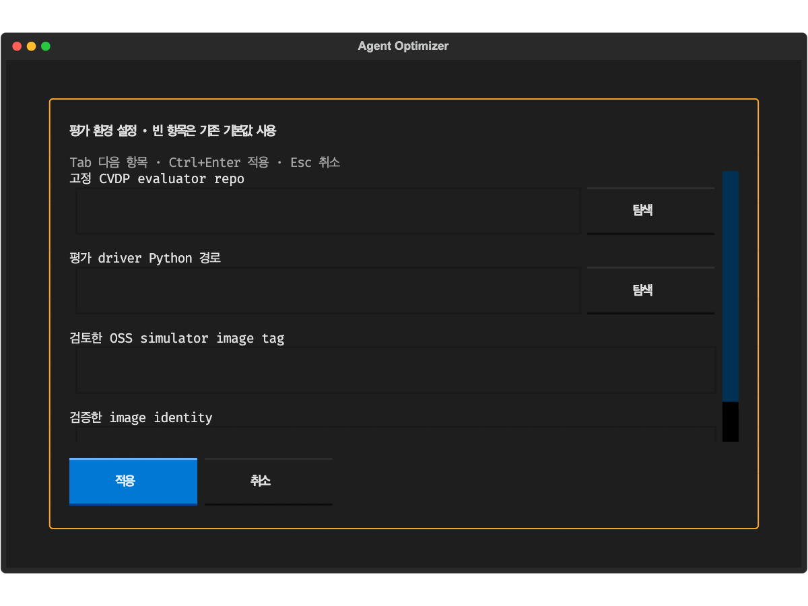
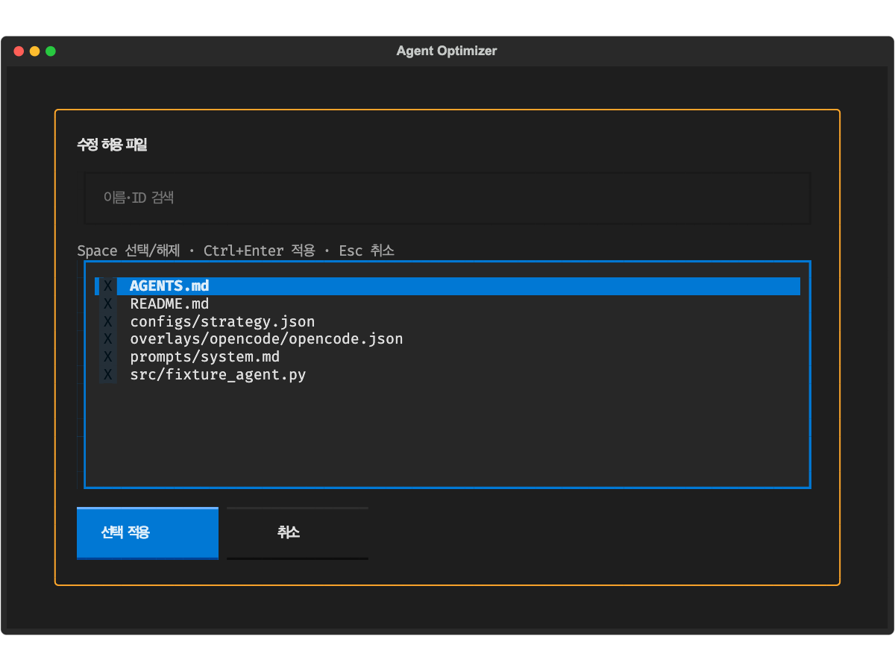
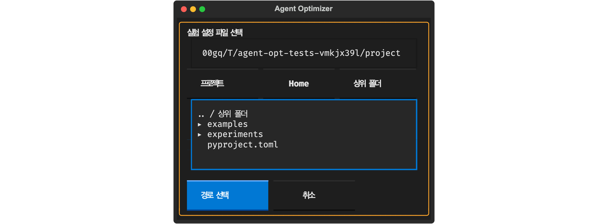

# 2026-10-07 TUI 입력 UX 검증

## 검토와 개선

| 기존 입력 부담 | 적용한 개선 |
|---|---|
| 기존 실험·작업공간·native 자산의 경로 타이핑 | 최근·예제 설정, 파일/폴더 탐색기, 프로젝트·Home·상위 폴더 이동, 경로 자동완성 |
| CID 쉼표 문자열 | 명시 체크 목록·Space 토글·적용 |
| row ID→split JSON 또는 row별 반복 선택 | 검색 목록·지원 row 다중 선택 후 일괄 train/validation/test/해제 |
| evaluator JSON 작성 | repo·Python·image·identity별 폼과 경로 탐색 |
| 모델 Endpoint·ID·compatible selector를 따로 설정 | 연결 프로필로 함께 적용, 현재 연결/명시 preset 재사용, 새 연결 항목폼 |
| 고급 설정에서 CLI로 이탈 | Agent/local·고정 Git·editable·등록 컴포넌트 선택 후 기존 init 계약으로 생성 |
| 긴 목록·수정 시 단계 반복 | Ctrl+F 검색·Ctrl+Enter 계속/적용·Review 직접 수정 |
| 취소 후 재입력 | Input·Select 폼 초안을 세션에서 보존; 적용 전 선택은 확정하지 않음 |
| 작은 터미널의 적용 버튼 잘림 | 50×20 compact 창·스크롤 폼·항상 보이는 적용/취소 버튼 |

Git URL과 Model Endpoint는 자격증명이 reactive 값·초안·화면에 들어오기 전에 차단한다.
정상 SSH 사용자명/SCP Git URL은 허용한다. API key는 기존 세션/환경 값만 사용하며 프로필에는 넣지 않는다.
Dataset·CID·row·split 자동 선택은 없고, 미지원 row는 일괄 선택 목록에서도 제외한다.
전용 Harness 프로필·사용자 채점기·실행 argv·고정 SHA는 기존 계약에서 검증한다.

## 실행 환경과 명령

Mac ARM64, 기존 코어 Python 3.12 환경을 명시하여 전용 워크트리에서 실행했다.

```bash
PYTHONPATH=src /Users/wt.jeong/workspace/agent-optimizer/.venv/bin/python -m unittest discover -s tests
AGENT_OPT_CORE_PYTHON=/Users/wt.jeong/workspace/agent-optimizer/.venv/bin/python make lint
PYTHONPATH=src /Users/wt.jeong/workspace/agent-optimizer/.venv/bin/python -m agent_optimizer run examples/minimal/experiment.toml
PYTHONPATH=src:tests /Users/wt.jeong/workspace/agent-optimizer/.venv/bin/python scripts/capture_tui_inputs.py docs/assets/tui-input-after
```

첫 전체 검사: **1181개 중 실행 1101 통과·기존 skip 80**, Ruff 통과.
추가 리뷰에서 Ctrl+Enter 모달 전달·Git URL의 비밀값 차단·기존 실험 후 Advanced 재진입·Select 초안·Git SHA 표시를
실제 Pilot 회귀로 재현하고 수정했다. 50×20 탐색기의 적용 버튼 잘림도 캡처와 클릭 테스트로 재현·수정했다.
최종 전체 검사: **1186개 중 실행 1106 통과·기존 skip 80**(171.337s), Ruff 통과.
새 입력 UX 회귀 17개를 포함한다. 기존 경로 직접 입력 회귀는 직접 입력 action을 명시적으로 선택하도록
갱신했고, CLI 안내를 기대하던 기존 고급 설정 회귀는 실제 TUI 설정 경로·미확정 Harness 상태를 검사한다.

합성 데모: **status=completed·trials_used=7**, `runs/20261006T155308Z-7ed278b0/report.html` 생성.
새 UX 테스트는 실제 Pilot 키/클릭·실제 init 설정 생성·load_experiment 결과를 검사한다.
외부 Agent·실모델·실 CVDP Docker/EDA·Ubuntu native loop는 이 변경에서 **not_run**이다.

## 변경 전후 캡처와 재현

캡처는 합성 프로젝트의 Textual `run_test(size=(100, 32))` 화면이며 실제 native 성공 근거가 아니다.
변경 전은 구현 전에 같은 페이지를 캡처했고, 변경 후 SVG는 위 명령으로 다시 생성할 수 있다.
PNG는 SVG를 로컬 브라우저에서 렌더링한 화면이다.

| 화면 | 변경 전 | 변경 후 |
|---|---|---|
| native 설정 |  |  |
| 고급 설정 |  |  |





실제 TUI 재현: `PYTHONPATH=src /절대/기존-venv/bin/python -m agent_optimizer tui` →
기존 실험의 탐색기 / 새 최적화의 ACE-RTL·Python native·CVDP 선택 후 CID·row·evaluator /
고급 설정의 Agent·editable / Model의 연결 프로필을 확인한다.
실행을 검증하려면 합성 Agent·Fixture·Baseline·sample_text를 명시 선택하고
Review → 준비 → Doctor → 실행을 각각 확정한다.
