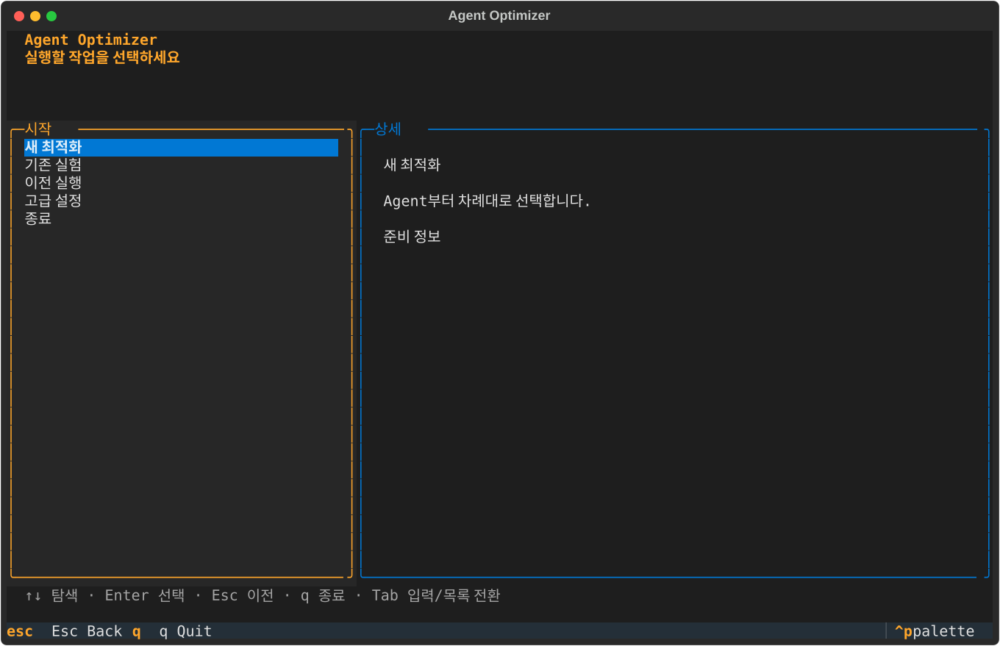
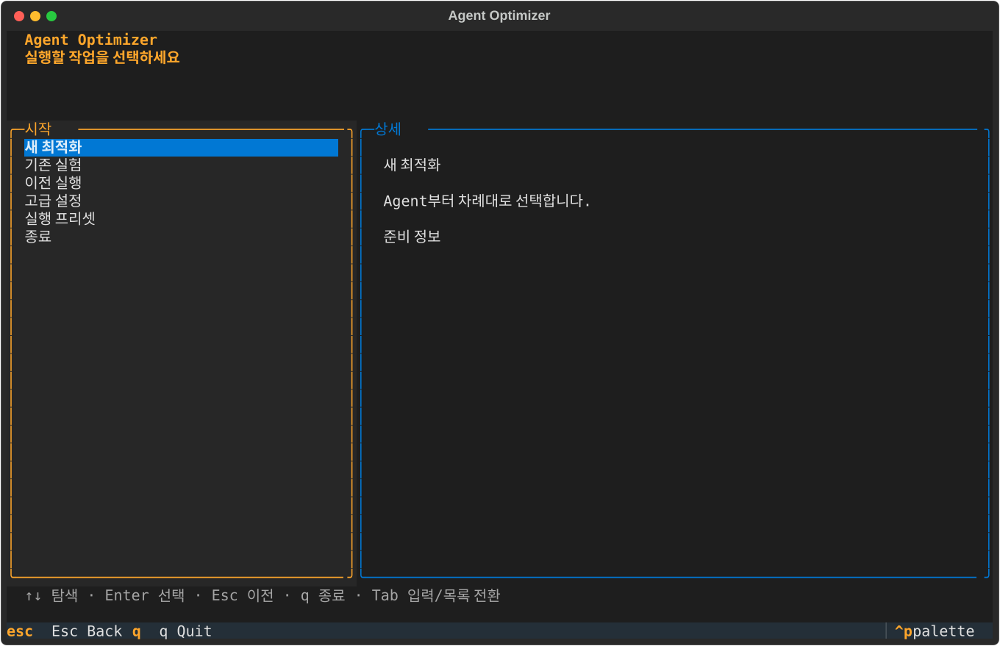
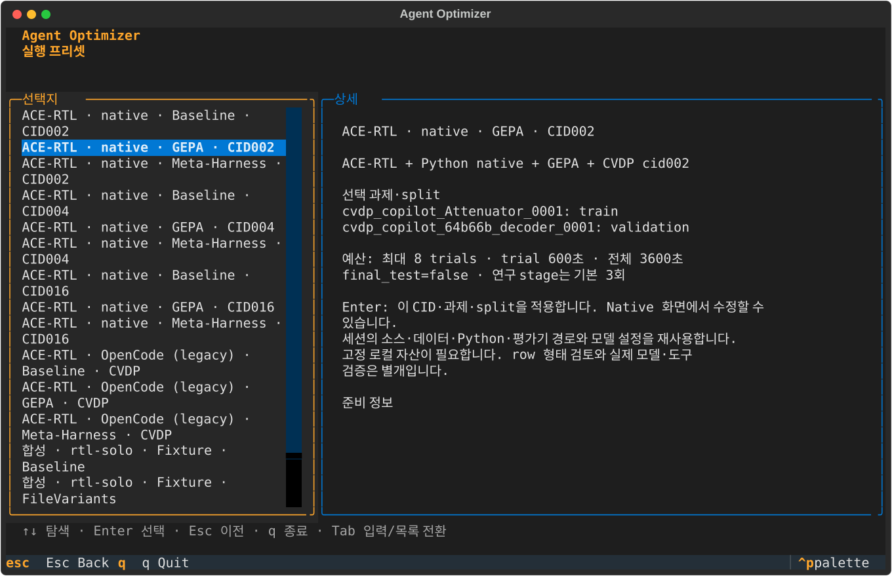

# 2026-10-07 실행 프리셋·E2E 검증

## 범위와 결과

**프리셋 적용·합성 E2E는 통과했고, native 실모델 정상 완료는 실패했다.** 16개 조합을 제공하며 CID/row 정책은 `examples/ace-rtl/native_selection.py`가 소유한다. Highlight는 조회만 하고 Enter에서 네 구성요소·명시 CID/row/split을 적용한다. 이전 설정·준비·진단을 무효화하고 세션 자산 경로·모델 설정은 보존한다. 앱 재시작 간 경로 자동 저장이나 자산 자동 추측은 없다.

| 종류 | 구성 | 선택 과제·예산 |
|---|---|---|
| native CID002 | ACE-RTL + Python native + Baseline/GEPA/Meta-Harness | validation `cvdp_copilot_64b66b_decoder_0001`, 연구 train `cvdp_copilot_Attenuator_0001` |
| native CID004 | 위와 동일 | validation `cvdp_copilot_8x3_priority_encoder_0013`, 연구 train `cvdp_copilot_64b66b_encoder_0009` |
| native CID016 | 위와 동일 | validation `cvdp_copilot_32_bit_Brent_Kung_PP_adder_0001`, 연구 train `cvdp_copilot_64b66b_encoder_0005` |
| legacy 3개 | ACE-RTL + OpenCode + Baseline/GEPA/Meta-Harness + 고정 CVDP | 기존 train 1 / validation 1, native 역할 loop와 별개 |
| 합성 4개 | rtl-solo/team + Fixture + Baseline/FileVariants + sample_text | 기존 합성 train/validation/test, 모델·Docker 불필요 |

Native Baseline은 validation 1개·최대 1 trial, 연구 조합은 train/validation 각각 1개·기본 3회·최대 8 trials, trial 600초·wall 3600초·final_test=false다. 9개 모두 실제 고정 JSONL에 대해 CID 소속·row 지원·split 계약 검사를 통과했다. 정적 지원 검사이지 실도구 성공/정답률이 아니다.

## 코어·화면 검증

환경: macOS arm64, Python 3.12.12, Textual 7.5.0, 고정 `uv.lock`, 독립 작업 브랜치 `feat/tui-run-presets`.

```bash
uv sync --frozen --extra dev --extra native --python /절대/기존-venv/bin/python
PYTHONPATH=src .venv/bin/python -m unittest discover -s tests -p test_run_presets.py -v
make lint
make test
make demo
.venv/bin/python -m build
wheel=$(.venv/bin/python scripts/select_wheel.py dist)
.venv/bin/python tests/test_installed_cli.py "$wheel"
PYTHONPATH=src .venv/bin/python scripts/capture_run_presets.py docs/assets after
```

- 새 프리셋 회귀 **5개 통과**. 실제 fixture runner를 사용한 Prepare→Doctor→Run→Result→History→loopback HTTP HTML 검증을 포함한다. Missing native assets는 Continue에서 차단하고 설정을 생성하지 않는다. 없는 fixture source는 비활성화한다.
- `make test`: **1174개 중 실행 1096 통과·기존 skip 78**, 160.361초. 이 환경에는 native extra가 있어 코어-only의 skip 수와 다르다.
- `make lint` 통과. `make demo`: `completed`, `trials_used=7`, 합성 실행 `20261006T162816Z-b67310b5`.
- sdist→wheel build 및 `test_installed_cli.py`의 실제 설치형 검증 통과.
- 저장소 밖 `uv run --no-project --with /절대/dist/agent_optimizer-0.3.0-py3-none-any.whl python -I -c ...`로 새 wheel의 16개 목록·native 9개·자산 없는 fixture 비활성을 별도 확인했다.
- 코드 리뷰: Critical/Important 없음. 영어 모드에서도 신규 상세 안내는 한국어인 Minor가 남아 있다.

### 변경 전후 화면

캡처는 실제 Textual `run_test(size=(110,34))` 화면이며 모델을 호출하지 않는다. 변경 전은 origin/main 기준 구현, 변경 후는 현재 구현이다.





재현: `.venv/bin/agent-opt tui` → Home **실행 프리셋** → 방향키로 조합·과제·split·예산 확인 → Enter 적용. 합성은 Review, native는 부족한 자산 경로를 안내하는 Native, legacy는 Model(설치형은 먼저 Workspace)로 이동한다.

## 실제 native 실행: 실패 근거

**성공 기록이 아니다.** 실제 Docker daemon 29.2.1, 로컬 ACE `fead921f18bb57345b5a41ef93ba625be208e99c`, CVDP `8e894cf74414ab1eaea1e2b4e80a02f123df07b6`, HF revision `5b807d945f6a99aa645f7e43a64a2115e281b4bf`의 고정 no-commercial JSONL을 사용했다. Native Python은 이번 독립 `.venv`의 3.12.12 + native extra, 평가 driver는 별도 `external/cvdp-venv` Python 3.12.12다. 기존 OSS image `agent-optimizer-cvdp-eval:8e894cf-arm64`와 `docker image inspect`의 실제 identity를 inner/outer 모두 지정했다. 모델 ID는 `deepseek-flash`, URL·키는 실행 환경에만 제공했다. 제품 TUI의 `.env` 자동 로딩은 없다.

검증용 임시 Pilot 드라이버에서 다음 순서를 실제로 수행했다:

```text
Home → 실행 프리셋 → native-cid002-baseline / native-cid004-baseline
→ Native(고정 dataset/upstream/python/evaluator 지정)
→ native.continue → Model → Review → prepare
→ Preparing 완료 → doctor → 전체 진단/실제 모델 probe ready=true
→ run → Result → History
```

실제 실행 명령은 `PYTHONPATH=src .venv/bin/python /.../opencode/verify_native_run_presets.py [native-cid004-baseline]`이었다. `/.../opencode`는 격리 임시 경로이며 드라이버는 커밋 대상이 아니다. 같은 입력으로 위 TUI 순서 또는 [native CLI 안내](../../examples/ace-rtl/NATIVE.md)의 init/doctor/run으로 재현할 수 있다. 실행 자료는 임시 `AGENT_OPT_HOME=tui-presets-live-home` 아래 보존했다. 시간은 run-id의 UTC, 문서 날짜는 로컬 날짜다.

| 실행 | 결과 | 실제 근거 |
|---|---|---|
| `20261006T161358Z-9474008e` CID002 | `no_eligible_candidate`, trials 1/1 | 모델 요청 4개 완료, 생성 파일 1개, inner 공식 평가 1회 `failed`, 이후 worker `ConfigurationError`·`infrastructure_error`; outer 평가는 0회 |
| `20261006T161642Z-526d2b18` CID004 | `no_eligible_candidate`, trials 1/1 | generator 요청 1개 완료, 생성 파일/inner/outer 평가는 0회, worker `ConfigurationError`·`infrastructure_error` |

두 실행 모두 `report.html`·`report.md`·`summary.json`·`events.jsonl`과 native sidecar를 생성하고 History에 실패 상태를 표시했다. 사용량은 partial이며 전체 비용/토큰으로 주장하지 않는다. PID/network 정리 sidecar도 남았지만 이 실패 실행만으로 성공 native loop 전체 cleanup을 검증했다고 표현하지 않는다.

CID004 요청을 **새 진단 공간**에서 실제 모델로 재현한 결과, 예외 위치는 `native_bridge.SafeIterationModel.prompt` → **`native_cvdp.parse_outputs:102`**였다. 원인은 **빈 target 또는 Markdown 출력 거부**이며 데이터/평가기/자격증명 성공으로 이를 정상 RTL 제출로 대체하지 않았다. 원본 요청·private 평가·API 키/응답 원문은 공개 기록에 포함하지 않았다. CID002의 후속 예외는 타입만 기록돼 동일 원인이라고 확정하지 않는다.

## 남은 검증

- 해당 모델의 native 출력 계약 준수와 정상 완료를 추가로 확인해야 한다.
- native GEPA/Meta-Harness 실제 stage, CID016 live, Ubuntu x86_64 native loop는 이번 실행에서 미검증이다.
- legacy 조합은 선택·Model 연결 회귀만 새로 확인했으며 과거 OpenCode 성공을 이번 live로 재사용하지 않는다.
