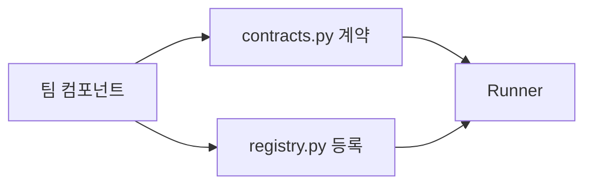

# Astro + Starlight 문서 전환 Implementation Plan

> **For agentic workers:** REQUIRED SUB-SKILL: Use superpowers:executing-plans to implement this plan task-by-task. Steps use checkbox (`- [ ]`) syntax for tracking.

**Goal:** 기존 사람용 한국어 가이드 7쪽과 이미지를 보존하고, 네 개의 정확한 개념도를 갖춘 Starlight 정적 사이트를 GitHub Pages에 게시한다.

**Architecture:** `website/`에 독립적인 Astro 프로젝트를 두고 Starlight 기본 문서 컬렉션으로 원고를 이동한다. 링크 검사와 Mermaid·llms 출력만 플러그인으로 보완하고, PR 빌드와 `main` Pages 배포는 기존 워크플로를 전환한다.

**Tech Stack:** Node 22+, npm lockfile, Astro 7, Starlight, MDX, Mermaid 11, astro-mermaid, starlight-links-validator, starlight-llms-txt, GitHub Actions/Pages.

**Spec:** `website/MIGRATION-DESIGN.md`

## Global Constraints

- `docs/`, 애플리케이션·실험·Optimizer 코드는 수정하지 않는다.
- `website/` 원고 7쪽과 합성 fixture 이미지의 사실 설명을 보존한다.
- 한국어 단일 root locale, Starlight 기본 테마·검색·명암 전환·코드 복사를 사용한다.
- GitHub Pages 주소는 `https://wontaeJeong.github.io/agent-optimizer/`다.
- PR에서는 빌드·내부 링크 검사, `main`에서만 Pages 게시를 실행한다.
- 원문 Markdown 플러그인은 현재 버전 호환·실제 출력이 통과하는 경우에만 사용한다.
- 기록 목적의 `docs/` MkDocs 언급은 변경하지 않는다.

## 파일별 책임

- `website/{package.json,package-lock.json,astro.config.mjs,tsconfig.json}`: 독립 사이트 도구·설정·버전.
- `website/src/content.config.ts`: Starlight 문서 컬렉션.
- `website/src/content/docs/{index.mdx,concepts/overview.md,getting-started/*.md,guides/*.md,developer/*.md}`: 게시하는 원고만 포함.
- `website/src/assets/report-fixture.png`: 기존 합성 결과 이미지.
- `.github/workflows/pages.yml`: PR 검증, `main` 게시.
- `README.md`, `.gitignore`: 사이트 실행 안내, 생성 산출물 제외.
- 제거: `website/{index.md,user/*.md,developer/*.md,assets/report-fixture.png}`, `mkdocs.yml`, `requirements-docs.txt`.

---

### Task 1: 사이트 기반과 독립 빌드

**Files:** Create `website/package.json`, `website/package-lock.json`, `website/astro.config.mjs`, `website/tsconfig.json`, `website/src/content.config.ts`, `website/src/content/docs/index.mdx`; keep `website/index.md` until Task 2.

**Interfaces:** Produces `npm run build`, `npm run dev`, `npm run preview`, `npm run check:links` and only the home sidebar entry. Later tasks add sidebar slugs `getting-started/first-run`, `getting-started/results`, `concepts/overview`, `guides/experiment`, `developer/components`, `developer/overview`, `developer/validation` when the pages exist.

- [ ] **Step 1:** Add the package metadata and exact dependency families. Commit `package-lock.json` generated by `npm install` (do not hand-edit it):

```json
{
  "name": "agent-optimizer-guides",
  "private": true,
  "type": "module",
  "scripts": { "dev": "astro dev", "build": "astro build", "preview": "astro preview", "check:links": "astro build" },
  "dependencies": {
    "astro": "^7.3.5", "@astrojs/starlight": "^0.42.4", "@astrojs/mdx": "^8.0.2",
    "astro-mermaid": "^2.1.0", "mermaid": "^11.0.0",
    "starlight-links-validator": "^0.26.0", "starlight-llms-txt": "^0.12.0"
  },
  "engines": { "node": ">=22.12.0" }
}
```

- [ ] **Step 2:** Define `astro.config.mjs` with the Pages project base, root Korean locale and home-only sidebar; later tasks expand this sidebar as real pages appear:

```js
import { defineConfig } from 'astro/config';
import starlight from '@astrojs/starlight';
import mdx from '@astrojs/mdx';
import mermaid from 'astro-mermaid';
import starlightLinksValidator from 'starlight-links-validator';
import starlightLlmsTxt from 'starlight-llms-txt';

export default defineConfig({
  site: 'https://wontaeJeong.github.io',
  base: '/agent-optimizer',
  integrations: [
    mermaid(),
    starlight({
      title: 'Agent Optimizer 가이드',
      description: 'Agent 최적화 실험을 시작하고 팀 컴포넌트를 연결하는 가이드',
      locales: { root: { label: '한국어', lang: 'ko' } },
      sidebar: [{ slug: 'index' }],
      social: [{ icon: 'github', label: 'GitHub', href: 'https://github.com/wontaeJeong/agent-optimizer' }],
      editLink: { baseUrl: 'https://github.com/wontaeJeong/agent-optimizer/edit/main/website/' },
      plugins: [starlightLinksValidator(), starlightLlmsTxt()],
    }),
    mdx(),
  ],
});
```

Create `content.config.ts`:

```ts
import { defineCollection } from 'astro:content';
import { docsLoader } from '@astrojs/starlight/loaders';
import { docsSchema } from '@astrojs/starlight/schema';
export const collections = { docs: defineCollection({ loader: docsLoader(), schema: docsSchema() }) };
```

- [ ] **Step 3:** Add `tsconfig.json` with `{"extends":"astro/tsconfigs/strict"}` and create `index.mdx` with `---\ntitle: Agent Optimizer 가이드\n---` frontmatter and the opening product introduction from `website/index.md`. Keep the old home source and its page links until Task 3, then transfer its remaining copy.
- [ ] **Step 4:** Run `npm install` in `website/`; then `npm run build`. Fix actual integration/config failures without disabling link validation. Check `website/dist/index.html` exists.
- [ ] **Step 5:** Commit only the Task 1 files after `git diff --check` and a successful build.

### Task 2: 기존 원고 보존과 내부 링크 이관

**Files:** Move seven Markdown pages and `website/assets/report-fixture.png` to paths listed in the file map; modify their frontmatter, MkDocs callouts, and internal URLs.

**Interfaces:** Consumes the Task 1 Starlight collection; produces six real Starlight pages and sidebar entries at their slugs. `concepts/overview` is supplied in Task 3. Page assets use relative imports from `website/src/content/docs/getting-started/results.md` to `website/src/assets/report-fixture.png`.

- [ ] **Step 1:** Move `website/user/getting-started.md` → `website/src/content/docs/getting-started/first-run.md`, `website/user/results.md` → `website/src/content/docs/getting-started/results.md`, `website/user/experiment.md` → `website/src/content/docs/guides/experiment.md`, and the three `website/developer/*.md` → `website/src/content/docs/developer/`. Put the image in `website/src/assets/`. Preserve each original page's statements and command examples.
- [ ] **Step 2:** Add frontmatter `title` matching the existing H1 of each moved page and remove the duplicate H1. Convert existing `!!! tip "설치가 막히면"` to `:::tip[설치가 막히면]` and `!!! warning "합성 수치 해석"` to `:::caution[합성 수치 해석]`, preserving their inner text.
- [ ] **Step 3:** Replace relative `.md` links with base-prefixed absolute Starlight URLs, e.g. `[결과 읽기](/agent-optimizer/getting-started/results/)` and `[구조와 경계](/agent-optimizer/developer/overview/)`. Point the existing `#workflow` reference at `/agent-optimizer/` until Task 3. Point the results screenshot at `../../../assets/report-fixture.png` from its new page directory. Add sidebar groups for the moved pages only.
- [ ] **Step 4:** Run `npm run build` and inspect link/anchor diagnostics; commit the moved pages and navigation after a green build and `git diff --check`.

### Task 3: 정확한 구조와 반복 시각화

**Files:** Create `website/src/content/docs/concepts/overview.md`; update `website/src/content/docs/index.mdx` home navigation and `website/src/content/docs/developer/overview.md` references.

**Interfaces:** Produces `/agent-optimizer/concepts/overview/` and four named headings: `#전체-구조`, `#실험-단계`, `#최적화-반복`, `#컴포넌트-경계` (verify actual generated IDs at build).

- [ ] **Step 1:** Write short Korean paragraphs and four `mermaid` fenced flowcharts. Use distinct flows for the Agent snapshot → Harness (public task) → Evaluator → Optimizer → report, configure/prepare/doctor → run → train/validation/fixed test → report, baseline-local train proposals → candidate reevaluation, and team implementation → `contracts.py`/`registry.py` → Runner. Example boundary pattern:

````md
---
title: 동작 원리
---
## 컴포넌트 경계

등록 정보와 실행 계약은 다르며, 평가 전용 자료는 Agent 작업공간에 전달하지 않습니다.
````

- [ ] **Step 2:** Add the Concepts sidebar entry, then move the remaining copy from old `website/index.md` into `index.mdx` (remove its duplicate H1), use Starlight `CardGrid`/`LinkCard` for `/agent-optimizer/concepts/overview/`, `/agent-optimizer/getting-started/first-run/`, and `/agent-optimizer/developer/components/`, and remove old `website/index.md`. Run `npm run build`; confirm Mermaid output is rendered into HTML (not an unprocessed `language-mermaid` code block) and all local links/anchors pass. Confirm text distinguishes synthetic scores, model API vs OpenCode model selector, and static doctor vs real tool execution.
- [ ] **Step 3:** Commit page and related navigation changes after `git diff --check`.

### Task 4: 원문·배포·개발 안내 전환

**Files:** Modify `.github/workflows/pages.yml`, `.gitignore`, `README.md`, `website/astro.config.mjs`; remove `mkdocs.yml`, `requirements-docs.txt`; optionally add `starlight-dot-md` and update `website/package-lock.json` if compatible.

**Interfaces:** Consumes the production `website/dist/` artifact; produces PR link/build check and `main` Pages deploy.

- [ ] **Step 1:** Run `npm view starlight-dot-md version peerDependencies time.modified --json`; try `npm install starlight-dot-md` and `starlightDotMd()` only if the package works with the installed Astro/Starlight. Verify `website/dist/index.md` and one guide `.md`. If that fails, omit this optional package and retain `llms-full.txt` plus GitHub edit links.
- [ ] **Step 2:** Update Pages workflow with `actions/setup-node@v4` (Node 22, `cache: npm`, `cache-dependency-path: website/package-lock.json`), `npm ci` and `npm run build` in `website/`, and `actions/upload-pages-artifact@v3` with `path: website/dist`; retain existing PR vs `main` job conditions, `pages: write`/`id-token: write` deployment permission, `github-pages` environment, and `actions/deploy-pages@v4`.
- [ ] **Step 3:** Remove root MkDocs config/dependencies; replace README's documentation subsection with `cd website`, `npm ci`, `npm run dev` and `npm run build`, and explain local URL `/agent-optimizer/`. Replace ignore rules `.venv-docs/` and `/site/` with `/website/node_modules/`, `/website/.astro/`, `/website/dist/`.
- [ ] **Step 4:** Run `npm ci && npm run build` in `website/`; check generated `dist/llms.txt` and `dist/llms-full.txt`, the sidebar/search index, theme toggle and image paths. Run `actionlint .github/workflows/pages.yml` if installed and `git diff --check`. Commit Task 4 changes.

### Task 5: 배포 모양의 최종 확인

**Files:** No application changes; place PR comparison captures in `website/screenshots/` if image files can be created. Do not store new screenshots under `docs/`.

**Interfaces:** Produces verified PR with build evidence; `main` Pages deployment is only verifiable after merge.

- [ ] **Step 1:** Start the Astro preview under `/agent-optimizer/` and inspect desktop/mobile navigation, Korean labels, Pagefind search, dark mode, Mermaid SVGs and image in browser. Compare with current published MkDocs page; capture before/after screenshots for PR, saved under `website/screenshots/` if possible. Do not modify `docs/` for captures.
- [ ] **Step 2:** Re-run `npm ci`, `npm run build`, link validation, generated `llms` files and `git diff --check`. Confirm `git diff origin/main --name-only` lists only site, README, workflow and ignore changes. Verify no MkDocs runtime config/dependency remains; historical `docs/` records stay untouched.
- [ ] **Step 3:** Inspect `git status`, `git diff`, and recent logs. Commit remaining intended files, push `docs/astro-starlight-site`, open PR to `main` with before/after captures or reason unavailable and reproduction commands, then inspect PR checks including Pages build. Do not treat PR validation as published Pages; report deployment status honestly.
