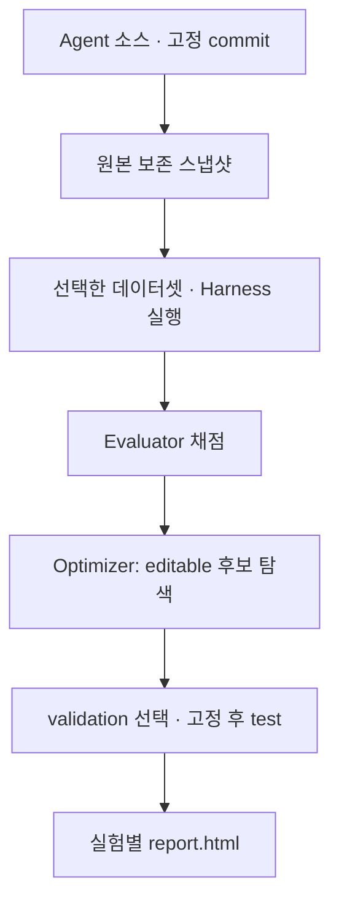

# Agent Optimizer 가이드

**내 Agent를 어떤 조건에서 개선했는지 확인하는 실험 도구.** Agent Optimizer는 Python CLI·대화형 TUI에서 Agent 소스, 실행 방법, 데이터셋, 평가기와 Optimizer를 조합해 비교합니다. 웹 서버를 설치할 필요는 없습니다.

-   :material-play-circle-outline: **사용자 가이드**

    ---

    코어를 준비하고 작은 합성 데모를 실행한 다음, 자신의 Agent와 데이터셋을 명시적으로 선택합니다.

    [첫 실행 →](user/getting-started.md)

-   :material-puzzle-outline: **개발자 가이드**

    ---

    팀의 Dataset·Harness·Optimizer·Evaluator를 공통 계약에 맞춰 구현하고 등록합니다.

    [구조와 경계 →](developer/overview.md)

## 실험은 이렇게 진행됩니다 {#workflow}

도식의 순서: 원본에서 분리한 Agent 후보를 Harness가 공개 과제에 실행하고 Evaluator가 결과를 채점합니다. 데이터셋은 사용자가 선택하며, Optimizer는 허용된 파일만 바꿉니다. 최종 선택 후 보고서를 읽습니다.

!!! info "합성 데모와 실제 평가"
    첫 실행은 모델·Docker 없이 배선을 확인하는 **합성 fixture**입니다. 데모의 점수 변화는 실제 Agent의 개선이나 모델 성능을 입증하지 않습니다. 실제 실행에는 대상 Agent의 명령, 수정 허용 범위, 데이터셋과 신뢰할 평가기가 필요합니다.

다음 단계: [첫 실행](user/getting-started.md) 또는 [팀 개발 시작](developer/components.md).
