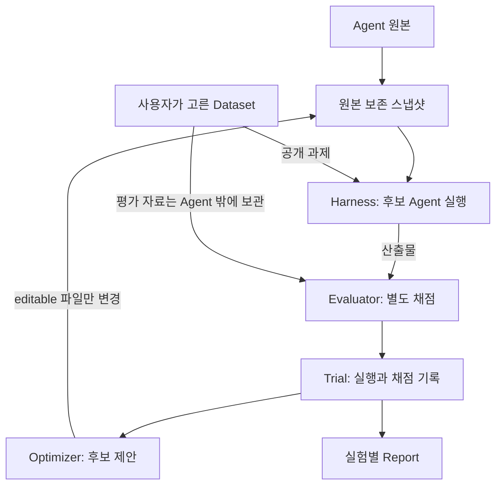
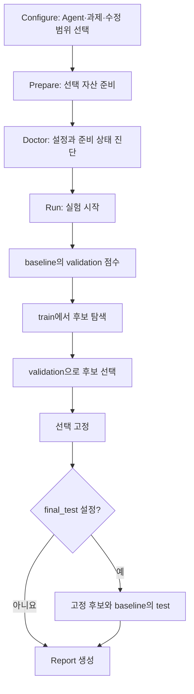
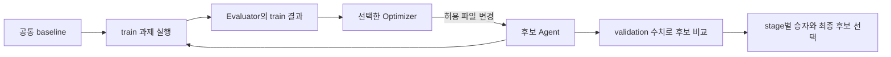
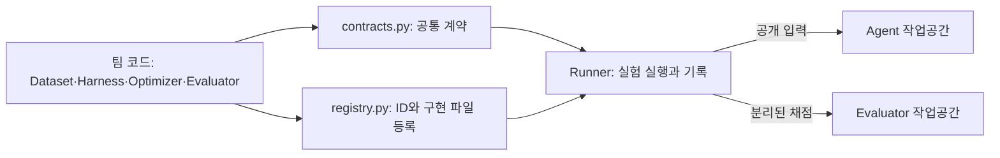

Agent Optimizer는 **Agent를 실행하고, 결과를 채점하고, 허용된 파일을 바꾼 후보를 비교**하는 도구입니다. 아래 그림의 화살표는 정보가 이동하는 방향을 보여 줍니다. 자세한 실행 명령은 [첫 실행](/agent-optimizer/getting-started/first-run/)에 있습니다.

## 전체 구조

**Agent**는 최적화할 대상, **Harness**는 이를 실행하는 방법, **Dataset**은 과제 모음, **Evaluator**는 실행 결과를 채점하는 컴포넌트입니다. Optimizer는 원본을 고치지 않고 허용된 파일만 바꾼 스냅샷을 만듭니다. 채점 전용 자료는 Agent 실행 공간으로 전달하지 않습니다. [역할별 상세 설명](/agent-optimizer/developer/overview/)도 참고하세요.

## 실험 단계

사용자가 데이터셋을 직접 선택합니다. `doctor --plan`은 **준비 전에도** 실행할 수 있지만, 그때는 부족한 자산을 표시할 수 있습니다. 준비 뒤 다시 확인해도 실제 모델 호출이나 채점 성공을 보증하지 않습니다. `run`은 부족한 자산을 자동 설치하지 않으며, 최종 test는 선택을 고정한 뒤에만 실행합니다.

## 최적화 반복

각 Optimizer stage는 공통 baseline에서 **독립적으로** 시작합니다. 수정 근거와 이력에는 baseline과 자기 stage의 train 결과만 들어갑니다. 일부 방법은 validation **수치**를 내부 후보 선택에 사용할 수 있지만, 비공개 채점 자료나 test 결과를 수정 근거로 받지 않습니다. [결과 읽기](/agent-optimizer/getting-started/results/)에서 선택된 후보와 실패 근거를 확인하세요.

## 컴포넌트 경계

팀 구현은 `experiments/<team>/`에서 관리하고 중앙 `registry.py`에 ID를 등록합니다. Runner가 공통 계약을 통해 컴포넌트를 호출하므로 알고리즘끼리 직접 연결하지 않습니다. 로컬 팀 플러그인에는 자동 OS 격리가 없으므로 신뢰한 코드를 연결합니다. [컴포넌트 연결](/agent-optimizer/developer/components/)에서 실제 파일과 메서드를 확인하세요.
