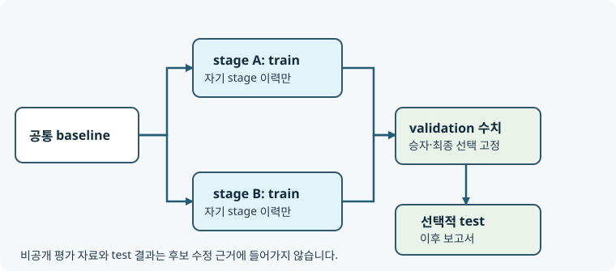

**먼저:** [담당 템플릿을 고르고 컴포넌트를 연결](/agent-optimizer/developer/components/)하세요. 팀 확장은 `experiments/<team>/`에 구현하고 [registry.py](https://github.com/wontaeJeong/agent-optimizer/blob/main/src/agent_optimizer/registry.py)에 등록합니다. 코어는 실험 선언·후보 스냅샷·실행·평가·기록을 맡으며 특정 RTL Agent나 벤치마크를 요구하지 않습니다.

## 누가 무엇을 맡나요?

| 구성 | 책임 | 입력과 출력 |
|---|---|---|
| Agent 소스 | 최적화할 실행 대상 | 로컬 소스 또는 전체 commit으로 고정한 Git 소스 |
| Dataset provider | 사용자가 선택한 과제 준비 | 공개 과제·split·버전/출처 및 분리된 평가 자산 |
| Harness | 후보 Agent 실행 | `RunRequest` → `ExecutionResult`, 공개 과제 입력·산출물 |
| Evaluator | 실제 결과 채점 | `Task`와 산출물 → `Evaluation` |
| Optimizer | 허용된 변경으로 후보 제안 | `OptimizationContext` → `OptimizationResult` |
| Runner | 예산·분할·선택·기록 | 독립 stage, 그룹별 보고서와 이벤트 |

[전체 구조 그림](/agent-optimizer/concepts/overview/#전체-구조)은 구성 간 데이터 흐름을 보여줍니다. 공통 타입·메서드는 [contracts.py](https://github.com/wontaeJeong/agent-optimizer/blob/main/src/agent_optimizer/contracts.py)로 연결합니다. 원본은 보존하고 후보는 editable 파일의 스냅샷에서 만듭니다. 공개 과제만 Agent 실행 공간으로 전달하며 private 채점 자료는 Evaluator가 관리합니다.

:::caution[신뢰 경계]
로컬 팀 Python 플러그인이나 Harness에는 OS 격리가 자동으로 생기지 않습니다. 신뢰한 구현을 연결하고 채점 자료·테스트 수정 권한을 구분하세요.
:::

## 선택과 정보 경계

**탐색:** 모든 Optimizer stage가 공통 baseline에서 독립적으로 시작하고 **자기 stage와 baseline의 train 이력**만 사용합니다. [ACE 선택형 데모](/agent-optimizer/getting-started/presets/)는 GEPA **또는** Meta-Harness의 단일 stage이며, [사용자 정의 실험](/agent-optimizer/guides/experiment/)에서는 여러 독립 stage를 지정할 수 있습니다. **선택:** validation 수치로 후보를 고를 수 있지만 private 평가 자료와 test 결과는 수정 근거로 노출되지 않습니다. **최종 평가:** 후보 선택을 고정한 뒤에만 설정된 test를 실행합니다. 좁은 화면에서는 그림 영역을 좌우로 스크롤하세요.

기본 최종 비교는 모든 stage winner를 대상으로 하며 선택은 lexicographic `keep=1`, 지표 집계는 `mean`/`sum`입니다. 서로 다른 데이터셋의 평가 점수를 하나로 합쳐 순위를 매기지 않습니다. 다음은 [검증 순서](/agent-optimizer/developer/validation/)입니다.
