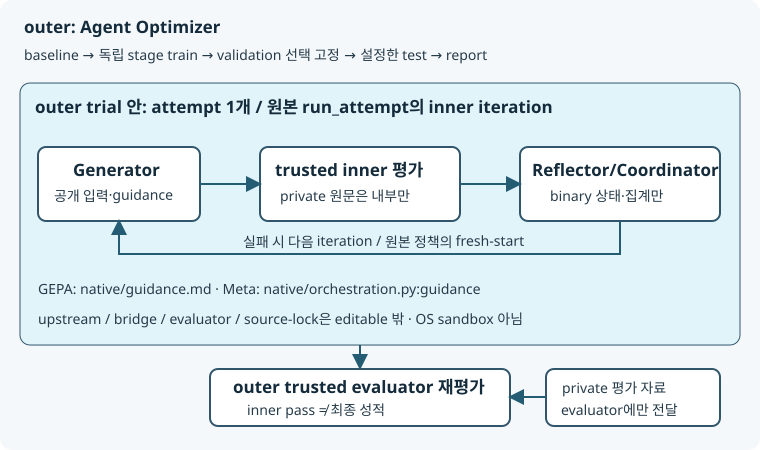

**ACE-RTL의 새 기본 Harness는 Python native입니다. native live는 현재 `not_run`입니다.** 모델·Docker 없는 [fixture 첫 실행](/agent-optimizer/getting-started/first-run/) 뒤 조건을 갖춘 경우에만 진행하세요. 코어와 native 환경, 공식 평가 driver는 별개입니다.

## 무엇을 선택하나요?

| 선택 | native | legacy coding |
|---|---|---|
| CLI profile | `--harness-profile ace_native`(별칭 `ace-native`) | `--harness-profile ace-opencode`, 별도 Claude Code 프로필 |
| Agent / adapter / profile | `ace-rtl-native` / `ace_native` / `ace-native` | 고정 ACE 스킬 / `ace_opencode` / `ace-opencode` |
| Dataset / Evaluator | 명시 CID·row→split, `cvdp_native` | reviewed cid003 데모 과제, `cvdp` |
| GEPA 실제 표면 | `native/guidance.md` | `skills/ace-rtl/references/role-guidance.md` → coding prompt |
| Meta 실제 표면 | `native/orchestration.py:guidance` 실제 import | `agent_opt_scaffold.py:prepare_task` → 공개 과제 선행 build |

GEPA와 Meta-Harness는 연구 이름을 쓴 **자체 구현**이며 upstream/논문 완전 재현이 아닙니다. 각 독립 설정은 baseline에서 시작하고 자기 stage의 train만 수정 근거로 사용합니다. validation은 후보 선택 수치만, test는 선택 고정 이후입니다.

## 준비와 모델 역할

사용자가 고른 고정 **로컬 ACE checkout/export·HF JSONL**과 명시 row/split이 필요합니다. native Python은 **별도 3.12 + native extra(`PyYAML==6.0.2`)·pydantic_settings**, CVDP driver도 별도 3.12 고정 lock입니다. Docker/Compose·`ps`·검토한 OSS simulator tag/로컬 image ID와 모델 API를 준비하세요. `make setup-core`는 코어/합성만, 옵션 없는 `make setup/doctor`·`make smoke/live`는 기존 legacy ACE 전체 경로입니다. native 전체 installer가 아닙니다.

native 명령의 책임은 다음처럼 구분합니다. 누락 환경을 자동 설치/다운로드/온라인 보완하지 않으며 **native `--offline`은 검사 범위를 확대하지 않습니다.** source/data/driver pin도 문서 정리로 갱신하지 않습니다.

| 명령 | 실제 검사/지원 범위 | 성공의 의미 |
|---|---|---|
| init | 고정 로컬 source export 또는 기존 export 검증, 명시 CID/row/split·고정 자료/active surface 검증·설정 생성 | 전체 실행환경 진단 아님 |
| prepare | 고정 선택 데이터/descriptor·private row 대조, native source pin/asset/lock·Python 3.12/yaml/pydantic_settings, **outer evaluator benchmark** | outer repo entrypoint/driver 파일·task 형태, **identity 선언 시** image inspect만 확인. 모델 URL/ID/key·driver 패키지 imports·독립 inner 환경 전체는 검사하지 않음 |
| doctor --plan | **전체 정적 준비 진단**: 실제 pair별 source/interpreter·ps/Docker 실행 파일·inner/outer repo pin·driver Python/imports·image 선언/identity·모델 URL/ID/key·TLS/CA 등 | API 연결/Agent·실 EDA 평가 성공 아님 |
| doctor --plan --model | 정적 진단에 실제 모델 API probe 추가 | 전체 native 실행 성공 보장 아님 |

**모델/driver 패키지/독립 inner 환경이 없어도 prepare는 성공할 수 있습니다.** prepare ready를 전체 준비 완료로 해석하지 말고 다음 doctor의 전체 정적 checks를 확인하세요. 준비 경로·고정 값은 [NATIVE 가이드](https://github.com/wontaeJeong/agent-optimizer/blob/main/examples/ace-rtl/NATIVE.md), CA/proxy·offline 복구는 [개발 명령](https://github.com/wontaeJeong/agent-optimizer/blob/main/docs/development.md)을 확인하세요.

| 역할 | 필요한 값 | 의미 |
|---|---|---|
| native Generator/Reflector/Coordinator | `AGENT_OPT_MODEL_BASE_URL`, `AGENT_OPT_MODEL_ID`, `AGENT_OPT_MODEL_API_KEY` | 동일 transport/API. Baseline에도 Agent 모델 필요. `AGENT_OPT_MODEL`·NVIDIA key는 native 필수 아님 |
| 연구 Optimizer | 위 API 설정 | Agent 요청과 Optimizer 요청/사용량을 별도로 기록. Baseline은 Optimizer API를 추가 요구하지 않음 |
| legacy OpenCode Agent | `AGENT_OPT_MODEL` 및 provider 인증 | compatible selector/ID는 일치해야 함. native와 별도 |

**Endpoint/Model ID는 평문, API key만 password 입력**입니다. 환경·세션·기본·명시 제공 named preset·Custom을 구별합니다. preset은 URL/ID만 보존하고 key를 넣지 않습니다. userinfo/query/fragment 포함 Endpoint는 입력 시 거부하며 key는 세션/환경에만 유지합니다. `.env` 자동 로딩·TOML/argv/보고서에 키 저장은 없습니다.

## TTY에서 네 항목 고르기

```bash
.venv/bin/agent-opt tui
```

정상 TTY에서는 무인자 `agent-opt`도 TUI를 열고 pipe/CI/dumb 터미널은 help/종료 2입니다. Home의 **새 최적화 / 기존 실험 / 실행 이력 / 고급 설정 / 종료**에서 새 최적화를 선택합니다. **Agent ACE-RTL → Harness Python native → Optimizer → Dataset CVDP → Native 경로/CID → row 목록 → split → Model → Review → Preparing → Doctor → Running → Result/History**입니다. row 목록은 public target/도구·지원/제외 이유를 표시하며 추천하지 않습니다.

`↑/↓`·`Enter`로 선택, `Esc`로 돌아갑니다. highlight는 읽기 전용입니다. Planned는 미구현 disabled, 미준비는 자산/환경 부족, 비호환은 선택 불가, 미검증은 실환경 근거 부재입니다. 상위 선택이나 native row/source/split 변경 시 이전 생성 설정·진단을 무효화하고 새 선택으로 재생성합니다. 모델 값은 세션에 유지합니다.

Review는 **실제 train/validation/test 수·final_test·active file·모델 출처·예약 budget·준비/외부 호출·output**을 보여줍니다. Preparing 완료 후 Doctor로, Doctor 통과 후 실행으로 각각 명시적으로 계속합니다. doctor 실패/blocked면 실행하지 않습니다. 준비/정적 진단/API probe 성공은 전체 Agent/공식 평가 성공이 아닙니다.

## 자동화용 CLI: 작은 native smoke

아래 `/absolute/...`·image 값은 설명용이며 준비한 값으로 바꿉니다. 명령은 저장소 루트의 준비된 코어 CLI 기준입니다. `--native-source`는 준비된 export를 지정할 때 `--native-upstream` 대신 사용합니다.

```bash
.venv/bin/agent-opt catalog list --kind harness
.venv/bin/agent-opt catalog show optimizer gepa --json
.venv/bin/agent-opt init --name native-smoke --agent-preset ace-rtl \
  --harness-profile ace_native --dataset cvdp --optimizer baseline \
  --cid cid002 --rows '{"cvdp_copilot_64b66b_decoder_0001":"validation"}' \
  --native-upstream /absolute/pinned-ACE \
  --native-dataset /absolute/pinned-data.jsonl \
  --native-python /absolute/native-venv/bin/python \
  --native-evaluator '{"repo":"/absolute/pinned-cvdp","python":"/absolute/driver/bin/python","sim_image":"local-reviewed-tag","sim_image_id":"sha256:reviewed-identity"}' \
  --yes
# init JSON의 experiment 절대경로로 교체:
CONFIG='/absolute/Home/experiments/실제-UUID/experiment.toml'
.venv/bin/agent-opt prepare "$CONFIG" --offline
.venv/bin/agent-opt doctor --plan "$CONFIG" --json
.venv/bin/agent-opt plan "$CONFIG"
# 모델 연결만 명시 검사할 때(실제 API 호출):
.venv/bin/agent-opt doctor --plan "$CONFIG" --model --json
# 위 조건을 갖춘 경우 작은 baseline smoke(실제 모델·평가):
.venv/bin/agent-opt run "$CONFIG"
```

`catalog`는 설명 조회, `plan/doctor --plan`은 읽기 전용 검사입니다. stdout JSON과 progress stderr를 구별합니다. 별도 `serve` 명령은 없습니다. 한 row smoke 뒤 새 독립 init에서 `--optimizer gepa` 또는 `meta_harness`와 실제 **CID/row→train/validation/test**를 선택합니다. native rows는 `max_tasks`로 몰래 재샘플링하지 않으며 split/family를 자동 생성하지 않습니다. 생성 경로는 Home/experiments UUID이며 init JSON `experiment`가 정본입니다.

## CID 지원과 private 경계

고정 HF no-commercial JSONL의 선택 CID **224개 중 197 eligible·27 제외**입니다. **정적 지원 판정이지 실도구 정답률이 아닙니다.**

| CID | 전체/eligible | 실제 검토 범위 / 제외 |
|---|---:|---|
| cid002 | 94/94 | 90 single·2 two-file·2 three-file RTL, Icarus/cocotb/pytest |
| cid004 | 55/55 | 54 single·1 two-file 공개 RTL 수정, Icarus/cocotb/pytest |
| cid007 | 40/13 | 13 sanity/lint binary: Icarus + Verilator --lint-only + pytest 두 서비스 모두 result=0. 25 PNR/합성 자산 + lint-only 2 상용 helper 제외; 우선 사유 PNR 17·상용 10(8 중복) |
| cid016 | 35/35 | 공개 증상/기존 single RTL bug fix, Icarus/cocotb/pytest |

상용 helper 비호출을 입증하지 않아 제외하며 PNR objective를 binary 기능 성공으로 대체하지 않습니다. 전체 CVDP 지원이 아닙니다. [C 원문 지원표](https://github.com/wontaeJeong/agent-optimizer/blob/main/docs/verification/final-mvp-c-20261001.md#cid-판정표)를 따릅니다.



outer trial 하나에 attempt 하나, 고정 원본 `run_attempt`가 inner generation/평가·반성·coordinator/iteration/fresh-start를 소유합니다. private harness/golden/로그 원문은 모델에 전달하지 않고 binary 상태/집계만 bridge로 전달합니다. 정상 종료 후 **outer trusted evaluator가 다시 판정**하며 inner pass는 최종 점수가 아닙니다. inner `profile.native.evaluator`와 outer evaluator 설정은 별도 진단합니다. local Python 후보는 신뢰한 plugin이지 OS sandbox가 아닙니다.

## legacy coding을 선택할 때

`--harness-profile ace-opencode`는 기존 OpenCode 스킬, Claude Code 프로필은 외부 Claude CLI/인증을 사용합니다. `init --profile ace-rtl --workspace PATH`는 고정 simple_feedback의 별도 경로입니다. legacy init의 `--yes`/prepare는 선택 고정 자산 다운로드·Docker 빌드가 가능합니다. native 로컬 준비와 섞지 마세요.

[2026-09-28 OpenCode 기록](https://github.com/wontaeJeong/agent-optimizer/blob/main/docs/verification.md#2026-09-28-선택형-gepameta-harness-실모델공식-cvdp-후속-검증)은 Mac ARM64 source checkout에서 GEPA/Meta 각각 **1 iteration·실제 4/상한 5 trial**, 공식 raw 각 4건·validation 동점 baseline 선택·final_test 없음입니다. **native 성공·일반 성능 향상·기본 3회/9 trial 검증이 아닙니다.** legacy first-party pin은 자동 갱신하지 않았고 신규 native 파일 포함을 주장하지 않습니다. 현재 native wheel은 distribution metadata의 자산을 사용하며 누락 old wheel은 명시 실패합니다.

## 결과와 검증 범위

`run` JSON의 실제 run_dir/report_html을 사용합니다. [결과/History](/agent-optimizer/getting-started/results/)에서 normalized JSON/MD/HTML·algorithm trail·frozen selection·partial/null usage·evidence warning을 확인하세요. 서버는 HTML만 제공하며 raw native/private 파일은 공개하지 않습니다.

[G 최종 §7](https://github.com/wontaeJeong/agent-optimizer/blob/main/docs/verification/final-mvp-g-20261001.md)은 전체 **1155개 중 실행 1075 통과·skip 80**, Ruff·실제 source-free wheel build/install/합성 CLI/native helper/정적 진단·HTTP 검증입니다. **native API·원본 Agent/실 EDA/cleanup·Ubuntu loop는 not_run**입니다. 한정 fixture·배포 성공을 native 성능으로 쓰지 않습니다.
