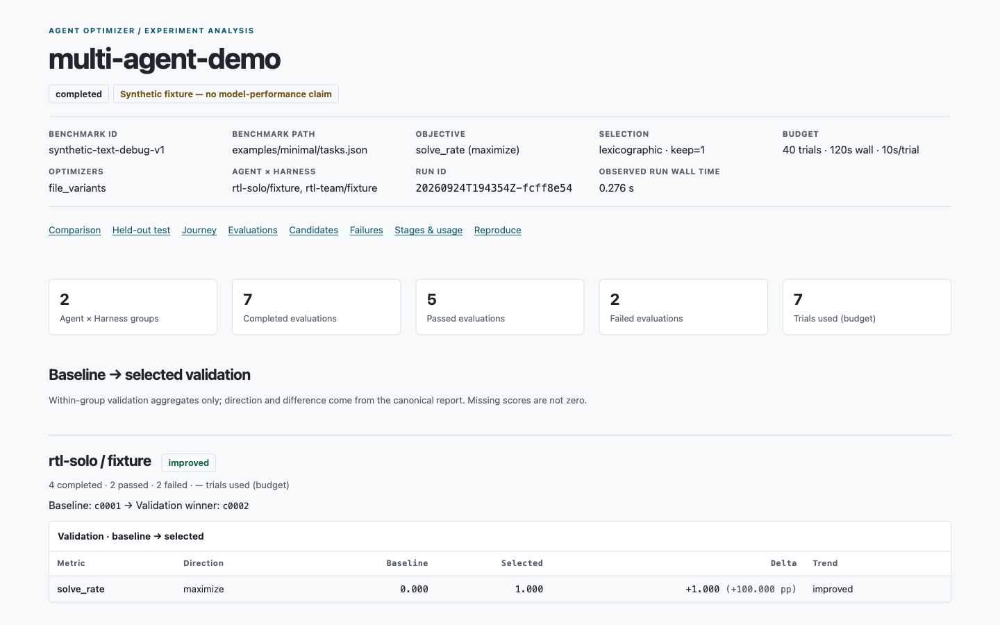

# 결과 읽기

`run`이 출력한 `run_dir`에서 **`report.html`**을 엽니다. 함께 생성되는 `summary.json`, `report.md`, `events.jsonl`은 상태와 근거를 다시 확인할 때 사용합니다. 이미 생성된 HTML을 다시 만들 때만 `.venv/bin/agent-opt report "runs/<run-id>" --html`을 실행하세요.

*위 화면은 저장소의 `docs/superpowers/report-after-1440.png`에 보존된 실제 **합성 fixture 보고서**의 복사본입니다. 모델 성능이나 실제 외부 Agent 개선의 증거가 아닙니다.*

## 어디를 먼저 볼까요?

1. **상태·예산:** 완료, 부분 완료, 실패 등의 상태와 예약된 trial 수를 확인합니다. `trial_completed`는 평가 기록의 종료를 뜻하며 성공 판정이 아닙니다.
2. **비교:** 동일 Agent × Harness 그룹에서 baseline과 선택된 후보의 **validation 집계**를 비교합니다. 다른 데이터셋·평가기의 점수를 한 표에서 직접 순위화하지 않습니다.
3. **선택과 test:** Optimizer는 train의 결과를 개선 근거로 사용하며 validation으로 후보를 고릅니다. 최종 선택을 고정한 뒤에만 test가 실행됩니다. test는 후보 수정에 쓰지 않습니다.
4. **여정·실패·사용량:** 후보/평가의 근거와 실패 사유를 살펴봅니다. 미수집 지표는 `null`이며 관측된 partial 사용량을 Agent 전체 사용량으로 읽지 않습니다.

!!! warning "합성 수치 해석"
    [첫 실행](getting-started.md)의 fixture는 연결 확인을 위해 만든 과제입니다. 점수가 올라도 실제 모델이나 외부 Agent의 성능 향상을 입증하지 않습니다. 실제 실험 결과는 사용한 Agent, 데이터셋, 모델, 평가기와 예산을 함께 기록해 해석하세요.

다른 데이터셋을 여러 개 실행했다면 각 실행의 `report.html`을 별도로 열어 비교 기준을 확인하세요.
